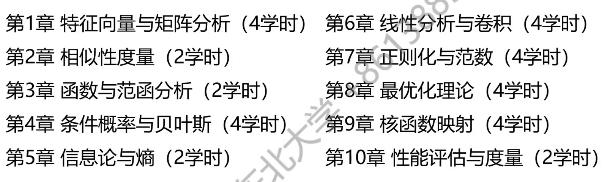

# 人工智能的数学基础

该目录仅供参考
待补充：符号逻辑，图论

## 目录
- [特征向量](#第一章-特征向量eigenvector)
- [矩阵](#第二章-矩阵)
- [矩阵的特征值与特征向量](#矩阵的特征值与特征向量)
- [矩阵的秩（旧版）](#矩阵的秩rank1分条陈述版)
- [矩阵的秩（新版）](#矩阵的秩rank2串联版)
- [矩阵的特征分解](#特征值与特征向量)
- [对称矩阵的特征分解](#对称矩阵的特征分解)
- [特征分解与降维](#特征分解与降维)
- [相似变换与相似不变量](#相似变换与相似不变量)
- [多维缩放](#多维缩放)
- [奇异值分解](#svd-section)

## 第一章 特征向量[^Eigenvector]

#### 向量基础
[^Eigenvector]: 注：此处特征向量不等于线性代数中的特征向量,在机器学习和数据科学中，特征向量通常指一个样本的多维特征表示。  

由单一数值构成的对待研究对象的量化评价，称作标量。标量的定义与其代表的数据类型强相关。
一个用于描述某个对象的​​多维度特征的有序集合​​称为特征向量（Feature Vector，请注意与线性代数中的特征向量Eigenvector区分）。用[ ]标注。
由各个特征可能的取值张成的空间，称作“特征空间”。显然，特征空间限制了特征向量的取值范围。
$$\boldsymbol{x}=[x_1,x_2,x_3,...,x_d]$$
给定任一向量，其包含大小[^size]（其模长，由范数Norm定义）与方向两类信息。
[^size]:我们常常使用两点间距离的平方和(**欧氏距离**)表示大小，即$\|\boldsymbol{x}\|=\sqrt{x_1^2+x_2^2+x_3^2+...+x_d^2}$或$\sqrt{\sum_{i=1}^dx_i^2}$但是请注意，大小不要局限于欧氏距离

$\boldsymbol{x_1}=[x_{1,1},x_{1,2},x_{1,3},...,x_{1,d}]\quad \boldsymbol{x_2}=[x_{2,1},x_{2,2},x_{2,3},...,x_{2,d}]$
相应地，只有分别在各分量位置处取相同值时，两个向量才相等（意味两个向量在空间中同一点）。$x_{1,i}=x_{2,i}$
几类特殊的向量：
零向量：$\boldsymbol{o}=[0,0,0,0,...,0]$
单位向量：$\boldsymbol{e}=\frac{\boldsymbol{x}}{\|\boldsymbol{x}\|}$
向量的转置：略
#### 向量运算
**向量加法**：向量加法是指将两个​​同维度​​的向量按照对应分量相加，得到一个新向量的运算。
**向量数乘**：数乘是指用一个标量（实数）乘以向量，每个分量都乘以该标量
**单位元**：在某种运算下，与任何元素结合都保持该元素不变。在线性代数中，向量的单位元是​​零向量​​。
**逆元**：对于向量加法，一个向量$\boldsymbol{u}$的逆元是它的​​**负向量**​​，记作$\boldsymbol{−u}$
**零元**：一个广义术语，泛指具有“归零”或“湮灭”性质的元素。在向量加法中，​​单位元​​是零向量 0,在标量乘法中，​​零向量​​是“零元”，即 0⋅$\boldsymbol{x=0}$,标量 0 是标量域中的零元，但不是向量空间的“零元”。
**向量内积**：对于两个维度相同的向量，它们的内积是其​​对应分量乘积之和​​，结果是一个​​标量​​（长度仅有一个维度向量，转置等于自身）。（满足交换律）
内积结果为0，说明两个向量正交，如果这两个向量均为单位向量，则称这种正交为*标准正交*。
若两个内积向量均已单位化，则向量内积可以作为两个*向量相似程度的判据*,单位向量的内积即为​​余弦相似度。长度确定情况下，内积越接近长度的乘积，则向量在方向上越相似。
用于改写给定函数的泰勒展开式+内积向量方向正好相反时，内积结果取最小值=*梯度降*
内积运算是行向量与列向量的乘积
**分类平面（决策边界）**：​​一个（或一组）用于将特征空间划分成不同类别区域的​​边界​​。与法向量同侧的向量为正，异侧为负。
设有平面方程：$ag+bh+cr+d=0$
扩展特征向量$\boldsymbol{x_c}=[g,h,r,1]\quad$权重向量$\boldsymbol{w}=[a,b,c,d]$
则该平面方程可以改写为向量形式$\boldsymbol{w·x_c^T=0}$
几何意义：$\boldsymbol{w·x_c^T}=0$是$ag+bh+cr+d=0$的等价向量表述形式，它们描述了同一个分类平面。权重向量$\boldsymbol{w}$的前三个分量$[a,b,c]$构成了分类平面的法向量，指出平面方向，即决策得分（$\boldsymbol{w·x^T}$）为正的一侧。
**向量外积**：向量外积是列向量与行向量的矩阵乘积。其运算结果是一个矩阵，该矩阵的每个元素都是列向量的一个分量与行向量的一个分量进行数乘（标量乘法）的结果。
**分量乘法（Hadamard积）**：分量乘法用$\odot$来表示，对于两个维度相同的向量：$\boldsymbol{w}=[w_1,w_2,w_3,...,w_d]\quad\boldsymbol{x}=[x_1,x_2,x_3,...,x_d]$它们的Hadamard积（分量乘法）定义为对应分量相乘，结果是一个新的同维向量：
$\boldsymbol{w\odot x}=[w_1x_1,w_2x_2,w_3x_3,...,w_dx_d]
$
一般地，特征分量对于分类或评分结果的贡献度不一定相同。Hadamard积提供了一种​​为每个特征分量施加不同权重​​的直接方式，从而体现各分量的差异化影响效果。
#### 向量线性相关性
任意向量，总能通过同一向量空间中其余向量得到。限定只包含**数乘与加法运算**————线性运算。
取向量空间中一组向量 $\boldsymbol{x_1,x_2,x_3,...,x_n}$，当且仅当标量值$a_1,a_2,...,a_n$均等于0，$a_1\boldsymbol{x}_1 + a_2\boldsymbol{x}_2 + \cdots + a_n\boldsymbol{x}_n = \boldsymbol{0}$才成立,则称$\boldsymbol{x_1,x_2,x_3,...,x_n}$为**线性无关**的，​​ 反之称这组向量为**线性相关**的，（如二维线性相关的两个向量共线，3维线性相关的两个向量共面）。
线性相关意味着其中至少有一个向量可以表示为其他向量的线性组合（即数乘与加法运算）。也就是说其中任意一个向量**不能**写成由其它向量的数乘与加法运算构成的线性组合时，该向量组为线性无关向量组。
如果对于向量空间中的一个线性无关向量组，不存在空间中另一个向量可以加入该向量组并保持向量组的线性无关，则该向量组为**极大线性无关组**能生成整个向量空间的向量集合，称为该空间的**​​生成组**​​。如果一个生成组中​​不包含任何冗余的向量​​（即去掉其中任何一个向量都无法再生成整个空间），则称它为​**​极小生成组**​​。
互不线性相关的最大集合是构成对应向量空间的向量的最小集合————**基向量**，基向量等价于同时满足极大线性无关组与极小生成组的向量。
## 第二章 矩阵
#### 矩阵（Matrices）
**矩阵的定义**：一个 ​​m × n 矩阵​​ (Matrix) 是一个由​​数字​​（或更一般地，来自某个​​域​​的元素，如实数、复数）排成的 ​​m 行​​ (Row)、​​n 列​​ (Column) 的矩形阵列。
矩阵可以理解为对向量进行的线性变换。
向量是特殊的矩阵。
行数与列数对应相等的矩阵称作**同行矩阵**。同型且对应元素相等，则矩阵相等
行数与列数相等的矩阵，称作**方阵**。
零阵：
$$
\boldsymbol{O} = \begin{bmatrix}
    0 & 0 & \cdots & 0 \\
    0 & 0 & \cdots & 0 \\
    \vdots & \vdots & \ddots & \vdots \\
    0 & 0 & \cdots & 0
\end{bmatrix}
$$
对角阵$diag(\boldsymbol{x})$:
$$
\boldsymbol{D} = \begin{bmatrix}
    d_{1} & 0 & \cdots & 0 \\
    0 & d_{2} & \cdots & 0 \\
    \vdots & \vdots & \ddots & \vdots \\
    0 & 0 & \cdots & d_{n}
\end{bmatrix}
$$
$$
\boldsymbol{D} = \operatorname{diag}(d_1, d_2, \ldots, d_n)
$$
单位阵（$E$）：
$$
\boldsymbol{E}=\begin{bmatrix}
    1&0&\cdots&0\\
    0&1&\cdots&1\\
    \vdots&\vdots&\ddots&\vdots\\
    0&0&\cdots&1
\end{bmatrix}
$$
#### 矩阵的基本运算:
矩阵加法/减法​​：只有​​同维度​​的矩阵才能相加减。规则是​​对应元素相加减​​。
标量乘法​​：用一个数（标量）乘以矩阵中的​​每一个元素​​。
​​矩阵乘法​​：这是最重要但也最需要理解的运算。
&emsp;一个​m×n​​的矩阵$​​A$​​和一个​n×p​​的矩阵​$​B$​​可以相乘,结果是一个​m×p​的矩阵​$​C$​​。
&emsp;$C​​$中第i行第j列的元素$c_{ij}$ ，等于$​​A$​​的第i行$​​B​$​的第j列的​​点积（内积）​​。
&emsp;重要​​：矩阵乘法​​不满足交换律​​，即AB$\neq$BA。
矩阵的转置：
一个​​m×n​​矩阵$​​A$​​的​​转置​​，记作$A^T$或​​A​​'，是一个​​n×m​​矩阵。
矩阵加法与数乘统称为矩阵的线性运算。
若无特殊说明，矩阵内积乘法时，不再特殊标注左操作数的列数与右操作数的行数，而是**默认二者相等**。
矩阵的乘法满足结合律和分配律，但是不满足交换律。
$AO=OA=O$&emsp;零元
$AE=EA=E$&emsp;单位元
$AB=BA=E$&emsp;逆元
矩阵的幂：
$A^{k+l}=A^kA^l$ &emsp; (前提：$A$是方阵)
$(AB)^k\neq A^kB^l$
$(AB)^T=B^TA^T$
矩阵内积等于向量外积的和——**内积的外积展开**。
矩阵乘法（基于内积）可以分解为多个外积矩阵的求和，矩阵乘积$AB$（由内积计算）等于所有列向量和行向量外积的和。
设$A$是$m×n$矩阵，矩阵$B$是$n×p$矩阵。它们的乘积$C=AB$是一个$m×p$矩阵。
外积展开形式：$$AB=\sum_{k=1}^{n}a_kb_k^T$$
其中：
&emsp;&emsp;&emsp;$a_k$是$A$的第$k$列（一个$m×1$列向量），
&emsp;&emsp;&emsp;$b_k^T$是$B$的第$k$行（一个$1×p$行向量），
&emsp;&emsp;&emsp;$a_kb_k^T$是一个$m×p$矩阵（即外积）。
**矩阵元素相乘**：矩阵的​​元素相乘​​（Element-wise Multiplication），也称为 ​Hadamard积​​（Hadamard Product）或 ​​Schur积​​（Schur Product），是一种二元运算。
核心规则：两个​​同维度​​的矩阵（即行数和列数完全相同）才能进行元素相乘。结果是一个新的​​同维度矩阵​​，其每个元素的值是原始两个矩阵​​对应位置元素的乘积​​。通常用$\odot$符号表示。
#### 矩阵的特征值与特征向量
**乘法形式：左乘与右乘**[^multiplicative_form]
矩阵与向量的乘法有两种等价的表示形式，取决于将向量视为列向量还是行向量。
右乘（列向量视角）
​$\boldsymbol{y=Ax}$
矩阵$A$右乘于列向量$x$，得到新的列向量$y$。（这是线性代数和科学技算中最常用的形式）
左乘（行向量视角）
​$\boldsymbol{y^T=x^TA}$，得到新的列向量$y^T$。

[^multiplicative_form]:两种形式描述的变换本质相同，只是表示惯例的差异。通常优先使用​​右乘列向量​​的形式。

**矩阵变换的几何效果**:矩阵对向量的乘法是一种​**​线性变换**​​，其效果取决于矩阵的形状。
非方阵 $(m×n,m\ne n)​$
变换是一种​​投影或升降维​​操作。变换后的新向量$y$与原向量$x$的​​维度不同$(m\ne n)$，因此直接比较“长度”(参考注释2)意义不大。
方阵$(n×n)​$
变换是在​​同一空间内​​的变换（输入输出维度相同）。
几何效果可理解为对原向量$x$进行​​旋转​​和​​缩放​​的组合，从而得到新向量$y$。
**特征向量与特征值：变换中的“不变量”**
对于方阵$A$，存在一些特殊的向量，在线性变换中保持方向不变。
定义（右特征向量/值）​​：
若存在一个​​非零​​列向量v和一个标量$\lambda$，使得：$$Av=\lambda v$$
则称：
&emsp;&emsp;&emsp;$v$是矩阵$A$的一个​​特征向量​​。
&emsp;&emsp;&emsp;$\lambda$是该特征向量对应的​​特征值​​。
几何解释​：
&emsp;&emsp;特征向量$v$在经过矩阵$A$的变换后，​​方向保持不变​​。
&emsp;&emsp;特征值$\lambda$量化了变换过程中沿该方向​​缩放的大小。
$|\lambda|>1:被拉伸\\
|\lambda|=1:长度不变\\
|\lambda|<1:被压缩\\
\lambda<0:方向反向$
左特征向量/值同理
重要性质：
&emsp;&emsp;1.非零缩放​​：任何非零标量$k$乘以特征向量($kv$)后，​​仍然是​​同一个特征值$\lambda$对应的特征向量。
&emsp;&emsp;2.单位特征向量​​：为了比较的方便，常将特征向量​​标准化​​为单位长度（模长为1）。
&emsp;&emsp;3.计算简化​​：特征向量将矩阵乘法运算$Av$​​简化为​​数乘运算$\lambda v$，极大地简化了分析和计算。
**特征降维**：特征降维是一种通过数学变换，将高维数据映射到一个低维空间的技术，其目标是保留数据中最重要的结构信息（如方差、区分度），同时摒弃冗余、噪声和无关细节。
​特征向量指明了​​最重要的方向​​，特征值告诉我们这些方向​​有多重要​​。
**用特征降维简化运算**
降维目标：降维后各维度方差尽可能大，保证不同维度之间的相关性为0（基向量正交）
💡 也就是协方差尽可能小

💡 特征降维将在后续章节细致讲解，此处仅为引子

### 矩阵的秩[^rank1]（分条陈述版）
> **💡 理论注记：秩的严格定义与等价定理**
>
> 设 $A$ 为一个 $m \times n$ 矩阵，定义在数域 $F$ 上。
> *   **定义**：矩阵 $A$ 的秩 $R(A)$ 是其行空间（或列空间）的维数。
> *   **定理**：以下关于秩的表述彼此等价：
>     1.  $R(A) = r$（行空间维数）。
>     2.  存在 $r$ 阶非零子式，且所有 $r+1$ 阶子式均为零。
>     3.  存在可逆矩阵 $P_{m \times m}$, $Q_{n \times n}$，使得 $PAQ = \begin{bmatrix} I_r & O \\ O & O \end{bmatrix}$，其中 $I_r$ 为 $r$ 阶单位矩阵。
> *   **不变性**：初等行变换或列变换不改变矩阵的秩。

[^rank1]:为方便理解，本文将用模块式和串联式两种方式讲解矩阵的秩的内容，旨在突出矩阵的重要性与必要性
#### 矩阵的秩
一个 $m \times n$ 的矩阵 $\boldsymbol{A}$ 可以表示为：
$$
\boldsymbol{A} = \begin{bmatrix}
a_{11} & \cdots & a_{1n} \\
\vdots & \ddots & \vdots \\
a_{m1} & \cdots & a_{mn}
\end{bmatrix}_{m \times n}
$$
- 其**第 i 行行向量**记为：$\boldsymbol{A_{i,:}}$
- 其**第 j 列列向量**记为：$\boldsymbol{A_{:,j}}$

矩阵 $\boldsymbol{A}$ 的**列向量组**（或**行向量组**）的**极大线性无关组**中所包含向量的个数，定义为矩阵的**秩**，记作 $R(\boldsymbol{A})$ 或 $\operatorname{rank}(\boldsymbol{A})$。

行满秩: $R(\boldsymbol{A}) = m$ (所有行向量线性无关)
列满秩: $R(\boldsymbol{A}) = n$ (所有列向量线性无关)
满秩方阵: $\boldsymbol{A}$ 为 $n \times n$ 方阵且 $R(\boldsymbol{A}) = n$ (又称**非奇异矩阵**，可逆)
欠秩矩阵: $R(\boldsymbol{A}) < \min(m, n)$ (方阵欠秩又称**奇异矩阵**，不可逆)

💡 秩揭示了数据中**独立信息**的多少。秩越低，数据中的冗余度就越高。

**数据意义的解释**:
若矩阵的行代表**观测对象**，列代表**观测特征**。
- **行欠秩**意味着部分观测对象可由其它对象的线性组合来表示（**样本冗余**）。
- **列欠秩**意味着某些观测特征可由其它特征的线性组合来表示（**特征冗余**或**多重共线性**）。

#### 初等变换
给定任意一组维度相同的向量，如何求其最大线性无关组中向量的个数呢？
一种核心方法是对矩阵进行**初等变换**。

对于矩阵的**行向量**，初等变换包括三类操作：
1.  行对调: 交换两行的位置。
2.  非零数乘: 用一个非零常数 $k$ 乘以某一行的所有元素。
3.  倍加行: 把某一行的 $k$ 倍加到另一行上。

💡 以上操作同样适用于**列变换**，只需将“行”替换为“列”。

**矩阵等价**:
若矩阵 $\boldsymbol{A}$ 经过有限次初等变换变成矩阵 $\boldsymbol{B}$，则称矩阵 $\boldsymbol{A}$ 与 $\boldsymbol{B}$ **等价**，记作 $\boldsymbol{A} \sim \boldsymbol{B}$。

初等变换具有以下性质：
- **可逆性**: 三种变换均是可逆的，且其逆变换是同一类型的初等变换。
- **自反性**: $\boldsymbol{A} \sim \boldsymbol{A}$
- **对称性**: 若 $\boldsymbol{A} \sim \boldsymbol{B}$，则 $\boldsymbol{B} \sim \boldsymbol{A}$
- **传递性**: 若 $\boldsymbol{A} \sim \boldsymbol{B}$ 且 $\boldsymbol{B} \sim \boldsymbol{C}$，则 $\boldsymbol{A} \sim \boldsymbol{C}$

所有与矩阵 $\boldsymbol{A}$ 等价的矩阵构成一个**等价类**。**初等变换不改变矩阵的秩**，因此同一等价类中的所有矩阵秩相等。

#### 初等矩阵与标准形

💡 一个矩阵对应一种线性变换。初等变换是线性变换。

对**单位矩阵** $\boldsymbol{E}$ 施以**一次**初等变换得到的矩阵，称为**初等矩阵**。

- 对矩阵 $\boldsymbol{A}$ 实施一次**初等行变换**，等价于在其**左侧**乘以对应的初等矩阵。
- 对矩阵 $\boldsymbol{A}$ 实施一次**初等列变换**，等价于在其**右侧**乘以对应的初等矩阵。

通过初等变换，任何矩阵都可以化为以下形式：
1.  **行阶梯形**: 矩阵的零行位于底部，每个非零行的主元（第一个非零元）所在的列严格递增。
    $$
    \begin{bmatrix}
    1 & 2 & 5 & 3 \\
    0 & 1 & 2 & 6 \\
    0 & 0 & 0 & -3
    \end{bmatrix}
    $$
2.  **行最简形**: 在行阶梯形基础上，每个主元均为 1，且主元所在列的其它元素均为 0。
    $$
    \begin{bmatrix}
    1 & 0 & 1 & 0 \\
    0 & 1 & 2 & 0 \\
    0 & 0 & 0 & 1
    \end{bmatrix}
    $$
3.  **标准形**: 最简形式，左上角是单位阵，其余元素为 0。$\boldsymbol{D} = \begin{bmatrix} \boldsymbol{E}_r & \boldsymbol{O} \\ \boldsymbol{O} & \boldsymbol{O} \end{bmatrix}$，其中 $r$ 就是矩阵的秩。
    $$
    \begin{bmatrix}
    1 & 0 & 0 & 0 \\
    0 & 1 & 0 & 0 \\
    0 & 0 & 1 & 0
    \end{bmatrix}
    $$

### 矩阵的秩[^rank2]（串联版）
矩阵的秩是线性代数中**最深刻、最重要的概念之一**。它精确地量化了矩阵中所包含的**独立信息的数量**，是理解线性方程组、维度、以及后续所有矩阵分解技术的基石。
[^rank2]:本节会将秩的定义、数据意义的解释、初等变换整合成一个连贯的叙事流
#### 3.1 秩的定义：什么是"独立信息"？

我们已知，一个 $m \times n$ 的矩阵 $\mathbf{A}$ 可以看作一组行向量或一组列向量。
-   其**行向量**组记为：$\{\mathbf{A}_{1,:}, \mathbf{A}_{2,:}, ..., \mathbf{A}_{m,:}\}$
-   其**列向量**组记为：$\{\mathbf{A}_{:,1}, \mathbf{A}_{:,2}, ..., \mathbf{A}_{:,n}\}$

**秩的定义**：矩阵 $\mathbf{A}$ 的**秩**，是其**行向量组**或**列向量组**的**极大线性无关组**中所包含向量的个数。
-   记为 $R(\mathbf{A})$ 或 $\text{rank}(\mathbf{A})$。
-   **关键定理**：行秩 = 列秩。因此，秩是矩阵的一个内在属性。

**秩的取值**：$0 \leq R(\mathbf{A}) \leq \min(m, n)$

根据秩的大小，我们可以对矩阵进行分类：
-   **行满秩**: $R(\mathbf{A}) = m$ (所有行向量线性无关)
-   **列满秩**: $R(\mathbf{A}) = n$ (所有列向量线性无关)
-   **满秩方阵**: $\mathbf{A}$ 为 $n \times n$ 方阵且 $R(\mathbf{A}) = n$ (又称**非奇异矩阵**或**可逆矩阵**)
-   **欠秩矩阵**: $R(\mathbf{A}) < \min(m, n)$ (方阵欠秩又称**奇异矩阵**，**不可逆**)

#### 3.2 如何求秩？—— 初等变换法

给定一个矩阵，我们通过**初等变换**求出它的秩。初等变换包括三类操作：
1.  **行对调**：交换两行的位置。
2.  **非零数乘**：用一个非零常数 $k$ 乘以某一行的所有元素。
3.  **倍加行**：把某一行的 $k$ 倍加到另一行上。

**关键性质**：初等变换**不改变**矩阵的秩。

**化简过程与标准形**：
通过初等变换，任何矩阵 $\mathbf{A}$ 都可以化为**行阶梯形**和**行最简形**，最终得到**标准形**：

$$\mathbf{D} = \begin{bmatrix} \mathbf{E}_r & \mathbf{O} \\ \mathbf{O} & \mathbf{O} \end{bmatrix}$$

**秩 $r$ 就是标准形中单位阵 $\mathbf{E}_r$ 的阶数！**

**示例**：求矩阵 $\mathbf{A} = \begin{bmatrix} 1 & 2 & 3 \\ 4 & 5 & 6 \\ 7 & 8 & 9 \end{bmatrix}$ 的秩。
#### 3.3 如何理解秩？—— 数据意义的解释

在现代机器学习中，矩阵的行代表**观测对象**（样本），列代表**观测特征**。
-   矩阵 $\mathbf{A}$ 的**秩** $r$，揭示了数据中**独立信息**的多少。
-   **秩越低，数据中的冗余度就越高**。

**从行视角看（样本冗余）**：
如果 $R(\mathbf{A}) < m$（行欠秩），意味着部分观测样本（行）可以被其他样本的线性组合所表示，是**冗余的**。

**从列视角看（特征冗余/多重共线性）**：
如果 $R(\mathbf{A}) < n$（列欠秩），意味着某些观测特征（列）可以被其他特征的线性组合所表示，存在**多重共线性**。

**核心洞见**：
矩阵的秩 $r$ 决定了数据**本质的维度**。一个 $1000 \times 500$ 的庞大矩阵，如果它的秩是 $5$，那么这 $1000$ 个样本在 $500$ 维空间中的分布，其**本质**仅仅张成了一个 **$5$ 维** 的子空间。

#### 3.4 秩与相关概念的联系

-   **与行列式的关系**：方阵 $\mathbf{A}$ 可逆的**充要条件**是 $R(\mathbf{A}) = n$（满秩），亦即 $\det(\mathbf{A}) \neq 0$。
-   **与方程组的解的关系**：秩是理解线性方程组 $\mathbf{A}\mathbf{x} = \mathbf{b}$ 是否有解、有多少解的关键。
-   **与后续分解的关系**：矩阵的秩决定了SVD中有多少个非零奇异值，也决定了PCA中可以提取多少个有效的主成分。

---

**总结**：矩阵的秩是一个衡量矩阵中**独立信息量**和**内在维度**的核心指标，是连接线性代数理论与数据科学应用的桥梁。

#### 行列式 (Determinant)
仅方阵有行列式，记作 $\det(\boldsymbol{A})$ 或 $|\boldsymbol{A}|$。

**余子式 ($M_{ij}$)**: 在 $n$ 阶行列式中，划去元素 $a_{ij}$ 所在的行和列，剩下的 $(n-1)^2$ 个元素按原来的排列构成的 $n-1$ 阶行列式，称为 $a_{ij}$ 的余子式。
**代数余子式 ($A_{ij}$)**: $A_{ij} = (-1)^{i+j} M_{ij}$

行列式可以按行或按列展开：
- **按第 i 行展开**: $\det(\boldsymbol{A}) = \sum_{j=1}^{n} a_{ij}A_{ij} = \sum_{j=1}^{n} (-1)^{i+j} a_{ij}M_{ij}$
- **按第 j 列展开**: $\det(\boldsymbol{A}) = \sum_{i=1}^{n} a_{ij}A_{ij} = \sum_{i=1}^{n} (-1)^{i+j} a_{ij}M_{ij}$

##### 伴随矩阵 (Adjugate Matrix)
矩阵 $\boldsymbol{A}$ 的伴随矩阵 $\boldsymbol{A}^{*}$ 由其**代数余子式**构成：
$$
\boldsymbol{A}^{*} = \begin{bmatrix}
A_{11} & A_{21} & \cdots & A_{n1} \\
A_{12} & A_{22} & \cdots & A_{n2} \\
\vdots & \vdots & \ddots & \vdots \\
A_{1n} & A_{2n} & \cdots & A_{nn}
\end{bmatrix}
$$

💡 注意伴随矩阵中代数余子式的排列是**转置**的（第 i 行第 j 列的元素是 $A_{ji}$）。

伴随矩阵的一个重要性质是：
$$\boldsymbol{A} \boldsymbol{A}^{*} = \boldsymbol{A}^{*} \boldsymbol{A} = \det(\boldsymbol{A}) \boldsymbol{E}$$

#### 逆矩阵

##### 左逆与右逆
对于矩阵 $\boldsymbol{A}_{m \times n}$，若存在矩阵 $\boldsymbol{B}_{n \times m}$，使得：
$$ \boldsymbol{B}_{n \times m} \boldsymbol{A}_{m \times n} = \boldsymbol{E}_{n \times n} $$
则称 $\boldsymbol{B}$ 是 $\boldsymbol{A}$ 的**左逆**，$\boldsymbol{A}$ 是 $\boldsymbol{B}$ 的**右逆**。

若存在矩阵 $\boldsymbol{B}_{n \times m}$，使得：
$$ \boldsymbol{A}_{m \times n} \boldsymbol{B}_{n \times m} = \boldsymbol{E}_{m \times m} $$
则称 $\boldsymbol{B}$ 是 $\boldsymbol{A}$ 的**右逆**，$\boldsymbol{A}$ 是 $\boldsymbol{B}$ 的**左逆**。

💡 除非 $m = n$，否则左逆和右逆对应的恒等变换的阶数不同。

若 $\boldsymbol{A}$ 是 $n \times n$ 方阵，且存在同阶方阵 $\boldsymbol{B}$ 使得：
$$\boldsymbol{A}\boldsymbol{B} = \boldsymbol{B}\boldsymbol{A} = \boldsymbol{E}_{n \times n}$$
则称矩阵 $\boldsymbol{A}$ 和 $\boldsymbol{B}$ **可逆**，且互为**逆矩阵**。记作 $\boldsymbol{B} = \boldsymbol{A}^{-1}$, $\boldsymbol{A} = \boldsymbol{B}^{-1}$。

**性质**:
1.  若矩阵 $\boldsymbol{A}$ 可逆，则其逆矩阵是**唯一**的。
2.  $\boldsymbol{A}$ 可逆的充要条件是 $\boldsymbol{A}$ 为满秩方阵（非奇异矩阵）。
3.  若 $\boldsymbol{A}^{-1} = \boldsymbol{B}$，则 $(\boldsymbol{A}^{-1})^{-1} = \boldsymbol{B}^{-1} = \boldsymbol{A}$。
4.  若同阶方阵 $\boldsymbol{A}$ 和 $\boldsymbol{B}$ 均可逆，则 $(\boldsymbol{A}\boldsymbol{B})^{-1} = \boldsymbol{B}^{-1}\boldsymbol{A}^{-1}$。
5.  若 $\boldsymbol{A}$ 可逆，则 $\boldsymbol{A}^T$ 亦可逆，且 $(\boldsymbol{A}^T)^{-1} = (\boldsymbol{A}^{-1})^T$。

##### 逆矩阵公式
由伴随矩阵的性质，可得到求逆矩阵的一个直接公式：
$$ \boldsymbol{A}^{-1} = \frac{1}{\det(\boldsymbol{A})} \boldsymbol{A}^{*} $$
此公式仅适用于 $\det(\boldsymbol{A}) \neq 0$ 的情况，即 $\boldsymbol{A}$ 可逆。

将大矩阵分割成若干个小矩阵（子块）进行运算，可以简化计算和理论分析。
设矩阵 $\boldsymbol{A}_{m \times n}$ 和 $\boldsymbol{B}_{m \times n}$ 按同样方式分块：
$$
\boldsymbol{A} = \begin{bmatrix}
\boldsymbol{A}^{(1,1)}_{m_1 \times n_1} & \boldsymbol{A}^{(1,2)}_{m_1 \times n_2} & \cdots & \boldsymbol{A}^{(1,q)}_{m_1 \times n_q} \\
\boldsymbol{A}^{(2,1)}_{m_2 \times n_1} & \boldsymbol{A}^{(2,2)}_{m_2 \times n_2} & \cdots & \boldsymbol{A}^{(2,q)}_{m_2 \times n_q} \\
\vdots & \vdots & \ddots & \vdots \\
\boldsymbol{A}^{(p,1)}_{m_p \times n_1} & \boldsymbol{A}^{(p,2)}_{m_p \times n_2} & \cdots & \boldsymbol{A}^{(p,q)}_{m_p \times n_q}
\end{bmatrix},
\quad
\boldsymbol{B} = \begin{bmatrix}
\boldsymbol{B}^{(1,1)}_{m_1 \times n_1} & \boldsymbol{B}^{(1,2)}_{m_1 \times n_2} & \cdots & \boldsymbol{B}^{(1,q)}_{m_1 \times n_q} \\
\boldsymbol{B}^{(2,1)}_{m_2 \times n_1} & \boldsymbol{B}^{(2,2)}_{m_2 \times n_2} & \cdots & \boldsymbol{B}^{(2,q)}_{m_2 \times n_q} \\
\vdots & \vdots & \ddots & \vdots \\
\boldsymbol{B}^{(p,1)}_{m_p \times n_1} & \boldsymbol{B}^{(p,2)}_{m_p \times n_2} & \cdots & \boldsymbol{B}^{(p,q)}_{m_p \times n_q}
\end{bmatrix}
$$
其中 $\sum_{i=1}^p m_i = m$, $\sum_{j=1}^q n_j = n$。

**分块矩阵的运算**:
1.  **转置**: 分块矩阵的转置，需先对子块整体转置，再对每个子块自身转置。
    $$
    \boldsymbol{A}^T = \begin{bmatrix}
    (\boldsymbol{A}^{(1,1)})^T & (\boldsymbol{A}^{(2,1)})^T & \cdots & (\boldsymbol{A}^{(p,1)})^T \\
    (\boldsymbol{A}^{(1,2)})^T & (\boldsymbol{A}^{(2,2)})^T & \cdots & (\boldsymbol{A}^{(p,2)})^T \\
    \vdots & \vdots & \ddots & \vdots \\
    (\boldsymbol{A}^{(1,q)})^T & (\boldsymbol{A}^{(2,q)})^T & \cdots & (\boldsymbol{A}^{(p,q)})^T
    \end{bmatrix}
    $$
2.  **加法/减法**: 对应位置的子块相加减。
    $$
    \boldsymbol{A} + \boldsymbol{B} = \begin{bmatrix}
    \boldsymbol{A}^{(1,1)}+\boldsymbol{B}^{(1,1)} & \boldsymbol{A}^{(1,2)}+\boldsymbol{B}^{(1,2)} & \cdots & \boldsymbol{A}^{(1,q)}+\boldsymbol{B}^{(1,q)} \\
    \boldsymbol{A}^{(2,1)}+\boldsymbol{B}^{(2,1)} & \boldsymbol{A}^{(2,2)}+\boldsymbol{B}^{(2,2)} & \cdots & \boldsymbol{A}^{(2,q)}+\boldsymbol{B}^{(2,q)} \\
    \vdots & \vdots & \ddots & \vdots \\
    \boldsymbol{A}^{(p,1)}+\boldsymbol{B}^{(p,1)} & \boldsymbol{A}^{(p,2)}+\boldsymbol{B}^{(p,2)} & \cdots & \boldsymbol{A}^{(p,q)}+\boldsymbol{B}^{(p,q)}
    \end{bmatrix}
    $$
3.  **数乘**: 标量乘以矩阵等于乘以每一个子块。
    $$
    a\boldsymbol{A} = \begin{bmatrix}
    a\boldsymbol{A}^{(1,1)} & a\boldsymbol{A}^{(1,2)} & \cdots & a\boldsymbol{A}^{(1,q)} \\
    a\boldsymbol{A}^{(2,1)} & a\boldsymbol{A}^{(2,2)} & \cdots & a\boldsymbol{A}^{(2,q)} \\
    \vdots & \vdots & \ddots & \vdots \\
    a\boldsymbol{A}^{(p,1)} & a\boldsymbol{A}^{(p,2)} & \cdots & a\boldsymbol{A}^{(p,q)}
    \end{bmatrix}
    $$

💡 分块矩阵的乘法规则类似，但需确保子块的维度满足矩阵乘法要求。

#### 矩阵的迹
方阵 $\boldsymbol{A}$ 的**迹** (Trace) 定义为它的主对角线上的所有元素之和，记作 $\operatorname{tr}(\boldsymbol{A})$。
$$ \operatorname{tr}(\boldsymbol{A}) = \sum_{i=1}^{n} a_{ii} $$

💡 迹是一个标量，是矩阵的一个非常重要的数值特征。

## 第三章 矩阵的特征分解 (Eigen Decomposition)

#### 特征值与特征向量
对于$n$阶方阵$\boldsymbol{A}$，若存在标量$\lambda$和非零向量$\boldsymbol{x}_i$，使得：
$$ \boldsymbol{A} \boldsymbol{x}_i^T = \lambda_i \boldsymbol{x}_i^T $$
则称$\lambda_i$为矩阵$\boldsymbol{A}$的**特征值**，$\boldsymbol{x}_i$为对应的**左特征向量**（单位行向量）。

💡 该方程有非零解的条件是矩阵 (A - λI)是奇异的，即其行列式为零：det(A - λI) = 0。该方程称为特征方程，是求解特征值 λ 的基础。

**特征方程**：
$$det(A - \lambda I) = 0$$该方程为求解特征值和特征向量的核心。
**重要性质**: 若方阵$\boldsymbol{A}$的特征值$\lambda_1, \lambda_2, \ldots, \lambda_n$**非零且互不相等**，则其对应的所有特征向量$\boldsymbol{x}_1, \boldsymbol{x}_2, \ldots, \boldsymbol{x}_n$构成一个**线性无关组**。

💡 该性质可通过数学归纳法证明。核心在于利用特征值互异的条件，证明任何一组特征向量都无法线性表出其他特征向量。

##### 如何求解特征值与特征向量？

定义式 $A v = \lambda v$ 是一个线性方程组。将其改写为：
$$A v - \lambda v = 0$$
$$(A - \lambda I) v = 0$$

其中 $I$ 是单位矩阵。我们的目标是找到使这个方程有**非零解v**的标量 $\lambda$。

根据线性代数理论，该齐次方程组有非零解的**充要条件**是系数矩阵 $(A - \lambda I)$ 是**奇异的**（即不可逆），其行列式必须为零：
$$\boxed{\det(A - \lambda I) = 0}$$

这个方程称为矩阵A的**特征方程**。求解特征值$\lambda$的问题，就转化为**求解这个关于$\lambda$的多项式方程**。

**求解步骤：**
1.  **计算特征多项式**：计算 $\det(A - \lambda I)$，得到一个关于$\lambda$的n阶多项式。
2.  **求特征根**：解特征方程 $\det(A - \lambda I) = 0$，得到的根 $\lambda_1, \lambda_2, ..., \lambda_n$ 就是矩阵A的**特征值**。
3.  **求特征向量**：将每个特征值 $\lambda_i$ 代回方程 $(A - \lambda_i I) v = 0$，求解出对应的**非零解向量v**，这个向量就是属于特征值 $\lambda_i$ 的**特征向量**。

**【举例说明】**
求矩阵 $A = \begin{bmatrix} 2 & 1 \\ 1 & 2 \end{bmatrix}$ 的特征值和特征向量。

1.  **构造特征方程**：
    $A - \lambda I = \begin{bmatrix} 2-\lambda & 1 \\ 1 & 2-\lambda \end{bmatrix}$
    $\det(A - \lambda I) = (2-\lambda)(2-\lambda) - (1)(1) = \lambda^2 - 4\lambda + 3$

2.  **求解特征值**：
    $\lambda^2 - 4\lambda + 3 = 0$
    $(\lambda - 1)(\lambda - 3) = 0$
    $\lambda_1 = 1, \quad \lambda_2 = 3$

3.  **求解特征向量**：
    -   对于 $\lambda_1 = 1$：
        $(A - I)v = \begin{bmatrix} 1 & 1 \\ 1 & 1 \end{bmatrix} \begin{bmatrix} v_1 \\ v_2 \end{bmatrix} = 0$
        解得 $v_1 + v_2 = 0$，所有形如 $v = k\begin{bmatrix} 1 \\ -1 \end{bmatrix}$ (k ≠ 0) 的向量都是特征向量。
    -   对于 $\lambda_2 = 3$：
        $(A - 3I)v = \begin{bmatrix} -1 & 1 \\ 1 & -1 \end{bmatrix} \begin{bmatrix} v_1 \\ v_2 \end{bmatrix} = 0$
        解得 $-v_1 + v_2 = 0$，所有形如 $v = k\begin{bmatrix} 1 \\ 1 \end{bmatrix}$ (k ≠ 0) 的向量都是特征向量。

**几何意义**：矩阵A的作用可以理解为：将向量朝向 $\begin{bmatrix} 1 \\ 1 \end{bmatrix}$ 的方向拉伸3倍，同时将向量朝向 $\begin{bmatrix} 1 \\ -1 \end{bmatrix}$ 的方向压缩到1倍（即不变）。

---

##### 重要性质与注释

1.  **特征值的和与积**：
    -   所有特征值之和等于矩阵的**迹**：$\lambda_1 + \lambda_2 + ... + \lambda_n = \operatorname{tr}(A) = \sum a_{ii}$
    -   所有特征值之积等于矩阵的**行列式**：$\lambda_1 \cdot \lambda_2 \cdot ... \cdot \lambda_n = \det(A)$
    *这两个性质为验证特征值计算是否正确提供了快速检查的方法。*

2.  **特征向量的线性无关性**：属于**不同特征值**的特征向量是**线性无关**的。如果所有特征值都互不相同，则所有特征向量构成空间的一组基。

3.  **退化矩阵**：如果一个特征值对应多个线性无关的特征向量，则称这个特征值是**退化的**。单位矩阵 $I$ 就是一个极端的例子，它的所有特征值都是1，但所有非零向量都是它的特征向量。
#### 对称矩阵的特征分解
对于**对称矩阵** $\boldsymbol{B}$ ($\boldsymbol{B}^T = \boldsymbol{B}$)，其性质更为优良：
1.  **特征向量正交**: 对称矩阵的属于**不同特征值**的特征向量是彼此**正交**的。
    $$ \text{若 } \lambda_i \neq \lambda_j, \text{ 则 } \boldsymbol{x}_i \boldsymbol{x}_j^T = 0 $$
2.  **正交对角化**: 任意对称阵$\boldsymbol{B}$都可进行**特征分解**（或称**正交对角化**）：
    $$ \boldsymbol{B} = \boldsymbol{Q} \boldsymbol{\Lambda} \boldsymbol{Q}^T $$
    其中：
    - $\boldsymbol{\Lambda} = \operatorname{diag}(\lambda_1, \lambda_2, \ldots, \lambda_n)$ 是由特征值构成的对角阵。
    - $\boldsymbol{Q} = [\boldsymbol{x}_1^T, \boldsymbol{x}_2^T, \ldots, \boldsymbol{x}_n^T]$ 是由对应的**单位特征向量**（已标准化）构成的**正交矩阵**，满足 $\boldsymbol{Q}^T \boldsymbol{Q} = \boldsymbol{Q} \boldsymbol{Q}^T = \boldsymbol{E}$。

💡 对称矩阵的特征分解是奇异值分解(SVD)和主成分分析(PCA)的理论基础。

**唯一性说明**:
- 特征分解的结果可能不唯一（例如特征向量的符号或重特征值对应特征向量基的选取）。
- 通常约定将特征值按降序排列 $\lambda_1 \geq \lambda_2 \geq \ldots \geq \lambda_n$。在此约定下，若所有特征值**互不相等**，则特征分解是**唯一**的。

#### 特征分解与降维

💡 先前已经提到了特征降维，在此我们细致了解一下特征分解降维的内容

内积矩阵 $\boldsymbol{B}$ 是一个实对称半正定矩阵，可以进行特征分解：
$$ \boldsymbol{B} = \boldsymbol{V} \boldsymbol{\Lambda} \boldsymbol{V}^T $$
其中 $\boldsymbol{\Lambda} = \operatorname{diag}(\lambda_1, \lambda_2, ..., \lambda_m)$ ($\lambda_1 \geq \lambda_2 \geq ... \geq \lambda_m \geq 0$)，$\boldsymbol{V}$ 是正交矩阵。

取前 $k$ 个最大的特征值及其对应的特征向量，即可得到降维后的数据矩阵：
$$ \boldsymbol{Z} = \boldsymbol{V}_{:, 1:k} \boldsymbol{\Lambda}_{1:k, 1:k}^{1/2} $$
其中 $\boldsymbol{Z}$ 的每一行 $\boldsymbol{z}_i$ 就是一个样本在 $k$ 维空间中的坐标。

💡 MDS的魅力在于：我们无需知道原始高维数据X，仅凭样本间的距离矩D，就可以通过数学推导恢复出其内积矩阵B，并最终通过特征分解直接得到降维后的结果Z。

#### 相似变换与相似不变量
线性变换是对整个空间的变换，其本质与描述它所采用的基向量（即变换矩阵的具体形式）无直接关联。线性变换与方阵的一一对应关系建立在空间**基向量确定**的前提下。

💡 想象一个二维坐标系逆时针旋转45°的变换。在不同的基向量组下，描述这个同一旋转动作的矩阵是不同的，但这些矩阵之间是**相似**的。

**定义（相似矩阵）**:
若存在可逆矩阵 $\boldsymbol{P}$，使得 $n$ 阶方阵 $\boldsymbol{A}$ 与 $\boldsymbol{B}$ 满足如下关系：
$$ \boldsymbol{B} = \boldsymbol{P} \boldsymbol{A} \boldsymbol{P}^{-1} $$
则称 $\boldsymbol{B}$ 是 $\boldsymbol{A}$ 的**相似矩阵**，或称 $\boldsymbol{A}$ 与 $\boldsymbol{B}$ **相似**。$\boldsymbol{P} \boldsymbol{A} \boldsymbol{P}^{-1}$ 的运算称为对 $\boldsymbol{A}$ 进行**相似变换**。

相似矩阵代表**同一个线性变换**，只是在不同基下的表达。因此，它们必然会留下一些共同的“痕迹”，即**相似不变量**。

**重要性质**:
1.  **迹的相似不变性**: 若 $\boldsymbol{A} \sim \boldsymbol{B}$，则 $\operatorname{tr}(\boldsymbol{A}) = \operatorname{tr}(\boldsymbol{B})$。
    
    💡 相似矩阵的对角线元素和一定相等。
    
2.  **行列式的相似不变性**: 若 $\boldsymbol{A} \sim \boldsymbol{B}$，则 $\det(\boldsymbol{A}) = \det(\boldsymbol{B})$。
    
    💡 由行列式的几何意义（线性变换的伸缩比例）可知，该比例与坐标基的选择无关。
    

#### 多维缩放 (Multiple Dimensional Scaling, MDS) {#多维缩放}
**多维缩放**是一种经典的**降维**方法，其核心思想是：在低维空间中重构数据点的坐标，使得这些点之间的**距离**尽可能接近原始高维空间中的距离。

**问题设定与目标**
假设有 $m$ 个样本，并已知它们在高维空间中的**距离平方矩阵** $\boldsymbol{D}$，其元素为：
$$ D_{i,j}^{2} = \left\| \boldsymbol{x}_i - \boldsymbol{x}_j \right\|^2 = \sum_{k=1}^{d} (x_{i,k} - x_{j,k})^2 $$
MDS的目标是找到一组低维表示 $\boldsymbol{z}_1, \boldsymbol{z}_2, ..., \boldsymbol{z}_m$，使得：
$$ \left\| \boldsymbol{z}_i - \boldsymbol{z}_j \right\|^2 \approx D_{i,j}^{2} $$

**从距离矩阵到内积矩阵**
推导的关键在于将距离关系转化为内积关系。我们假设降维后的数据已经进行了**中心化**，即：
$$ \sum_{i=1}^{m} \boldsymbol{z}_i = \boldsymbol{0} $$
定义降维后数据的**内积矩阵** (Gram Matrix) 为 $\boldsymbol{B}$，其元素为 $B_{i,j} = \boldsymbol{z}_i \boldsymbol{z}_j^T$。

距离的平方与内积存在以下关系：
$$
\begin{aligned}
D_{i,j}^{2} &= \left\| \boldsymbol{z}_i - \boldsymbol{z}_j \right\|^2 \\
&= (\boldsymbol{z}_i - \boldsymbol{z}_j)(\boldsymbol{z}_i - \boldsymbol{z}_j)^T \\
&= \boldsymbol{z}_i \boldsymbol{z}_i^T + \boldsymbol{z}_j \boldsymbol{z}_j^T - 2\boldsymbol{z}_i \boldsymbol{z}_j^T \\
&= B_{i,i} + B_{j,j} - 2B_{i,j}
\end{aligned}
$$

为了求解 $\boldsymbol{B}$，需对上述关系式进行求和，并利用中心化条件($\sum_{i} B_{i,j} = 0$, $\sum_{j} B_{i,j} = 0$)进行推导：
$$
\begin{aligned}
\sum_{i=1}^{m} D_{i,j}^{2} &= \operatorname{tr}(\boldsymbol{B}) + m B_{j,j} \\
\sum_{j=1}^{m} D_{i,j}^{2} &= \operatorname{tr}(\boldsymbol{B}) + m B_{i,i} \\
\sum_{i=1}^{m} \sum_{j=1}^{m} D_{i,j}^{2} &= 2m \operatorname{tr}(\boldsymbol{B})
\end{aligned}
$$

最终，可以通过以下公式从距离矩阵 $\boldsymbol{D}$ 还原出内积矩阵 $\boldsymbol{B}$：
$$
B_{i,j} = -\frac{1}{2} \left( D_{i,j}^{2} - \frac{1}{m} \sum_{i=1}^{m} D_{i,j}^{2} - \frac{1}{m} \sum_{j=1}^{m} D_{i,j}^{2} + \frac{1}{m^2} \sum_{i=1}^{m} \sum_{j=1}^{m} D_{i,j}^{2} \right)
$$

💡 特征分解仅适用于方阵​​。
💡 即使对于方阵，也要求矩阵是​​可对角化的​​（即有n个线性无关的特征向量）。很多现实中的方阵不满足此条件。因此下一章的奇异值分解(SVD)的必要性不言而喻。

## 第四章 奇异值分解（SVD） {#svd-section}
### 一、核心概念与定义

#### 1.1 基本定义
**奇异值分解 (SVD)** 是一种矩阵因子分解方法，将任意 $m \times n$ 实矩阵 $\boldsymbol{A}$ 表示为三个矩阵的乘积形式：

$$\boldsymbol{A} = \boldsymbol{U} \boldsymbol{\Sigma} \boldsymbol{V}^T$$

其中：
- $\boldsymbol{U}$ 是 $m \times m$ 正交矩阵（$\boldsymbol{U}^T\boldsymbol{U} = \boldsymbol{U}\boldsymbol{U}^T = \boldsymbol{I}_m$）
- $\boldsymbol{\Sigma}$ 是 $m \times n$ 矩形对角矩阵，对角线元素满足 $\sigma_1 \geq \sigma_2 \geq \dots \geq \sigma_r > 0$
- $\boldsymbol{V}$ 是 $n \times n$ 正交矩阵（$\boldsymbol{V}^T\boldsymbol{V} = \boldsymbol{V}\boldsymbol{V}^T = \boldsymbol{I}_n$）

#### 1.2 术语定义
- $\sigma_i$：矩阵 $\boldsymbol{A}$ 的**奇异值**
- $\boldsymbol{U}$ 的列向量：**左奇异向量**
- $\boldsymbol{V}$ 的列向量：**右奇异向量**
- 奇异值分解可以看作是方阵对角化概念的推广

#### 1.3 存在性与唯一性
- **存在性定理**：任意非零 $m \times n$ 实矩阵 $\boldsymbol{A}$ 的奇异值分解一定存在
- **不唯一性**：矩阵的奇异值分解存在但不唯一

---

### 二、三种分解形式

#### 2.1 完全奇异值分解 (Full SVD)
$$\boldsymbol{A} = \boldsymbol{U} \boldsymbol{\Sigma} \boldsymbol{V}^T$$
- 保留所有奇异值（包括零奇异值）
- $\boldsymbol{U}$ 和 $\boldsymbol{V}$ 为满正交矩阵

#### 2.2 紧奇异值分解 (Compact SVD)
设 $\text{rank}(\boldsymbol{A}) = r$，则紧SVD为：
$$\boldsymbol{A} = \boldsymbol{U}_r \boldsymbol{\Sigma}_r \boldsymbol{V}_r^T$$
- $\boldsymbol{U}_r$：由 $\boldsymbol{U}$ 的前 $r$ 列组成（$m \times r$）
- $\boldsymbol{V}_r$：由 $\boldsymbol{V}$ 的前 $r$ 列组成（$n \times r$）
- $\boldsymbol{\Sigma}_r$：由前 $r$ 个非零奇异值组成的对角矩阵（$r \times r$）
- **性质**：紧奇异值分解的对角矩阵 $\boldsymbol{\Sigma}_r$ 的秩与原始矩阵 $\boldsymbol{A}$ 的秩相等
- **特点**：无损压缩，保留原矩阵全部信息

#### 2.3 截断奇异值分解 (Truncated SVD)
取前 $k < r$ 个奇异值，构成低秩近似：
$$\boldsymbol{A} \approx \boldsymbol{U}_k \boldsymbol{\Sigma}_k \boldsymbol{V}_k^T$$
- **性质**：对角矩阵 $\boldsymbol{\Sigma}_k$ 的秩比原始矩阵 $\boldsymbol{A}$ 的秩低
- **特点**：有损压缩，但在弗罗贝尼乌斯范数意义下是最优近似
- **应用**：实际应用中提到的SVD通常指截断奇异值分解

---

### 三、奇异值分解的基本定理与性质

#### 3.1 奇异值分解基本定理
若 $\boldsymbol{A}$ 为一 $m \times n$ 实矩阵，则 $\boldsymbol{A}$ 的奇异值分解存在，且可表示为：
$$\boldsymbol{A} = \boldsymbol{U} \boldsymbol{\Sigma} \boldsymbol{V}^T$$
其中 $\boldsymbol{U}$ 是 $m$ 阶正交矩阵，$\boldsymbol{V}$ 是 $n$ 阶正交矩阵，$\boldsymbol{\Sigma}$ 是 $m \times n$ 矩形对角矩阵，其对角线元素非负且按降序排列。

#### 3.2 主要性质
1. **与特征分解的关系**：
   $$\boldsymbol{A}^T\boldsymbol{A} = \boldsymbol{V} \boldsymbol{\Sigma}^T \boldsymbol{\Sigma} \boldsymbol{V}^T$$
   $$\boldsymbol{A}\boldsymbol{A}^T = \boldsymbol{U} \boldsymbol{\Sigma} \boldsymbol{\Sigma}^T \boldsymbol{U}^T$$
   - $\boldsymbol{V}$ 的列向量是 $\boldsymbol{A}^T\boldsymbol{A}$ 的特征向量
   - $\boldsymbol{U}$ 的列向量是 $\boldsymbol{A}\boldsymbol{A}^T$ 的特征向量
   - $\boldsymbol{\Sigma}$ 的奇异值是 $\boldsymbol{A}^T\boldsymbol{A}$ 和 $\boldsymbol{A}\boldsymbol{A}^T$ 的特征值的平方根

2. **奇异向量关系**：
   $$\boldsymbol{A} \boldsymbol{v}_j = \sigma_j \boldsymbol{u}_j, \quad j = 1, 2, \cdots, n$$
   $$\boldsymbol{A}^T \boldsymbol{u}_j = \sigma_j \boldsymbol{v}_j, \quad j = 1, 2, \cdots, n$$
   $$\boldsymbol{A}^T \boldsymbol{u}_j = 0, \quad j = n+1, n+2, \cdots, m$$

3. **秩的关系**：矩阵 $\boldsymbol{A}$ 和 $\boldsymbol{\Sigma}$ 的秩相等，等于正奇异值 $\sigma_i$ 的个数 $r$（包含重复的奇异值）

4. **子空间标准正交基**：
   - $r$ 个右奇异向量 $\boldsymbol{v}_1, \boldsymbol{v}_2, \cdots, \boldsymbol{v}_r$ 构成 $\boldsymbol{A}^T$ 的值域 $R(\boldsymbol{A}^T)$ 的一组标准正交基
   - $n-r$ 个右奇异向量 $\boldsymbol{v}_{r+1}, \boldsymbol{v}_{r+2}, \cdots, \boldsymbol{v}_n$ 构成 $\boldsymbol{A}$ 的零空间 $N(\boldsymbol{A})$ 的一组标准正交基
   - $r$ 个左奇异向量 $\boldsymbol{u}_1, \boldsymbol{u}_2, \cdots, \boldsymbol{u}_r$ 构成值域 $R(\boldsymbol{A})$ 的一组标准正交基
   - $m-r$ 个左奇异向量 $\boldsymbol{u}_{r+1}, \boldsymbol{u}_{r+2}, \cdots, \boldsymbol{u}_m$ 构成 $\boldsymbol{A}^T$ 的零空间 $N(\boldsymbol{A}^T)$ 的一组标准正交基

---

### 四、几何解释

奇异值分解可理解为三个连续的线性变换：
1. **旋转/反射变换**（$\boldsymbol{V}^T$）：基于右奇异向量 $\boldsymbol{v}_1, \boldsymbol{v}_2, \ldots, \boldsymbol{v}_n$ 构成的标准正交基
2. **缩放变换**（$\boldsymbol{\Sigma}$）：在各坐标轴方向缩放 $\sigma_1, \sigma_2, \ldots, \sigma_n$ 倍
3. **旋转/反射变换**（$\boldsymbol{U}$）：基于左奇异向量 $\boldsymbol{u}_1, \boldsymbol{u}_2, \ldots, \boldsymbol{u}_m$ 构成的标准正交基

**几何意义**：任意一个向量 $\boldsymbol{x} \in R^n$，经过基于 $\boldsymbol{A} = \boldsymbol{U}\boldsymbol{\Sigma}\boldsymbol{V}^T$ 的线性变换，等价于经过坐标系的旋转或反射变换 $\boldsymbol{V}^T$、坐标轴的缩放变换 $\boldsymbol{\Sigma}$、以及坐标系的旋转或反射变换 $\boldsymbol{U}$。

---

### 五、弗罗贝尼乌斯范数与矩阵最优近似

#### 5.1 弗罗贝尼乌斯范数定义
设矩阵 $\boldsymbol{A} \in R^{m \times n}, \boldsymbol{A} = [a_{ij}]_{m \times n}$，定义矩阵 $\boldsymbol{A}$ 的弗罗贝尼乌斯范数为：
$$\| \boldsymbol{A} \|_F = \left( \sum_{i=1}^m \sum_{j=1}^n a_{ij}^2 \right)^{1/2}$$

**性质**：
$$\| \boldsymbol{A} \|_F = \| \boldsymbol{U} \boldsymbol{\Sigma} \boldsymbol{V}^T \|_F = \| \boldsymbol{\Sigma} \|_F = \sqrt{\sigma_1^2 + \sigma_2^2 + \cdots + \sigma_n^2}$$

#### 5.2 矩阵最优近似定理
**定理 3.2**：设矩阵 $\boldsymbol{A} \in R^{m \times n}$，矩阵的秩 $\text{rank}(\boldsymbol{A}) = r$，并设 $\mathcal{M}$ 为 $R^{m \times n}$ 中所有秩不超过 $k$ 的矩阵集合，$0 < k < r$，则存在一个秩为 $k$ 的矩阵 $\boldsymbol{X} \in \mathcal{M}$，使得：
$$\| \boldsymbol{A} - \boldsymbol{X} \|_F = \min_{S \in \mathcal{M}} \| \boldsymbol{A} - S \|_F$$
称矩阵 $\boldsymbol{X}$ 为矩阵 $\boldsymbol{A}$ 在弗罗贝尼乌斯范数意义下的最优近似。

**定理 3.3**：设矩阵 $\boldsymbol{A} \in R^{m \times n}$，矩阵的秩 $\text{rank}(\boldsymbol{A}) = r$，有奇异值分解 $\boldsymbol{A} = \boldsymbol{U} \boldsymbol{\Sigma} \boldsymbol{V}^T$，并设 $\mathcal{M}$ 为 $R^{m \times n}$ 中所有秩不超过 $k$ 的矩阵的集合，$0 < k < r$，若秩为 $k$ 的矩阵 $\boldsymbol{X} \in \mathcal{M}$ 满足：
$$\| \boldsymbol{A} - \boldsymbol{X} \|_F = \min_{S \in \mathcal{M}} \| \boldsymbol{A} - S \|_F$$
则：
$$\| \boldsymbol{A} - \boldsymbol{X} \|_F = \sqrt{\sigma_{k+1}^2 + \sigma_{k+2}^2 + \cdots + \sigma_n^2}$$

特别地，若 $\boldsymbol{A}' = \boldsymbol{U} \boldsymbol{\Sigma}' \boldsymbol{V}^T$，其中：
$$\boldsymbol{\Sigma}' = 
\begin{bmatrix}
\sigma_1 & & & \\
& \ddots & & \\
& & \sigma_k & \\
& & & 0 \\
& & & & \ddots \\
& & & & & 0
\end{bmatrix}
= \text{diag}(\sigma_1, \cdots, \sigma_k, 0, \cdots, 0)$$
则：
$$\| \boldsymbol{A} - \boldsymbol{A}' \|_F = \sqrt{\sigma_{k+1}^2 + \sigma_{k+2}^2 + \cdots + \sigma_n^2}$$

---

### 六、外积展开式

矩阵 $\boldsymbol{A}$ 的奇异值分解可以表示为外积形式：
$$\boldsymbol{A} = \sigma_1 \boldsymbol{u}_1 \boldsymbol{v}_1^T + \sigma_2 \boldsymbol{u}_2 \boldsymbol{v}_2^T + \cdots + \sigma_n \boldsymbol{u}_n \boldsymbol{v}_n^T$$

或者写成求和形式：
$$\boldsymbol{A} = \sum_{k=1}^n \boldsymbol{A}_k = \sum_{k=1}^n \sigma_k \boldsymbol{u}_k \boldsymbol{v}_k^T$$

其中 $\boldsymbol{A}_k = \sigma_k \boldsymbol{u}_k \boldsymbol{v}_k^T$ 是 $m \times n$ 矩阵。上式将矩阵 $\boldsymbol{A}$ 分解为矩阵的有序加权和。

**性质**：
- 若 $\boldsymbol{A}$ 的秩为 $n$，则 $\boldsymbol{A} = \sum_{k=1}^n \sigma_k \boldsymbol{u}_k \boldsymbol{v}_k^T$
- 设矩阵 $\boldsymbol{A}_{n-1} = \sum_{k=1}^{n-1} \sigma_k \boldsymbol{u}_k \boldsymbol{v}_k^T$，则 $\boldsymbol{A}_{n-1}$ 的秩为 $n-1$，并且是秩为 $n-1$ 矩阵在弗罗贝尼乌斯范数意义下 $\boldsymbol{A}$ 的最优近似矩阵
- 类似地，$\boldsymbol{A}_k = \sum_{i=1}^k \sigma_i \boldsymbol{u}_i \boldsymbol{v}_i^T$ 是秩为 $k$ 矩阵中在弗罗贝尼乌斯范数意义下 $\boldsymbol{A}$ 的最优近似矩阵

---

### 七、奇异值分解的计算

#### 7.1 计算步骤
1. **求 $\boldsymbol{A}^T\boldsymbol{A}$ 的特征值和特征向量**
   - 计算对称矩阵 $\boldsymbol{W} = \boldsymbol{A}^T\boldsymbol{A}$
   - 求解特征方程 $(\boldsymbol{W} - \lambda \boldsymbol{I})\boldsymbol{x} = 0$
   - 得到特征值 $\lambda_i$，并将特征值由大到小排列 $\lambda_1 \geq \lambda_2 \geq \cdots \geq \lambda_n \geq 0$
   - 将特征值 $\lambda_i (i=1,2,\cdots,n)$ 代入特征方程求得对应的特征向量

2. **求 $n$ 阶正交矩阵 $\boldsymbol{V}$**
   - 将特征向量单位化，得到单位特征向量 $\boldsymbol{v}_1, \boldsymbol{v}_2, \cdots, \boldsymbol{v}_n$
   - 构成 $n$ 阶正交矩阵 $\boldsymbol{V} = [\boldsymbol{v}_1 \quad \boldsymbol{v}_2 \quad \cdots \quad \boldsymbol{v}_n]$

3. **求 $m \times n$ 对角矩阵 $\boldsymbol{\Sigma}$**
   - 计算 $\boldsymbol{A}$ 的奇异值 $\sigma_i = \sqrt{\lambda_i}$
   - 构造 $m \times n$ 矩形对角矩阵 $\boldsymbol{\Sigma} = \text{diag}(\sigma_1, \sigma_2, \cdots, \sigma_n)$

4. **求 $m$ 阶正交矩阵 $\boldsymbol{U}$**
   - 对 $\boldsymbol{A}$ 的前 $r$ 个正奇异值，令 $\boldsymbol{u}_j = \frac{1}{\sigma_j} \boldsymbol{A} \boldsymbol{v}_j, \quad j = 1, 2, \cdots, r$
   - 求 $\boldsymbol{A}^T$ 的零空间的一组标准正交基 $\{\boldsymbol{u}_{r+1}, \boldsymbol{u}_{r+2}, \cdots, \boldsymbol{u}_m\}$
   - 令 $\boldsymbol{U} = [\boldsymbol{u}_1 \quad \boldsymbol{u}_2 \quad \cdots \quad \boldsymbol{u}_m]$

#### 7.2 注意
- 上述算法只是为了说明计算过程，并非实际应用中的算法
- 实际应用的奇异值分解算法是通过求 $\boldsymbol{A}^T\boldsymbol{A}$ 的特征值进行，但不直接计算 $\boldsymbol{A}^T\boldsymbol{A}$

---

### 八、应用领域

1. **主成分分析 (PCA)**：基于SVD实现数据降维
2. **推荐系统**：协同过滤中的矩阵补全
3. **自然语言处理**：潜在语义分析 (LSA)
4. **图像压缩**：基于截断SVD的低秩近似
5. **系统辨识与信号处理**：噪声过滤与模型降阶
6. **数据压缩**：紧奇异值分解对应无损压缩，截断奇异值分解对应有损压缩

---

### 九、本章概要

1. 矩阵的奇异值分解是将 $m \times n$ 实矩阵 $\boldsymbol{A}$ 表示为三个实矩阵乘积形式的运算
2. 任意给定一个实矩阵，其奇异值分解一定存在，但并不唯一
3. 奇异值分解包括紧奇异值分解和截断奇异值分解
4. 奇异值分解有明确的几何解释，对应三个连续的线性变换
5. 对称矩阵 $\boldsymbol{A}^T\boldsymbol{A}$ 和 $\boldsymbol{A}\boldsymbol{A}^T$ 的特征分解可以由矩阵 $\boldsymbol{A}$ 的奇异值分解矩阵表示
6. 矩阵 $\boldsymbol{A}$ 的奇异值分解可以通过求矩阵 $\boldsymbol{A}^T\boldsymbol{A}$ 的特征值和特征向量得到
7. 在秩不超过 $k$ 的 $m \times n$ 矩阵的集合中，存在矩阵 $\boldsymbol{A}$ 的弗罗贝尼乌斯范数意义下的最优近似矩阵 $\boldsymbol{X}$
8. 任意一个实矩阵 $\boldsymbol{A}$ 可以由其外积展开式表示

---

| 特性 | 特征分解（EVD） | 奇异值分解（SVD） |
|------|------------------|------------------|
| **适用矩阵** | 方阵、可对角化 | 任意 $m \times n$ 矩阵 |
| **矩阵要求** | 必须是方阵 | 无要求 |
| **输出形式** | $\boldsymbol{A} = \boldsymbol{Q} \boldsymbol{\Lambda} \boldsymbol{Q}^{-1}$ | $\boldsymbol{A} = \boldsymbol{U} \boldsymbol{\Sigma} \boldsymbol{V}^T$ |
| **输出矩阵性质** | $\boldsymbol{Q}$ 由特征向量组成（可能不正交） | $\boldsymbol{U}$ 和 $\boldsymbol{V}$ 都是正交矩阵 |
| **对角线元素** | 特征值（可能为复数） | 奇异值（总是非负实数） |
| **稳定性** | 对非对称矩阵或缺陷矩阵不稳定 | 始终存在，数值稳定 |
| **几何解释** | 同一空间内的旋转和缩放 | 不同空间内的旋转-缩放-旋转 |
| **子空间分析** | 只能分析特征空间 | 可分析四个基本子空间（值域、零空间等） |
| **通用性** | 受限，仅适用于方阵 | 通用，适用于所有实数矩阵 |
| **计算基础** | 直接求解 $\boldsymbol{A}$ 的特征值和特征向量 | 通过 $\boldsymbol{A}^T\boldsymbol{A}$ 或 $\boldsymbol{A}\boldsymbol{A}^T$ 的特征分解导出 |
| **秩揭示能力** | 有限 | 能有效揭示矩阵的秩和数值秩 |
| **应用场景** | 方阵的对角化、微分方程求解 | 数据压缩、降维、矩阵近似、推荐系统等 |

---
> 📚 SVD是线性代数中的核心工具，兼具数学严谨性与应用广泛性，是现代数据科学与机器学习的基础之一。

## 第五章 特殊矩阵与投影理论

💡 注：此章节是根据课程ppt内容后加的，对于本人而言晦涩难懂，重要性待定

#### 正定矩阵

##### Hermite 正定矩阵的定义与性质

###### 定义
令 $A$ 是 $n$ 阶 Hermite 矩阵（即 $A^H = A$）。若对任意非零复向量 $x \in \mathbb{C}^n$，都有：
$$x^H A x > 0,$$
则称 $A$ 为 **Hermite 正定矩阵**（简称正定矩阵）。若上式改为 $\geq 0$，则称为**半正定矩阵**。

###### 性质
1. 若 $A$ 正定，$k > 0$，则 $kA$ 正定。
2. 若 $A$, $B$ 正定，则 $A + B$ 正定。
3. 若 $A$ 正定，则 $A^{-1}$ 正定。
4. $A$ 正定的充要条件是其特征值均为正数。
5. $A$ 半正定的充要条件是其特征值非负。

##### 正定矩阵的判定与分解

###### 判定定理
$n$ 阶 Hermite 矩阵 $A$ 为正定矩阵的充要条件是存在可逆矩阵 $P$，使得：
$$A = P^H P.$$
特别地，存在正定矩阵 $B$ 使得 $A = B^2$（即矩阵平方根）。

若 $A$, $C$ 均为 $n$ 阶正定矩阵，且满足 $AC = CA$，则 $AC$ 也是正定矩阵。

若 $A$, $C$ 分别为 $n$ 阶正定矩阵和非负定矩阵，且 $AC = CA$，则 $AC$ 为非负定矩阵。

###### 同时对角化定理
若 $A$, $B$ 都是 $n$ 阶 Hermite 矩阵且 $B$ 为正定，则存在可逆矩阵 $Q$，使得：
$$Q^{H} B Q = I, \quad Q^{H} A Q = \operatorname{diag}(\lambda_1, \lambda_2, \cdots, \lambda_n),$$
其中 $\lambda_1, \lambda_2, \cdots, \lambda_n$ 是广义特征值问题的特征值。

##### 正定矩阵的特征值性质

对于 Hermite 矩阵 $A = (a_{ij})_{n \times n}$，其特征值满足以下不等式：
$$\min_i a_{ii} \leq \lambda_{\min} \leq \max_i a_{ii},$$
$$\lambda_{\min} \geq \min_i \left( a_{ii} - \sum_{j \neq i} |a_{ij}| \right),$$
$$\lambda_{\max} \leq \max_i \left( a_{ii} + \sum_{j \neq i} |a_{ij}| \right).$$

---

#### 圆盘定理（Gerschgorin Theorem）及其推广

##### 基本圆盘定理

###### 定义
设 $A = (a_{ij})_{n \times n} \in \mathbb{C}^{n \times n}$，称不等式：
$$|z - a_{ii}| \leq R_i, \quad \text{其中 } R_i = \sum_{j \neq i} |a_{ij}|,$$
在复平面上确定的区域为矩阵 $A$ 的第 $i$ 个 **Gerschgorin 圆盘**，记为 $G_i$。

###### 定理
1. 矩阵 $A$ 的所有特征值都落在其 $n$ 个 Gerschgorin 圆盘的并集内。
2. 若某 $k$ 个圆盘构成一个连通区域，且与其余 $n-k$ 个圆盘分离，则该区域恰好包含 $k$ 个特征值（计入重数）。
3. 若 $A$ 不可约且一个特征值 $\lambda$ 落在某个圆盘的边界上，则所有圆盘边界都经过 $\lambda$。

##### 改进的圆盘定理

###### 定理
设 $A = (a_{ij})_{n \times n} \in \mathbb{C}^{n \times n}$，$0 \leq \alpha \leq 1$，则对 $A$ 的任一特征值 $\lambda$，存在下标 $i$，使得：
$$|\lambda - a_{ii}| \leq [R_i(A)]^{\alpha} [R_i(A^T)]^{1-\alpha},$$
其中 $R_i(A) = \sum_{j \neq i} |a_{ij}|$，$R_i(A^T) = \sum_{j \neq i} |a_{ji}|$。

###### 推论
1. 对 $0 \leq \alpha \leq 1$，有：
   $$|\lambda - a_{ii}| \leq \alpha R_i(A) + (1-\alpha) R_i(A^T).$$
2. 若 $A$ 奇异，则存在 $i$，使得：
   $$|a_{ii}| \leq [R_i(A)]^{\alpha} [R_i(A^T)]^{1-\alpha},$$
   $$|a_{ii}| \leq \alpha R_i(A) + (1-\alpha) R_i(A^T).$$
3. 谱半径估计：
   $$\rho(A) \leq \max_i \left\{ |a_{ii}| + [R_i(A)]^{\alpha} [R_i(A^T)]^{1-\alpha} \right\},$$
   $$\rho(A) \leq \max_i \left\{ |a_{ii}| + \alpha R_i(A) + (1-\alpha) R_i(A^T) \right\}.$$

##### 应用示例
圆盘定理可用于估计特征值的范围，特别适用于对角占优矩阵：
- 若 $|a_{ii}| > R_i$ 对所有 $i$ 成立（严格对角占优），则 $A$ 非奇异
- 若 $A$ 不可约且对角占优，且至少有一个行严格对角占优，则 $A$ 非奇异

---

#### 哈密顿-凯莱定理 (Hamilton-Cayley Theorem)

##### 基本定理

###### 定理
设 $A$ 是 $n$ 阶方阵，其特征多项式为：
$$p(\lambda) = \det(A - \lambda I) = p_n \lambda^n + p_{n-1} \lambda^{n-1} + \cdots + p_1 \lambda + p_0.$$
则 $A$ 满足其自身的特征方程：
$$p(A) = p_n A^n + p_{n-1} A^{n-1} + \cdots + p_1 A + p_0 I = O.$$
即：**特征多项式是矩阵的零化多项式**。

#### 最小多项式

###### 定义
对于 $n \times n$ 矩阵 $A$，其**最小多项式** $m(\lambda)$ 是满足 $m(A) = O$ 的次數最低的首一多项式。

###### 性质
1. 最小多项式整除特征多项式
2. 特征多项式和最小多项式有相同的根（可能重数不同）
3. 矩阵可对角化的充要条件是最小多项式无重根

#### 应用
1. 计算矩阵函数：$f(A)$ 可通过多项式插值计算
2. 求矩阵的逆：若 $p(A) = O$，则 $A^{-1}$ 可表示为 $A$ 的多项式
3. 求解矩阵方程

###### 例子
若 $A = \begin{bmatrix}1 & 2 \\ 3 & 4\end{bmatrix}$，则 $p(\lambda) = \lambda^2 - 5\lambda - 2$，且有：
$$A^2 - 5A - 2I = O,$$
$$A^{-1} = \frac{1}{2}(A - 5I).$$

---

#### 幂等矩阵与投影理论

💡 本节牵扯到的新概念非常多，这里将从线性算子->直和与直和分解->内积与内积空间->伴随和自伴算子->投影算子->幂等矩阵->正交投影算子->投影矩阵的构造的顺序讲述投影理论

##### 线性算子
两个线性空间之间保持线性结构的映射。它是线性代数中“函数”概念的推广。
**定义**​​：设 V和 W是定义在数域 𝔽(如实数域 ℝ或复数域 ℂ) 上的线性空间。一个映射 T: V → W被称为​​线性算子​​或​​线性变换​​，如果它同时满足：
1.可加性​​：对于任意的 𝐮, 𝐯 ∈ V，有 T(𝐮 + 𝐯) = T(𝐮) + T(𝐯)。对于任意的 𝐯 ∈ V和标量 c ∈ 𝔽，有 T(c𝐯) = c T(𝐯)。 T(cu) = c T(u)
2.齐次性​​：对于任意的 𝐯 ∈ V和标量 c ∈ 𝔽，有 T(c𝐯) = c T(𝐯)。
**关键性质**​​：
* T将零向量映射到零向量：T(𝟎) = 𝟎。
* T保持线性组合关系：T(c₁𝐯₁ + c₂𝐯₂ + ... + cₖ𝐯ₖ) = c₁T(𝐯₁) + c₂T(𝐯₂) + ... + cₖT(𝐯ₖ)。
**例子**：
- 矩阵变换​​：最核心的例子。固定一个 m×n矩阵 A，定义 T: ℝⁿ → ℝᵐ为 T(𝐱) = A𝐱。这是一个线性算子。
- 微分算子​​：在函数空间 C¹([a, b])(所有连续可微函数构成的空间) 上，定义 D(f) = f‘。D是一个线性算子。
- 积分算子​​：在函数空间 C([a, b])上，定义 I(f) = ∫ₐᵇ f(t) dt。I是一个线性算子。
线性算子是整个理论框架的基础，是研究空间结构的“动作”或“工具”。
##### 直和与直和分解
将一个大空间唯一地分解为几个互不干扰的小子空间的组合。这是简化问题的强大技术。
**定义**​​：
1.**子空间的和 (Sum of Subspaces)**
设 $W₁, W₂, ..., Wₘ$是向量空间$V$的子空间。它们的​​和​​定义为所有可能元素之和的集合：
$$W₁+W₂+...+Wₘ= {w₁+w₂+...+wₘ|wᵢ∈Wᵢ}$$
这个集合$W₁ + W₂ + ... + Wₘ$本身也是$V$的一个子空间。

💡 子空间的和≠并，它更像是不同维度的组合叠加，wᵢ是对应子空间的任意向量

2.**直和 (Direct Sum)**
如果上述子空间的​​和​​满足以下​​等价​​的条件之一，则称这个和为​​直和​​ (Direct Sum)，记为 $W₁ ⊕ W₂ ⊕ ... ⊕ Wₘ$：
* 条件一：唯一性 (最重要的性质)​​
对于 $V$中的任意向量 $v$，如果它能够表示为：
$v = w₁ + w₂ + ... + wₘ$(其中 $wᵢ ∈ Wᵢ$)
那么这种表示方式是​​唯一的​​。
* 条件二：零向量的表示唯一​​
零向量 0的表示方式是唯一的。即，如果：
$w₁ + w₂ + ... + wₘ = 0$(其中$ wᵢ ∈ Wᵢ$)
那么必然有 $w₁ = w₂ = ... = wₘ = 0$。
* 条件三：子空间两两交集为零​​
对于任意两个不同的子空间$ Wᵢ$和$ Wⱼ$($i ≠ j$)，有：
$$Wᵢ ∩ Wⱼ = {0}$$

💡 注意：当 m > 2时，这个条件（两两交为零）是直和的​​必要但不充分​​条件。充分必要条件是：每个 Wᵢ与它前面所有子空间的和的交集仅为零向量，即 Wᵢ ∩ (W₁ + ... + Wᵢ₋₁) = {0}。但在很多情况下（尤其在有限维中），我们使用条件一或二来判定。

3.**直和分解**
如果向量空间 V可以写成其子空间的直和：
$$V = W₁ ⊕ W₂ ⊕ ... ⊕ Wₘ$$
那么我们就说 V被​​直和分解​​成了子空间 $W₁, W₂, ..., Wₘ$。
**关键性质**
如果 **V = W₁ ⊕ W₂ ⊕ ... ⊕ Wₘ**，那么：
​​维数公式​​: $dim(V) = dim(W₁) + dim(W₂) + ... + dim(Wₘ)$
​​基的合并​​: 如果 $βᵢ$是子空间$ Wᵢ$的一组基，那么所有 $βᵢ$的并集 $β = β₁ ∪ β₂ ∪ ... ∪ βₘ$就是整个空间 $V$的一组基，且$ β$中的向量是线性无关的。
​​投影算子​​: 这种分解允许我们唯一定义​​投影算子​​ $Pᵢ: V -> Wᵢ$。对于任意$ v ∈ V$，存在唯一的分解$ v = w₁ + w₂ + ... + wₘ$，那么我们定义 $Pᵢ(v) = wᵢ$。算子 Pᵢ是一个线性映射。

💡 注：这里的⊕运算要和异或和对称差区分开

**“唯一性”的等价刻画**​​：
直和分解的充要条件是：V = W₁ + W₂ + ... + Wₖ(即 V是这些子空间的​​和​​)，并且对于每个 j，有 W_j ∩ (W₁ + ... + W_{j-1} + W_{j+1} + ... + Wₖ) = {𝟎}。即，每个子空间都与其他子空间的和只在零向量处相交。

**重要性与应用**
直和分解是线性代数中一个非常强大和基础的工具。
​* ​对角化​​: 矩阵可对角化的本质是，整个空间可以分解为特征子空间的直和。V = E(λ₁) ⊕ E(λ₂) ⊕ ... ⊕ E(λₖ)。
​​* ​投影​​: 如上所述，直和分解定义了投影算子。
​​* ​同构​​: V = W₁ ⊕ W₂意味着 V与 W₁ × W₂（笛卡尔积）是同构的。
​​* ​简化问题​​: 在研究线性算子时，如果空间能分解为该算子的不变子空间的直和，那么问题可以简化为在各个子空间上分别研究。
##### 内积与内积空间
内积（Inner Product）就是​​点积概念的抽象和推广​​。它不再局限于用坐标表示的向量，而是定义在更抽象的向量空间（如函数空间、多项式空间）上的一种运算，只要这种运算满足点积的核心性质（对称性、线性、正定性）。
###### **定义**：
**内积**：
设 V是数域 F（通常是实数域 R或复数域 C）上的一个向量空间。如果存在一个二元运算 <·, ·>： V × V → F，对于任意的向量 u, v, w ∈ V和标量 k ∈ F，满足以下三条公理：
1. ​**​共轭对称性**​​:
* 在​​实数域​​上：<u, v> = <v, u>
在​​复数域​​上：<u, v> = \overline{<v, u>}(共轭)
直观解释：计算顺序可以交换（复数时需要取共轭）。这保证了 <u, u>永远是实数。

2. ​**​线性性**（对第一个变量）​​:
* <u + v, w> = <u, w> + <v, w>
<ku, v> = k<u, v>
直观解释：内积运算可以像乘法一样“展开”。

💡 在复数域上，内积对​​第一个变量​​是线性的，对​​第二个变量​​是​​共轭线性​​的，即 <u, kv> = \bar{k}<u, v>。这样定义是为了保证 <v, v>是实数（根据公理1和3）。

3. ​**​正定性**​​:
* <v, v> ≥ 0，且 <v, v> = 0​​当且仅当​​ v = 0(零向量)。
直观解释：任何一个非零向量与自己“内积”，结果一定是一个大于零的实数。这保证了我们可以定义长度。
那么我们就把这个二元运算 <·, ·>称为向量空间 V上的一个​​内积​​。
**内积空间的定义**
定义了内积的向量空间​​就称为​​内积空间​​。
如果数域 F = R，则称为​​实内积空间​​。
如果数域 F = C，则称为​​复内积空间​​。
**例子**
欧几里得空间Rⁿ​​：最经典的内积空间。其标准内积就是点积。
$$u = (u₁, u₂, ..., uₙ), v = (v₁, v₂, ..., vₙ)$$
$$<u, v> = u₁v₁ + u₂v₂ + ... + uₙvₙ$$
​​酉空间 Cⁿ​​：复数域上的内积空间。其标准内积定义为：
$$u = (u₁, u₂, ..., uₙ), v = (v₁, v₂, ..., vₙ)$$
$$<u, v> = u₁\overline{v₁} + u₂\overline{v₂} + ... + uₙ\overline{vₙ}$$
注意：这里对第二个变量取共轭，以满足正定性。

**内积诱导出的概念**
一旦定义了内积，我们就可以在抽象的向量空间中重新定义那些我们熟悉的几何概念。
**​​长度 / 范数​​**
向量 v的​​长度​​或​​范数​​定义为：
$$||v|| = \sqrt{<v, v>}$$
性质：$||kv|| = |k| * ||v||$(齐次性)
$||v|| ≥ 0，且 ||v|| = 0$当且仅当 $v = 0$(正定性)
**​​距离​​**
向量 u和 v之间的​​距离​​定义为：
$$d(u, v) = ||u - v||$$
**​​夹角与正交​​**
​​夹角​​：由​​柯西-施瓦茨不等式​​ $|<u, v>| ≤ ||u|| * ||v||$保证，我们可以定义向量 u和 v(​​非零向量​​) 之间的夹角 θ为：
$$cosθ = <u, v> / (||u|| * ||v||)$$
​​正交​​：如果 $<u, v> = 0$，则称向量 $u$和 $v$是​​正交​​的，记作$ u ⊥ v$。这是垂直概念的推广。
**​​正交集和标准正交基​​**
​​正交集​​：一组向量中，任意两个不同的向量都彼此正交。
​​标准正交基​​：一个由​​单位向量​​（长度为1）组成的​​正交集​​，并且这个集合是向量空间的一组​​基​​。
例如：Rⁿ中的自然基 ${e₁, e₂, ..., eₙ}$就是一组标准正交基。
重要性：在标准正交基下，向量的坐标可以通过内积轻松求得：$$v = <v, e₁>e₁ + <v, e₂>e₂ + ... + <v, eₙ>eₙ$$。
**内积空间的核心几何定理**
​​勾股定理​​
如果 $u ⊥ v$，则 $||u + v||² = ||u||² + ||v||²$。
证明：$$||u+v||² = <u+v, u+v> = <u, u> + <u, v> + <v, u> + <v, v> = ||u||² + 0 + 0 + ||v||²。$$
​​正交分解与投影​​
给定一个子空间 W和其​​正交补​​ W⊥（所有与 W中向量都正交的向量构成的集合），内积空间 V可以直和分解为：
$$V = W ⊕ W⊥$$
这意味着空间中的任何向量 v都可以​​唯一地​​分解为：
$$v = w + w⊥，其中 w ∈ W, w⊥ ∈ W⊥$$
分量 w就是向量 v在子空间 W上的​​正交投影​​。这是最小二乘法、傅里叶级数等应用的理论基础。

💡 内积是赋予向量空间以几何结构（长度和角度）的一种运算​​，而​​内积空间就是装备了这种几何结构的向量空间​​。内积是人为指定的规则，最常见的就是欧氏空间的点积

##### ​​伴随算子​​和​​自伴算子​​
伴随算子 (Adjoint Operator)​​ 的概念就是​​矩阵的共轭转置在抽象内积空间中的推广​​。它回答了一个问题：在抽象的內积空间中，给定一个线性算子 T，是否存在一个对应的算子 T*，使得 T和 T*的关系也满足 $〈Tx, y〉=〈x, T*y〉$

###### 伴随算子 (Adjoint Operator)
**定义**
设 $T$是内积空间 $V$上的一个​​线性算子​​。$T$的​​伴随算子​​ $T*$是由以下性质唯一定义的算子：$$〈T(v), w〉= 〈v, T*(w)〉$$对于 ​​所有​​ 的 $v, w ∈ V$都成立。

💡 它意味着你可以将算子 T从一个内积项中“移动”到另一个项上，但需要将其替换为它的伴随 T*。

**存在性与唯一性**
在​​有限维​​内积空间中，每一个线性算子$T$都存在唯一的伴随算子$T*$。
在​​无限维​​空间中，情况则复杂得多，需要额外考虑算子的有界性、定义域等问题（泛函分析的内容）。我们通常的讨论限于有限维。

**矩阵表示**
在​​有限维​​内积空间中，一旦我们选定了一组​​标准正交基​​ $β$，算子$ T$和它的伴随$ T*$的矩阵表示$ [T]β$和 $[T*]β$就有以下关系：
$$[T*]β = ([T]β)ᴴ$$
即，$T*$的矩阵是$ T$的矩阵的​​共轭转置。

###### 自伴算子 (Self-Adjoint Operator)
**定义**
如果内积空间 V上的一个线性算子 T满足：
$$T = T*$$
那么它就称为​​自伴算子​​（或​​Hermitian算子​​）。
换句话说，T是自伴的，当且仅当：
$$〈T(v), w〉= 〈v, T(w)〉$$对于 ​​所有​​ 的$ v, w ∈ V$都成立。
**重要性质**
自伴算子拥有非常良好和重要的性质，这些性质使其在数学和物理中地位非凡：
​**​特征值都是实数**​​：这是量子力学中“可观测量对应自伴算子”的数学基础，因为测量结果（特征值）必须是实数。
​**​特征向量正交**​​：属于​​不同特征值​​的特征向量是​​自动正交​​的。
**​​可对角化​​（谱定理**）：在​​有限维​​复内积空间（酉空间）中，一个算子 T是自伴的，​​当且仅当​​ 它存在一组由特征向量构成的​​标准正交基​​。即，它可以在某组标准正交基下被对角化为一个​​实对角矩阵​​。
T是自伴的 ⇔存在标准正交基 β，使得 [T]β是实对角矩阵。
**特殊情况：实矩阵**
在​​实​​内积空间 Rⁿ中，伴随运算退化为转置 Aᵀ。因此，实空间中的自伴算子就是满足 T = T*（即 A = Aᵀ）的算子，也就是我们熟悉的​​实对称矩阵​​。
在​​复​​内积空间 Cⁿ中，自伴算子对应的是满足 A = Aᴴ的矩阵，即​​Hermitian矩阵​​。

**伴随 vs. 自伴**
| 特性 | 伴随算子 (Adjoint) T* | 自伴算子 (Self-Adjoint) T |
| :--- | :--- | :--- |
| **定义** | 满足 〈Tv, w〉 = 〈v, T*w〉 的唯一算子 | 满足 T = T* 的算子 |
| **关系** | 每个线性算子都有其伴随 | 是算子自身的一个特殊性质 |
| **类比** | 矩阵的共轭转置 AH | 实对称矩阵 (A = AT) 或复Hermitian矩阵 (A = AH) |
| **特征值** | 无特殊要求 | 全部是实数 |
| **对角化** | 无特殊保证 | 一定可被标准正交基对角化 (谱定理) |
| **核心等式** | 〈Tv, w〉 = 〈v, T*w〉 | 〈Tv, w〉 = 〈v, Tw〉 |
##### 投影算子
投影算子的核心思想来源于我们熟悉的几何直观。在三维空间中，如何将一个点“垂直地”投射到一个平面或一条直线上？这个“投射”的操作本身就是一个线性变换，执行这个操作的算子就是投影算子。
投影的目的是​​用子空间中的一个“近似”向量来代表原向量​​，这个近似向量是原向量在子空间中的“影子”。
###### 两种定义方式
**定义一：代数定义（通过幂等性）**
一个线性算子$ P : V → V$如果它满足：$$​​P² = P​​$$则被称为​​投影算子​​，
这个性质称为​​幂等性​​。

💡 单凭幂等性 P² = P定义的投影算子，其投影方向不一定是“垂直”的（即不一定是正交投影），它可以是​​斜投影​​。

**定义二：几何定义（通过直和分解）**

💡 不严谨的说：沿着一个方向子空间 U，将整个空间V“压扁”或“投影”到目标子空间W上

如果向量空间 V可以分解为两个子空间的​​直和​​：
$$V = W ⊕ U$$
那么对于任意向量$ v ∈ V$，都存在​​唯一​​的分解方式：$$v = w + u，其中 w ∈ W，u ∈ U$$我们据此定义一个线性算子$ P$：
$$P(v) = w$$
这个算子$ P$就将向量$ v$投影到了子空间$ W$上，并且其“投影方向”平行于​​补空间​$​ U$。
$W$称为投影的​​像空间​​（Range Space），即$ P$把所有向量投射到$ W$上。
$U$称为投影的​​零空间​​（Null Space），即$ P$把 $U$中的向量都映射为零向量。因为对于 $u ∈ U$，有$ P(u) = 0$。

💡 这个定义清晰地表明：​​一个投影算子由它的像空间和与之互补的零空间唯一确定​​。投影的方向决定了它是正交还是斜投影。

**两种定义的联系**
两种定义是等价的：
如果一个算子 $P$满足 $P² = P$（定义一），那么$ V$可以直和分解为：
$$V = im(P) ⊕ ker(P)$$
其中$ im(P)$是像空间，$ker(P)$是零空间。这就对应了定义二。
反之，如果$ V = W ⊕ U$，那么按定义二构造的算子$ P（P(v) = w）$一定满足$ P² = P$。

**特殊的投影算子：正交投影 (Orthogonal Projection)**
在我们之前基于直和的定义中，如果补空间$ U$恰好是像空间$ W$的​​正交补​​，即$ U = W⊥$，那么此时的投影就是​​正交投影​​。
​​关键性质​​：
一个投影算子$ P$是正交投影，​​当且仅当​​它不仅是幂等的$ (P² = P)$，而且是​​自伴的$​​ (P = P*)$。
即：
$$P是正交投影⇔P² = P​且​​〈P(u), v〉=〈u, P(v)〉$$

💡 对一个向量 v应用两次投影 P(P(v))，结果应该和应用一次 P(v)相同。因为一旦向量已经被投影到子空间里，再投影一次也不会改变它的位置。就像物体的影子，如果你再去照影子的影子，得到的还是它本身。

💡 自伴性 〈P(u), v〉= 〈u, P(v)〉保证了投影操作不会“扭曲”空间的角度关系。具体来说，误差向量 (v - P(v))一定垂直于像空间 im(P)中的任何向量。这正是我们几何直观中“垂直投射”的代数表达

##### 幂等矩阵
对这个矩阵进行​​多次相乘​​，结果不会改变。一旦你乘了一次，再乘多少次都像是乘第一次一样。
###### 定义
一个$ n×n$的方阵$ P$被称为​​幂等矩阵​​，当且仅当：
$$P^2=P·P=P$$
例子
​​零矩阵和单位矩阵​​：
$$O^2=O$$零矩阵是幂等的。
$$I^2=I$$单位矩阵也是幂等的。

###### 重要性质
* 特征值只能是 0 或 1​
* 可对角化​​（在复数域上）
* 幂等矩阵的迹等于它的秩​等于其所有特征值之和。
* 幂等矩阵$ P$的​​像空间​​（Column Space）就是其特征值 1 对应的特征空间。
* 其​​零空间​​（Null Space）就是其特征值 0 对应的特征空间。
* 整个向量空间$ V$可以直和分解为：$V=im(P)⊕ker(P)$。
###### 与投影算子的关系
这是幂等矩阵最重要的应用和解释。
每一个幂等矩阵$ P$都定义了一个从向量空间$R^n(或C^n)$到其子空间$ im(P)$的投影算子。​
**作用**​​：对于任意向量 $x$，$Px$就是$ x$在子空间$ im(P)$上的​​投影​​。
​**​方向**​​：这个投影是​​沿着​​子空间$ ker(P)$的方向进行的。
**​​幂等性的几何意义**​​：一个向量一旦被投影到子空间上，再次应用相同的投影变换不会改变它的位置$（P(Px)=Px）$，这正是幂等性的体现。
**正交投影​​**
如果幂等矩阵$ P_{additionally}$ 满足$P=P^T$（在实空间中是​​对称​​的，在复空间中是​​Hermitian​​的，即$P=P^H$)，那么它定义的投影是​​正交投影​​。此时，投影是垂直的，即投影方向$ ker(P)$正好是像空间 $im(P)$的​​正交补​​。

##### 投影矩阵的构造
一个矩阵 P是投影矩阵，当且仅当它满足​​幂等性:​$P^2=P$
而一个投影矩阵是​​正交投影矩阵​​，当且仅当它额外满足​​自伴性​​（在实空间中对称）:$P=P^T$
我们的目标就是：给定一个目标子空间 $W$，如何构造出对应的投影矩阵 $P$，使得$ Pv$就是$ v$在$ W$上的投影。

💡 投影矩阵的构造不是一个数学概念，而是一个计算的方法

###### 构造一：正交投影矩阵（到列空间）
这是最重要、最常用的场景。我们想将向量投影到矩阵$ A$的​​列空间​$​ C(A)$上。
**目标**
已知矩阵$ A_{m×n}$（其列向量张成了子空间$ W$），求投影矩阵 $P$，使得对于任意向量$ v∈R^m$，$Pv$是 $v$在$ C(A)$上的​​正交投影​​。

**公式推导**
向量$ v$在$ C(A)$上的正交投影$ p$必须满足两个条件：
$$p∈C(A)⇒ 存在系数向量 x，使得 p=Ax。$$
$$误差 e=v−p与子空间 C(A)​​正交​​ ⇒ 误差 e与 A的每一列都正交。$$
根据条件2，有：
$$A^T(v-Ax)=0$$
$$A^TAx=A^Tv$$
如果$A^TA$可逆（即 $A$是列满秩的），我们可以解出$ x$：
$$x=(A^TA)^{-1}A^Tv$$
现在，投影向量 $p=Ax$：
$$p=A(A^TA)^{-1}A^Tv$$
令$P=A(A^TA)^{-1}A^T$，则有 $p=Pv$。
**构造公式**
因此，到矩阵$ A$的列空间$ C(A)$上的​**​正交投影矩阵**​​为：
$$P=A(A^TA)^{-1}A^T$$
**特殊情况：当 $A$的列是标准正交时**
如果 A的列是​​标准正交​​的（即$A^TA=I）$，那么公式可以大大简化：
$$P=A(A^TA)^{-1}A^T=AI^{-1}A^T=AA^T$$
注意:这里的 $A$的列数决定了子空间 $W$的维数。如果 $A$的列是标准正交基，则 $P=AA^T$。如果 $A$的列只是基而不是标准的，则必须使用通用公式$P=A(A^TA)^{-1}A^T$
 
 💡 这里只说明A的列是标准正交的,A不一定是方阵，因此$A^TA=AA^T$不一定成立
 

###### 构造二：正交投影矩阵（到子空间的标准正交基上）
如果我们已经知道子空间 $ W $ 的一组标准正交基 $ \{ \mathbf{q}_{1}, \mathbf{q}_{2}, \dots, \mathbf{q}_{k} \} $，那么构造会变得非常简单。
**构造公式**
到由标准正交基 $ \{ \mathbf{q}_{1}, \mathbf{q}_{2}, \dots, \mathbf{q}_{k} \} $ 张成的子空间 $ W $ 上的正交投影矩阵为：
$$
P = QQ^{T}
$$
其中矩阵 $ Q = \begin{bmatrix} \mathbf{q}_{1} & \mathbf{q}_{2} & \cdots & \mathbf{q}_{k} \end{bmatrix} $。
**推导**
- 向量 $ \mathbf{v} $ 在标准正交基下的坐标分别为 $ \langle \mathbf{v}, \mathbf{q}_{1} \rangle, \langle \mathbf{v}, \mathbf{q}_{2} \rangle, \dots, \langle \mathbf{v}, \mathbf{q}_{k} \rangle $。
- 其投影 $ \mathbf{p} = \langle \mathbf{v}, \mathbf{q}_{1} \rangle \mathbf{q}_{1} + \langle \mathbf{v}, \mathbf{q}_{2} \rangle \mathbf{q}_{2} + \dots + \langle \mathbf{v}, \mathbf{q}_{k} \rangle \mathbf{q}_{k} $。
- 这正是 $ QQ^{T} \mathbf{v} $ 的结果：

$$QQ^{T} \mathbf{v} = Q \begin{bmatrix} \mathbf{q}_{1}^{T} \vdots  \mathbf{q}_{k}^{T}\end{bmatrix} \mathbf{v} =
Q \begin{bmatrix} \mathbf{q}_{1}^{T} \mathbf{v} \\ 
\vdots \\ 
\mathbf{q}_{k}^{T} \mathbf{v} 
\end{bmatrix} = \langle \mathbf{v}, \mathbf{q}_{1}\rangle \mathbf{q}_{1} + \ldots + \langle \mathbf{v}, \mathbf{q}_{k} \rangle\mathbf{q}_{k} = \mathbf{p}$$

>💡 注意：这里的 $ Q $ 是瘦高的矩阵，$ Q^{T}Q = I_{k} $（因为基是标准正交的），但 $ QQ^{T} $ 是一个 $ m \times m $ 的方阵，即投影矩阵 $ P $。

###### 构造三：斜投影矩阵

斜投影的构造更为复杂，因为它不仅依赖于目标子空间 $ W $，还依赖于投影方向所在的补空间 $ U $（其中 $ V = W \oplus U $）。

**构造思路**

1.  选择目标子空间 $ W $ 的一组基 $ \{ \mathbf{w}_{1}, \dots, \mathbf{w}_{k} \} $ 构成矩阵 $ A $。
2.  选择投影方向子空间 $ U $ 的一组基 $ \{ \mathbf{u}_{1}, \dots, \mathbf{u}_{m-k} \} $ 构成矩阵 $ B $。
3.  令 $ M = \begin{bmatrix} A & B \end{bmatrix} $，这个矩阵的列是 $ V $ 的一组基。
4.  斜投影矩阵 $ P $ 在这组基下的表示应该是 $ \begin{bmatrix} I_{k} & 0 \\ 0 & 0 \end{bmatrix} $，因为它将 $ W $ 的分量保留，将 $ U $ 的分量映射为 $ 0 $。
5.  通过相似变换，得到在标准基下的斜投影矩阵：

$$
P = M \begin{bmatrix} I_{k} & 0 \\ 0 & 0 \end{bmatrix} M^{-1}
$$
###### 投影类型总结

| 投影类型 | 已知条件 | 构造公式 | 性质 |
| :--- | :--- | :--- | :--- |
| **正交投影** | 子空间 $W$ 的任意一组基（构成矩阵 $A$，$W = \mathcal{R}(A)$） | $P = A(A^TA)^{-1}A^T$ | $P^T = P, \quad P^2 = P$   (对称、幂等) |
| **正交投影** | 子空间 $W$ 的一组**标准正交基**（构成列正交矩阵 $Q$） | $P = QQ^T$ | $P^T = P, \quad P^2 = P$   (对称、幂等) |
| **斜投影** | 目标空间 $W$ 的基（构成矩阵 $A$）和投影方向空间 $U$ 的基（构成矩阵 $B$），且 $V = W \oplus U$ | $P = M \begin{pmatrix} I_k & 0 \\ 0 & 0 \end{pmatrix} M^{-1}$   其中 $M = \begin{bmatrix} A & B \end{bmatrix}$ | $P^2 = P$   (幂等，但 $P^T \neq P$) |这个矩阵满足 $ P^{2} = P $（幂等），但通常 $ P^{T} \neq P $（非对称）。

##### 秩-零化度定理
线性代数中最深刻、最优雅的定理之一。

💡 一个线性变换（或矩阵）的“输入维度”，等于它“有效压缩掉的维度”加上“输出结果后剩下的维度”。​

**符号表示**：
定义域（输入空间）的维度 (n)​​
​​秩 (rank) - “保留下来的维度”​​
零化度 (nullity) - “被压缩掉的维度
**定理的正式表述**
设 $ A $ 是一个 $ m \times n $ 的矩阵（代表一个从 $ \mathbb{R}^{n} $ 到 $ \mathbb{R}^{m} $ 的线性变换），则有：
**n (输入空间的维度) = rank(A) (保留的维度) + nullity(A) (压缩掉的维度)**
用公式表示就是：
$$
\operatorname{dim}(\text{Domain}) = \operatorname{rank}(A) + \operatorname{nullity}(A)
$$
或者更常见地：
$$
n = \operatorname{rank}(A) + \operatorname{dim}(\operatorname{ker}(A))
$$

💡💡 本章介绍的特殊矩阵和投影理论在机器学习、信号处理、数值计算等领域有广泛应用。正定矩阵对应于二次型的正定性，圆盘定理提供了特征值的估计方法，哈密顿-凯莱定理揭示了矩阵与多项式的关系，而投影理论是许多降维和优化算法的基础。

## 第六章 LU分解
LU分解是将一个$n$阶方阵$\boldsymbol{A}$分解为一个**下三角矩阵** $\boldsymbol{L}$ (Lower triangular) 和一个**上三角矩阵** $\boldsymbol{U}$ (Upper triangular) 的乘积，即：
$$ \boldsymbol{A} = \boldsymbol{L} \boldsymbol{U} $$

LU分解并非对所有矩阵都可行。一个充分条件是：矩阵$\boldsymbol{A}$的**各阶顺序主子式均不为零**。在此条件下，可以通过高斯消元法（仅使用第三种行初等变换：倍加行）得到分解：
$$ \boldsymbol{L}^{(n-1)} \cdots \boldsymbol{L}^{(2)} \boldsymbol{L}^{(1)} \boldsymbol{A} = \boldsymbol{U} $$
其中$\boldsymbol{L}^{(k)}$是用于消元的初等矩阵。由此可得下三角矩阵$\boldsymbol{L}$为：
$$ \boldsymbol{L} = (\boldsymbol{L}^{(1)})^{-1} (\boldsymbol{L}^{(2)})^{-1} \cdots (\boldsymbol{L}^{(n-1)})^{-1} $$

💡 $\boldsymbol{L}$矩阵的构造非常巧妙，其主对角线以下的元素正好是高斯消元过程中所用的乘数。

##### 选主元与PLU分解
若放宽条件，只要求方阵$\boldsymbol{A}$为**满秩矩阵**，则可能在消元过程中遇到**0主元**。此时需要通过**行交换**（选主元）来继续分解。

这种情况下，LU分解可以推广为**PLU分解**（或称**带行置换的LU分解**）：
$$ \boldsymbol{PA} = \boldsymbol{L} \boldsymbol{U} $$
其中$\boldsymbol{P}$是一个**置换矩阵**（由单位矩阵行交换得到）。

💡 置换矩阵是标准正交阵，其逆矩阵等于其转置，即 $\boldsymbol{P}^{-1} = \boldsymbol{P}^T$。

##### LU分解的表示与优势
LU分解可以有多种等价的表示形式：
1.  **外积展开式**: 若 $\boldsymbol{L} = [\boldsymbol{L}_{:,1}, \boldsymbol{L}_{:,2}, \ldots, \boldsymbol{L}_{:,n}]$，$\boldsymbol{U} = [\boldsymbol{U}_{1,:}, \boldsymbol{U}_{2,:}, \ldots, \boldsymbol{U}_{n,:}]^T$，则分解可写为：
    $$ \boldsymbol{PA} = \sum_{k=1}^{n} \boldsymbol{L}_{:,k} \boldsymbol{U}_{k,:} $$
2.  **LDU分解**: 有时会将$\boldsymbol{U}$进一步分解为一个对角阵$\boldsymbol{D}$（由主元构成）和一个单位上三角矩阵的乘积，即 $\boldsymbol{A} = \boldsymbol{L} \boldsymbol{D} \boldsymbol{U}$。

**LU分解的优势**:
1.  **节省存储**: 将一个矩阵分解为两个三角矩阵，并未引入新的存储需求。
2.  **高效求解方程组**: 若将$\boldsymbol{A}$视作线性变换，给定变换后的向量$\boldsymbol{y}$，求解$\boldsymbol{Ax} = \boldsymbol{y}$时，关键变换信息已存储在$\boldsymbol{L}$和$\boldsymbol{U}$中，无需对$\boldsymbol{A}$重新计算。利用三角矩阵的特性，可通过**前向替换**和**回代**快速求解。
3.  **批量求解**: 对于多个方程组 $\boldsymbol{Ax}_1 = \boldsymbol{y}_1, \boldsymbol{Ax}_2 = \boldsymbol{y}_2, \ldots$，只需进行一次LU分解即可高效求解。

## 第七章 降维与数据科学应用
#### 协方差
协方差是衡量​​两个随机变量​​（例如变量 X和 Y）之间​​线性相关关系​​的方向和强度的统计量。
若存在两个随机变量$X$和$Y$，其期望值（均值）分别为$\mu_x$和$\mu_y$，则它们的协方差定义为：$$cov(X,Y)=E[(X-\mu_x)(Y-\mu_y)]$$
​对于一组含有$n$个样本的数据，其样本协方差的计算公式为：
$$S_{xy}=\frac{1}{n-1}\sum_{i=1}^{n}(x_i-\bar x)(y_i-\bar y)$$
几何解释​​：
将每个数据点$(x_i,y_i)$视为一个高维空间中的向量（在二维情况下就是一个点）。
公式中的$(x_i-\bar x)和(y_i-\bar y)$表示该点相对于数据中心$(\bar x,\bar y)$的​**​偏差**​​。
协方差本质上是计算这些​​偏差向量​​在四个象限中的分布情况，并求其平均乘积。
​​协方差 > 0 (正)​​：数据点主要分布在第一、三象限。表明当一个变量取值高于其均值时，另一个变量也倾向于高于其均值。两个变量之间存在​​正相关​​趋势。其散点图呈“右上-左下”的椭圆形分布。
​​协方差 < 0 (负)​​：数据点主要分布在第二、四象限。表明当一个变量取值高于其均值时，另一个变量倾向于低于其均值。两个变量之间存在​​负相关​​趋势。其散点图呈“左上-右下”的椭圆形分布。
​​协方差 = 0​​：数据点在各象限均匀分布，无明显的线性趋势。两个变量​​线性不相关​​。
**从协方差到协方差矩阵​​**
当处理多个变量（$p$个）时，我们将所有变量两两之间的协方差排列成一个矩阵，称为​​协方差矩阵$​​\sum$（或$ S$）
**协方差矩阵**
对于一个以向量 $\mathbf{X} = [X_{1}, X_{2}, ..., X_{p}]^{T}$ 表示的随机变量，其协方差矩阵是一个方阵，其中的每个元素 $\Sigma_{ij}$ 是变量 $X_{i}$ 和 $X_{j}$ 之间的协方差。
$$
\Sigma = \begin{bmatrix}
\text{cov}(X_{1}, X_{1}) & \text{cov}(X_{1}, X_{2}) & \cdots & \text{cov}(X_{1}, X_{p}) \\
\text{cov}(X_{2}, X_{1}) & \text{cov}(X_{2}, X_{2}) & \cdots & \text{cov}(X_{2}, X_{p}) \\
\vdots & \vdots & \ddots & \vdots \\
\text{cov}(X_{p}, X_{1}) & \text{cov}(X_{p}, X_{2}) & \cdots & \text{cov}(X_{p}, X_{p})
\end{bmatrix}
$$
重要性质
1. **方阵与对称性**: 协方差矩阵是一个对称方阵 $(p \times p)$，因为 $\text{cov}(X_{i}, X_{j}) = \text{cov}(X_{j}, X_{i})$。
2. **对角线元素**: 对角线上的元素 $\Sigma_{ii} = \text{cov}(X_{i}, X_{i}) = \text{Var}(X_{i})$ 是变量 $X_{i}$ 自身的方差。
3. **半正定性**: 协方差矩阵是一个半正定矩阵，这意味着其所有特征值均 $\geq 0$。这一性质至关重要。
协方差矩阵的特征分解：揭示主方向
协方差矩阵作为方阵，可以进行特征分解，其几何意义非常深刻。
**定义（特征分解）**:
$$ \Sigma \mathbf{v}_i = \lambda_i \mathbf{v}_i $$
其中：
- $\mathbf{v}_i$ 是矩阵 $\Sigma$ 的一个**特征向量**。
- $\lambda_i$ 是该特征向量对应的**特征值**。

**几何解释**:
- 协方差矩阵 $\Sigma$ 可以看作一个对数据点云进行**线性变换**的操作。
- **特征向量 $\mathbf{v}_i$** 指明了数据分布的主要**方向**（主方向）。
- **特征值 $\lambda_i$** 量化了数据在对应特征向量方向上的**离散程度（方差）**。$\lambda_i$ 越大，表示数据在该方向上的伸展越长，包含的信息越多。
重要性质
1.  **主成分分析 (PCA) 的基础**: PCA的本质就是求取协方差矩阵的特征值和特征向量。最大的特征值对应的特征方向就是**第一主成分**，即数据方差最大的方向。
2.  **标准化**: 特征向量通常被**标准化**为单位长度，以便比较不同方向上的方差（特征值）。
3.  **正交性**: 由于协方差矩阵是对称矩阵，其特征向量之间是**相互正交**的，构成了数据空间的一组正交基。
总结与应用
**协方差**: 衡量两个变量间的线性相关性。
**协方差矩阵**: 系统性地表示多个变量两两之间的协方差关系，是描述数据集形状（分布方向）的核心。
**特征值/特征向量**: 揭示了数据集内在的、不相关的**主方向**（特征向量）及其在各方向上的**扩展幅度**（特征值）。
**应用**:
主成分分析 (PCA)、线性判别分析 (LDA)、卡尔曼滤波、马氏距离等众多统计与机器学习算法都建立在协方差矩阵及其性质之上。

💡 ​​前面介绍了协方差矩阵及其特征分解的几何意义，主成分分析（PCA）正是建立在此基础之上的一种核心降维技术

#### PCA (主成分分析)

一种降维与特征提取方法。旨在找到一组新的正交坐标轴（**主成分**），以重新表述数据集，使得数据在新坐标轴上的投影**方差**依次最大化。

💡 想象坐标轴上分布着散乱的点，每个点代表一个样本，PCA正是让这些点尽可能落在新坐标轴的方法。

**关键步骤与原理**
1. 数据预处理：中心化
将原始数据矩阵 $\boldsymbol{X}$ ($m$ 个样本, $n$ 个特征) 中心化，得到均值向量为 $\boldsymbol{0}$ 的新矩阵 $\boldsymbol{X'}$。
$$\boldsymbol{X'} = \boldsymbol{X} - \boldsymbol{\mu}$$

💡 相当于移动原坐标轴的原点到散乱的点群中心，中心化其实就是换了一个中心

2. 构建协方差矩阵
计算中心化数据 $\boldsymbol{X'}$ 的协方差矩阵 $\boldsymbol{\Sigma}$，以衡量特征间的共同变化趋势。
$$\boldsymbol{\Sigma} = \frac{1}{m-1} \boldsymbol{X'}^T\boldsymbol{X'}$$
- $\boldsymbol{\Sigma}$ 是一个 $n \times n$ 的实对称方阵。

3. 特征分解：寻找主成分
对 $\boldsymbol{\Sigma}$ 进行特征分解，求解特征方程：
$$\boldsymbol{\Sigma v} = \lambda \boldsymbol{v}$$
- **特征向量 $\boldsymbol{v}_i$**：方向，即**主成分**。指向数据方差最大的方向。
- **特征值 $\lambda_i$**：大小，量化了数据在对应主成分方向上的**方差**。

4. 排序与选择
将特征对按特征值**从大到小**排序：
$$(\lambda_1, \boldsymbol{v}_1), (\lambda_2, \boldsymbol{v}_2), ..., (\lambda_n, \boldsymbol{v}_n)$$
- $\boldsymbol{v}_1$ 为第一主成分（方差最大），$\boldsymbol{v}_2$ 为第二主成分，依此类推。

5. 降维变换（投影）
选取前 $k$ 个主成分组成投影矩阵 $\boldsymbol{W}$：
$$\boldsymbol{W} = [\boldsymbol{v}_1, \boldsymbol{v}_2, ..., \boldsymbol{v}_k]$$
将中心化数据 $\boldsymbol{X'}$ **右乘**于 $\boldsymbol{W}$，得到降维后的数据 $\boldsymbol{Y}$ ($m \times k$)：
$$\boldsymbol{Y} = \boldsymbol{X'} \boldsymbol{W}$$

**重要性质**
- **正交性**：主成分（特征向量）之间相互正交。
- **方差解释度**：前 $k$ 个主成分的方差贡献率为：
  $$\frac{\sum_{i=1}^k \lambda_i}{\sum_{i=1}^n \lambda_i}$$
- **最优性**：在最小化重构误差和最大化投影方差的意义下，PCA是最优的降维方法。

💡 可以证明，​​最大化投影后的方差​​ 与 ​​最小化投影后样本点到原始样本点的重构误差​​ 这两个目标是等价的。PCA因此而成为最优的线性降维方法。

**本质**
对数据协方差矩阵进行特征分解，通过保留最大方差对应的特征向量方向，实现数据的有效降维与信息保留。

### 附录 A：矩阵理论的严密表述

本附录旨在为文档正文中提到的核心概念提供更严格、更一般的数学定义和定理。这些内容主要服务于希望深入理解理论基础的读者，跳过本附录不会影响对正文应用部分的理解。

#### **A.1 矩阵、运算与秩**

**A.1.1 矩阵的严格定义**
设 $F$ 为一个数域（如实数域 $\mathbb{R}$ 或复数域 $\mathbb{C}$），由 $F$ 中的 $m \times n$ 个数 $a_{ij}$ ($i=1,...,m; j=1,...,n$) 排成的数表称为 $F$ 上的一个 $m \times n$ **矩阵**，记作：
$$
A = \begin{pmatrix}
a_{11} & a_{12} & \cdots & a_{1n} \\
a_{21} & a_{22} & \cdots & a_{2n} \\
\vdots & \vdots & \ddots & \vdots \\
a_{m1} & a_{m2} & \cdots & a_{mn}
\end{pmatrix}
$$
简记为 $A = (a_{ij})_{m \times n}$ 或 $A_{m \times n}$。所有 $m \times n$ 矩阵的集合记作 $F^{m \times n}$。

**A.1.2 矩阵的秩**
矩阵 $A_{m \times n}$ 的**秩** $R(A)$ 定义为：
1.  其行向量组的极大线性无关组所含向量的个数（行秩），或
2.  其列向量组的极大线性无关组所含向量的个数（列秩）。

**定理 A.1**：矩阵的行秩与列秩相等。
**定理 A.2**（秩的等价定义）：矩阵 $A$ 的秩 $r$ 等于其最高的非零子式的阶数。即存在一个 $r$ 阶子式不为零，而所有 $r+1$ 阶子式（如果存在）都为零。
**定理 A.3**（秩的不变性）：初等行变换或列变换不改变矩阵的秩。

#### **A.2 矩阵的初等变换与逆矩阵**

**A.2.1 初等矩阵与初等变换**
以下三种对矩阵的变换称为**初等行变换**：
1.  对换变换：交换矩阵的两行。
2.  倍乘变换：以一个非零常数 $k$ 乘矩阵的某一行。
3.  倍加变换：将矩阵的某一行的 $k$ 倍加到另一行上。

将上述定义中的“行”替换为“列”，即得到**初等列变换**的定义。初等行变换和初等列变换统称为**初等变换**。

由单位矩阵经过一次初等变换得到的矩阵称为**初等矩阵**。初等矩阵都是可逆的，且其逆矩阵仍是同类型的初等矩阵。

**定理 A.4**：对矩阵 $A$ 施行一次初等行变换，等价于在 $A$ 的左边乘以相应的 $m$ 阶初等矩阵；对 $A$ 施行一次初等列变换，等价于在 $A$ 的右边乘以相应的 $n$ 阶初等矩阵。

**A.2.2 逆矩阵**
**定义 A.2**：对于 $n$ 阶方阵 $A$，若存在同阶方阵 $B$，使得：
$$
AB = BA = I_n
$$
则称 $A$ 为**可逆矩阵**（或非奇异矩阵），$B$ 称为 $A$ 的**逆矩阵**，记作 $A^{-1}$。

**定理 A.5**：方阵 $A$ 可逆的充要条件是 $R(A) = n$（即 $A$ 满秩），或等价地，$\det(A) \neq 0$。

**定理 A.6**：若 $A$ 可逆，则其逆矩阵 $A^{-1}$ 是唯一的。

**定理 A.7**：矩阵 $A$ 可逆的充要条件是它可以表示为一些初等矩阵的乘积。

**定理 A.8**（求逆矩阵的初等变换法）：若方阵 $A$ 可逆，则对分块矩阵 $(A \mid I)$ 施行初等行变换，当 $A$ 化为单位矩阵 $I$ 时，右边的 $I$ 就化为了 $A^{-1}$。即：
$$
(A \mid I) \xrightarrow{\text{初等行变换}} (I \mid A^{-1})
$$

**定理 A.9**：若 $A$ 可逆，则：
1.  $(A^{-1})^{-1} = A$
2.  $(A^T)^{-1} = (A^{-1})^T$
3.  $(AB)^{-1} = B^{-1}A^{-1}$ （其中 $B$ 也为可逆方阵）
4.  $\det(A^{-1}) = (\det A)^{-1}$

#### **A.3 特征值与特征向量**

**定义 A.3**：设 $A$ 是数域 $F$ 上的 $n$ 阶方阵。如果存在数 $\lambda \in F$ 和非零向量 $\mathbf{x} \in F^n$，使得：
$$
A\mathbf{x} = \lambda \mathbf{x}
$$
则称 $\lambda$ 是 $A$ 的一个**特征值**，$\mathbf{x}$ 是 $A$ 的对应于特征值 $\lambda$ 的**特征向量**。

**定义 A.4**：称 $f(\lambda) = \det(A - \lambda I)$ 为矩阵 $A$ 的**特征多项式**。方程 $\det(A - \lambda I) = 0$ 称为 $A$ 的**特征方程**。$A$ 的特征值就是其特征方程的根。

**定理 A.10**：$n$ 阶方阵 $A$ 在复数域 $\mathbb{C}$ 内必有 $n$ 个特征值（重根按重数计算）。

**定理 A.11**（哈密顿-凯莱定理）：设 $A$ 是 $n$ 阶方阵，$f(\lambda) = \det(\lambda I - A)$ 是其特征多项式，则 $A$ 满足其自身的特征方程，即：
$$
f(A) = O
$$
其中 $O$ 是零矩阵。

#### **A.4 矩阵分解**

**定理 A.12**（特征分解/对角化）：$n$ 阶方阵 $A$ 可对角化的充要条件是 $A$ 有 $n$ 个线性无关的特征向量。若 $P$ 的列由这些特征向量构成，$\Lambda$ 是由对应特征值构成的对角阵，则有：
$$
A = P \Lambda P^{-1}
$$
特别地，若 $A$ 是实对称矩阵，则存在正交矩阵 $Q$ ($Q^T = Q^{-1}$)，使得：
$$
A = Q \Lambda Q^T
$$

**定理 A.13**（奇异值分解，SVD）：设 $A$ 是 $m \times n$ 实矩阵，则存在正交矩阵 $U_{m \times m}$、$V_{n \times n}$ 和对角矩阵 $\Sigma_{m \times n}$，使得：
$$
A = U \Sigma V^T
$$
其中 $\Sigma$ 的对角线元素 $\sigma_1 \ge \sigma_2 \ge ... \ge 0$ 称为 $A$ 的**奇异值**。

#### **A.5 正定矩阵**

**定义 A.5**：设 $A$ 是 $n$ 阶实对称矩阵。如果对于**所有**非零向量 $\mathbf{x} \in \mathbb{R}^n$，都有：
$$
\mathbf{x}^T A \mathbf{x} > 0
$$
则称 $A$ 为**正定矩阵**。

**定理 A.14**（正定矩阵的等价判据）：设 $A$ 为实对称矩阵，则以下陈述等价：
1.  $A$ 是正定矩阵。
2.  $A$ 的所有特征值均为正数。
3.  $A$ 的所有顺序主子式均为正。
4.  存在可逆矩阵 $P$，使得 $A = P^T P$。

#### **A.6 圆盘定理（Gerschgorin Circle Theorem）**

**定理 A.15**：设 $A = (a_{ij})_{n \times n}$ 是复矩阵。定义第 $i$ 个**盖尔圆盘**为：
$$
G_i = \{ z \in \mathbb{C} \mid |z - a_{ii}| \le R_i \}
$$
其中 $R_i = \sum_{j \neq i} |a_{ij}|$ 是第 $i$ 行除主对角元外的绝对值之和。
则 $A$ 的每一个特征值都至少落在某个盖尔圆盘 $G_i$ 之中。
进一步，如果一个连通区域由 $k$ 个圆盘组成，且与其他圆盘不相交，则该区域内恰好包含 $k$ 个特征值。

**推论**：若矩阵 $A$ **严格对角占优**，即对所有 $i$ 有 $|a_{ii}| > R_i$，则 $A$ 必为可逆矩阵。

#### A.6正定矩阵的等价条件证明

**命题**：$A$ 是 $n$ 阶 Hermite 矩阵，则以下陈述等价：
1.  $A$ 是正定矩阵。
2.  $A$ 的所有特征值均为正数。
3.  存在可逆矩阵 $P$，使得 $A = P^H P$。

**证明**：
*(2) $\Rightarrow$ (1)*: 因为 $A$ Hermite，故可酉对角化 $A = U \Lambda U^H$，其中 $\Lambda = \operatorname{diag}(\lambda_1, \ldots, \lambda_n), \, \lambda_i > 0$。对任意 $x \neq 0$，令 $y = U^H x$ ($y \neq 0$)，则
$$x^H A x = x^H U \Lambda U^H x = y^H \Lambda y = \sum_{i=1}^n \lambda_i |y_i|^2 > 0.$$

*(1) $\Rightarrow$ (3)*: 同理，$A = U \Lambda U^H$。令 $\Lambda^{1/2} = \operatorname{diag}(\sqrt{\lambda_1}, \ldots, \sqrt{\lambda_n})$，则定义 $P = \Lambda^{1/2} U^H$（显然可逆），有
$$P^H P = (U \Lambda^{1/2}) (\Lambda^{1/2} U^H) = U \Lambda U^H = A.$$

*(3) $\Rightarrow$ (1)*: 对任意 $x \neq 0$，有 $Px \neq 0$（因为 $P$ 可逆），故
$$x^H A x = x^H P^H P x = (Px)^H (Px) = \|Px\|^2 > 0.$$
□

---

#### A.7圆盘定理 (Gerschgorin Theorem) 证明

**定理**：设 $A = (a_{ij})_{n \times n}$，其所有特征值 $\lambda$ 均满足 $\lambda \in \bigcup_{i=1}^n G_i$，其中 $G_i = \{ z \in \mathbb{C} \mid |z - a_{ii}| \leq R_i = \sum_{j \neq i} |a_{ij}| \}$。

**证明**：
设 $\lambda$ 是 $A$ 的一个特征值，$x = (x_1, x_2, \ldots, x_n)^T$ 是其对应的特征向量（$x \neq 0$）。设 $|x_k| = \max_i |x_i| > 0$。考察特征方程的第 $k$ 行：
$$\lambda x_k = \sum_{j=1}^n a_{kj} x_j = a_{kk} x_k + \sum_{j \neq k} a_{kj} x_j.$$
移项得：
$$(\lambda - a_{kk}) x_k = \sum_{j \neq k} a_{kj} x_j.$$
两边取绝对值，利用三角不等式和 $|x_j| \leq |x_k|$：
$$\begin{aligned}
|\lambda - a_{kk}| \cdot |x_k| &= \left| \sum_{j \neq k} a_{kj} x_j \right| \\
&\leq \sum_{j \neq k} |a_{kj}| \cdot |x_j| \\
&\leq \sum_{j \neq k} |a_{kj}| \cdot |x_k| = R_k \cdot |x_k|.
\end{aligned}$$
因为 $|x_k| > 0$，两边除以 $|x_k|$，即得：
$$|\lambda - a_{kk}| \leq R_k.$$
故 $\lambda \in G_k \subseteq \bigcup_{i=1}^n G_i$。 □

---

#### A.8哈密顿-凯莱定理 (Cayley-Hamilton Theorem) 证明思路

**定理**：$p(\lambda) = \det(\lambda I - A)$，则 $p(A) = O$。

**证明思路（利用对角化与Jordan标准形）**：
1.  **可对角化情形**：若 $A$ 可对角化，即 $A = P \Lambda P^{-1}$，$\Lambda = \operatorname{diag}(\lambda_1, \ldots, \lambda_n)$。则 $p(A) = P \, p(\Lambda) \, P^{-1}$。由于 $p(\lambda_i) = 0$ 对所有特征值成立，故 $p(\Lambda) = \operatorname{diag}(p(\lambda_1), \ldots, p(\lambda_n)) = O$，从而 $p(A) = O$。

2.  **一般情形**：对于任意矩阵，存在可逆矩阵 $P$ 使其化为 Jordan 标准形 $A = P J P^{-1}$。每个 Jordan 块 $J_i$ 的形式为：
    $$J_i = \begin{bmatrix}
    \lambda_i & 1 & & \\
    & \lambda_i & \ddots & \\
    & & \ddots & 1 \\
    & & & \lambda_i
    \end{bmatrix}$$
    可以证明 $p(J_i)$ 也是一个上三角矩阵，且其主对角线元素均为 $p(\lambda_i) = 0$。进一步分析可发现，$p(J_i)$ 的次对角线元素也均为零（因其涉及 $p'(\lambda_i)$ 等项，但最终可归纳证明所有元素为零）。故 $p(J_i) = O$，从而 $p(J) = O$，最终 $p(A) = P \, p(J) \, P^{-1} = O$。 □

---

#### A.9正交投影算子构造公式证明

**命题**：若 $A$ 列满秩，则到其列空间 $\operatorname{Col}(A)$ 的正交投影矩阵为 $P = A(A^H A)^{-1} A^H$。

**证明**：
任意向量 $b$ 到 $\operatorname{Col}(A)$ 的投影 $p$ 应满足 $b - p \perp \operatorname{Col}(A)$，即 $b - p$ 与 $A$ 的所有列正交。这等价于：
$$A^H (b - p) = 0.$$
设 $p = A \hat{x}$ ($\hat{x}$ 为系数向量)，代入上式：
$$A^H (b - A \hat{x}) = 0 \quad \Rightarrow \quad A^H A \hat{x} = A^H b.$$
由于 $A$ 列满秩，$A^H A$ 可逆，解得：
$$\hat{x} = (A^H A)^{-1} A^H b.$$
因此，投影向量为：
$$p = A \hat{x} = A (A^H A)^{-1} A^H b.$$
由 $b$ 的任意性，即得投影矩阵 $P = A(A^H A)^{-1} A^H$。 