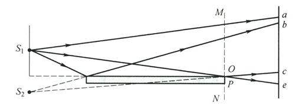

# 波动光学基础

## 光是电磁波

**电磁波的波源**：凡是做**加速运动**的电荷或电荷系都是发射电磁波的波源。加速运动的电荷在其周围空间产生**变化的电场**，变化的电场又产生**变化的磁场**，这种电场和磁场互相激发、由近及远地传播，就形成了电磁波。

电磁波是横波，是电场强度 $\boldsymbol{E}$ 与磁场强度 $\boldsymbol{H}$ 的矢量波。

$$\boldsymbol{E}(\boldsymbol{r},t)=\boldsymbol{E}_0\cos\omega(t-\frac{r}{u})$$
$$\boldsymbol{H}(\boldsymbol{r},t)=\boldsymbol{H}_0\cos\omega(t-\frac{r}{u})$$

- $\boldsymbol{E}(\boldsymbol{r},t)$: 电场强度矢量，描述空间某点在某一时刻电场的强弱与方向。
- $\boldsymbol{H}(\boldsymbol{r},t)$: 磁场强度矢量，描述空间某点在某一时刻磁场的强弱与方向。
- $\boldsymbol{r}$: 从坐标原点到场点的**矢径**（位矢）。
- $u$: 电磁波在均匀介质中的**传播速率**。

### 平面简谐电磁波的特性

1.  **电磁波场矢量 $\boldsymbol{E}$ 和 $\boldsymbol{H}$** 在同一地点同时存在，相位相同，并以相同的速度传播。
2.  $\boldsymbol{E}$ 和 $\boldsymbol{H}$ 互相垂直，且两者都与波的传播方向（波速 $\boldsymbol{u}$ 的方向）垂直，$\boldsymbol{E}$, $\boldsymbol{H}$, $\boldsymbol{u}$ 三者满足**右手螺旋定则**。
3.  在空间任意一点处，$\boldsymbol{E}$ 和 $\boldsymbol{H}$ 的**振幅在量值上满足关系**：
    $$\sqrt{\varepsilon}E_0 = \sqrt{\mu}H_0$$
    其中 $\varepsilon = \varepsilon_r \varepsilon_0$, $\mu = \mu_r \mu_0$ 分别是介质的总介电常数和总磁导率。
4.  电磁波的传播速率 $u$ 由介质的介电常数 $\varepsilon$ 和磁导率 $\mu$ **共同决定**：
    $$u = \sqrt{\frac{1}{\varepsilon \mu}}$$

    > 💡 **提示**：
    > - 在**真空**中，$\varepsilon_r = 1$, $\mu_r = 1$，电磁波的传播速率即为真空中的光速：
    >   $$c = \frac{1}{\sqrt{\varepsilon_0 \mu_0}} \approx 2.9979 \times 10^8  \text{m/s}$$
    > - $\varepsilon_0$ 是**真空介电常数**，$\mu_0$ 是**真空磁导率**，都是基本物理常数。
    > - $\varepsilon_r$ 是介质的**相对介电常数**（或称**介电常数**），$\mu_r$ 是介质的**相对磁导率**。

5.  电磁波在两种不同介质的分界面上会发生**反射**和**折射**。电磁波在真空中的速率 $c$ 与在某种介质中的速率 $u$ 之比称为该介质的**绝对折射率 $n$**（简称折射率）：
    $$n = \frac{c}{u} = \sqrt{\varepsilon_r \mu_r}$$
    对于**非铁磁性介质**，$\mu_r \approx 1$，因此折射率 $n$ 可近似为：
    $$n \approx \sqrt{\varepsilon_r}$$

### 电磁波的能量

电磁波是电磁场在空间的传播，电磁场是具有能量的，电磁波的传播伴随着电磁能的传播，电磁波所携带的电磁能也称辐射能。单位时间通过垂直电磁波传播方向单位面积的辐射能称为能流密度。

已知电场和磁场的能量密度分别为：
$$w_e=\frac{1}{2}\varepsilon E^2, \quad w_m=\frac{1}{2}\mu H^2$$
所以电磁场总的能量密度为：
$$w=w_e+w_m=\frac{1}{2}(\varepsilon E^2+\mu H^2)$$

设在垂直于电磁波传播方向上取一面积元 $dA$，则在 $dt$ 时间内通过面积元 $dA$ 的辐射能应为 $wudAdt$，则能流密度（即坡印廷矢量的大小）为：
$$S=\frac{wudAdt}{dAdt}=wu=\frac{1}{2}(\varepsilon{E}^2+\mu{H}^2)\sqrt\frac{1}{\varepsilon\mu}$$
也可表示为：
$$S=EH$$

$\boldsymbol{E}、\boldsymbol{H}和\boldsymbol{u}$ 三者构成右螺旋关系，而辐射能的传播方向与波速一致，因此，坡印廷矢量可表示为：
$$\boldsymbol{S}=\boldsymbol{E} \times \boldsymbol{H}$$

对平面简谐电磁波，上式可写成：
$$\boldsymbol{S}=\boldsymbol{E_0} \times \boldsymbol{H_0}\cos\omega(t-\frac{r}{u})$$
显然 $\boldsymbol{S}$ 的大小在极大值与极小值之间做周期性变化。频率很高时，$\boldsymbol{S}$ 是一个随时间变化很快的函数，难以测量，因此我们用求平均值的方法量度电磁波能流密度的大小。在一个周期 $T$ 内平均能流密度的大小用 $I$ 表示，有：
$$I=\langle S \rangle=\frac{1}{T}\int_t^{t+T}EH  dt$$
**其中符号 $\langle\;\rangle$ 表示对时间的平均**。

在光学中通常把平均能流密度 $I$ 称为光强。

平面简谐电磁波的平均能流密度为：
$$I=\frac{1}{T}\int_t^{t+T}E_0H_0\cos^2\omega(t-\frac{r}{u})  dt=\frac{1}{2}E_0H_0=\frac{1}{2}\sqrt{\frac{\varepsilon}{\mu}}E_0^2$$
平均能流密度正比于电磁波中电场强度振幅的平方。

一般常用平均能流密度的相对大小而不是其绝对值，此时：
$$I \propto \frac{1}{2}E_0^2$$
该表达式是从平面简谐波导出并且定义的，但是其对一般类型的波也是适用的，至少可作近似表达式。

### 光的特性

- 可见光的波长范围为 **0.4 ~ 0.76 μm**（微米）。
- 对应的频率范围为 **7.5 × 10¹⁴ Hz ~ 3.9 × 10¹⁴ Hz**。
- 引起视觉和光化学效应的是光波中的**电场矢量 $\boldsymbol{E}$**。
- 由于带电粒子受电场的作用力远大于磁场作用力，因此常将 $\boldsymbol{E}$ 矢量称为**光矢量**。
- 光强通常用 $\boldsymbol{E}$ 表示而不用 $\boldsymbol{H}$。

## 光源与光波的叠加

### 光源

**光源**：指发光的物体。任何发光过程都伴随着物体内部的能量变化。

**发光机理**：当原子或分子从**高能态**跃迁到**低能态**时，如果能量以光的形式释放，物体就会发光。

**常见发光过程**：
- **热辐射**：物体因加热而发光（如白炽灯）。
- **电致发光**：电能直接转换为光能（如LED、气体放电）。
- **光致发光**：物质吸收光子后重新辐射出光（如荧光、磷光）。
- **化学发光**：化学反应过程中产生的光（如萤火虫）。

光源发出的光是大量**简谐波**的叠加，这些光波的**频率**和**振幅**通常各不相同。

### 光波的叠加

#### 干涉现象

当两束光波满足以下相干条件时：
1. **频率相同**
2. **振动方向平行**
3. **相位差恒定**

在光波重叠区域会出现：
- 某些点合成光强**大于**分光强之和
- 某些点合成光强**小于**分光强之和
- 形成明暗相间、稳定分布的**干涉条纹**

这种叠加称为**相干叠加**，满足条件的光称为**相干光**。

不满足相干条件的叠加称为**非相干叠加**。

#### 数学描述

设两光波在 $P$ 点的振动方程为：
$$E_1 = E_{01} \cos(\omega_1 t - \frac{\omega_1 r_1}{u} + \varphi_1)$$
$$E_2 = E_{02} \cos(\omega_2 t - \frac{\omega_2 r_2}{u} + \varphi_2)$$

$P$ 点的合光矢量 $\boldsymbol{E}_P$ 为：
$$\boldsymbol{E}_P = \boldsymbol{E}_1 + \boldsymbol{E}_2$$

合振动的光强 $I_P$ 与合振幅的平方成正比，即：
$$
\begin{aligned}
I_P & \propto E_P^2 = (\boldsymbol{E}_1 + \boldsymbol{E}_2)^2 \\
& = E_1^2 + E_2^2 + 2 \boldsymbol{E}_1 \cdot \boldsymbol{E}_2
\end{aligned}
$$
对时间求平均后，得到合成光强：
$$I_P = I_1 + I_2 + 2 \langle \boldsymbol{E}_1 \cdot \boldsymbol{E}_2 \rangle$$

其中第三项 $2 \langle \boldsymbol{E}_1 \cdot \boldsymbol{E}_2 \rangle$ 称为干涉项，决定了两光波叠加的性质。

##### 干涉项 $\langle \boldsymbol{E}_1 \cdot \boldsymbol{E}_2 \rangle$ 的展开

两项点积的结果为：
$$
\begin{aligned}
\boldsymbol{E}_1 \cdot \boldsymbol{E}_2 &= E_{01} E_{02} \cos(\omega_1 t + \alpha_1) \cos(\omega_2 t + \alpha_2) \\
&= \frac{1}{2} E_{01} E_{02} \left\{ \cos[(\omega_1 + \omega_2)t + (\alpha_1 + \alpha_2)] + \cos[(\omega_1 - \omega_2)t + (\alpha_1 - \alpha_2)] \right\}
\end{aligned}
$$
其中 $\alpha_1 = -\frac{\omega_1 r_1}{u} + \varphi_1$, $\alpha_2 = -\frac{\omega_2 r_2}{u} + \varphi_2$。

对时间求平均：
$$
\langle \boldsymbol{E}_1 \cdot \boldsymbol{E}_2 \rangle = \frac{1}{2} E_{01} E_{02} \langle \cos[(\omega_1 + \omega_2)t + (\alpha_1 + \alpha_2)] \rangle + \frac{1}{2} E_{01} E_{02} \langle \cos[(\omega_1 - \omega_2)t + (\alpha_1 - \alpha_2)] \rangle
$$

#### 叠加类型分析

**1. 非相干叠加**（干涉项为零）：
- 当 $\boldsymbol{E}_1 \perp \boldsymbol{E}_2$ 时，$\langle \boldsymbol{E}_1 \cdot \boldsymbol{E}_2 \rangle = 0$。
- 当 $\omega_1 \neq \omega_2$ 时，$\langle \boldsymbol{E}_1 \cdot \boldsymbol{E}_2 \rangle = 0$。
- 当 $\omega_1 = \omega_2$ 但相位差 $(\varphi_1 - \varphi_2)$ 不恒定，时间平均 $\langle \boldsymbol{E}_1 \cdot \boldsymbol{E}_2 \rangle = 0$。

此时合成光强为两光强直接相加：
$$I_P = I_1 + I_2$$

**2. 相干叠加**：
当满足相干条件时，干涉项不为零。设 $\omega_1 = \omega_2 = \omega$，相位差 $\Delta \varphi$ 恒定：

$$I_P = I_1 + I_2 + 2\sqrt{I_1 I_2} \cos(\Delta \varphi)$$

其中相位差：
$$\Delta \varphi = \varphi_2 - \varphi_1 + \frac{\omega}{u}(r_1 - r_2)$$

- 当 $\Delta \varphi = \pm 2k\pi$ ($k = 0, 1, 2, \ldots$) 时，$\cos(\Delta \varphi) = 1$，出现**明条纹**：
  $$I_{\text{max}} = I_1 + I_2 + 2\sqrt{I_1 I_2}$$

- 当 $\Delta \varphi = \pm (2k+1)\pi$ ($k = 0, 1, 2, \ldots$) 时，$\cos(\Delta \varphi) = -1$，出现**暗条纹**：
  $$I_{\text{min}} = I_1 + I_2 - 2\sqrt{I_1 I_2}$$

- 特别地，当 $I_1 = I_2 = I_0$ 时：
  $$I_{\text{max}} = 4I_0,\quad I_{\text{min}} = 0$$
  干涉条纹对比度最大，效果最明显。

通常取可见度 $\eta$ 作为条纹清晰度的量度：
$$\eta=\frac{I_{\text{max}}-I_{\text{min}}}{I_{\text{max}}+I_{\text{min}}}$$
可以看出，当 $I_{\text{min}}=0$ (暗纹全暗) 时，$\eta=1$，此时条纹最清晰；当 $I_{\text{min}} \to I_{\text{max}}$ 时，$\eta \to 0$，条纹模糊不清。

**总结**：
干涉项不为零时，光波的叠加称为相干叠加，产生稳定的干涉图样。
两束光产生干涉的条件（称为相干条件）有：
* 频率相同
* 相位差恒定
* 光矢量振动方向平行
### 获得相干光的方法：杨氏双缝实验

#### 实验装置与假设
- $S_1S_2 = d$：双缝间距
- $D$：双缝到屏幕的距离
- $D \gg d$：实现近似计算的关键条件
- $P$：屏上任意一点，坐标为 $(x, y)$
- $r_1, r_2$：分别表示 $S_1$, $S_2$ 到 P 点的距离

#### 波程差推导
根据几何关系：
$$r_1^2 = D^2 + \left(x - \frac{d}{2}\right)^2$$
$$r_2^2 = D^2 + \left(x + \frac{d}{2}\right)^2$$

两式相减：
$$r_2^2 - r_1^2 = (r_2 - r_1)(r_2 + r_1) = 2xd$$

波程差表达式：
$$\delta = r_2 - r_1 = \frac{2xd}{r_2 + r_1}$$

利用近似条件 $D \gg d$：
$$r_2 + r_1 \approx 2D$$

得到波程差的近似表达式：
$$\delta = \frac{xd}{D}$$

相应的两相干波在 P 点相位差为：
$$\Delta\varphi=\varphi_1-\varphi_2+\frac{\omega}{c}\delta=\varphi_1-\varphi_2+\frac{2\pi}{\lambda}\delta$$
由实验条件知 $\varphi_1=\varphi_2$，可得两相干波在 P 点的相位差：
$$\Delta \varphi = \frac{2\pi}{\lambda} \delta = \frac{2\pi}{\lambda} \cdot \frac{xd}{D}$$

#### 干涉条件与条纹特征

**明纹条件（相长干涉）：**
$$\delta = \frac{xd}{D} = \pm k\lambda \quad (k = 0, 1, 2, ...)$$
明纹位置：
$$x = \pm k \frac{D\lambda}{d}$$

**暗纹条件（相消干涉）：**
$$\delta = \frac{xd}{D} = \pm (2k+1)\frac{\lambda}{2} \quad (k = 0, 1, 2, ...)$$
暗纹位置：
$$x = \pm (2k+1) \frac{D\lambda}{2d}$$

条纹的位置只与 x 有关，条纹的走向是平行于 y 轴的。

1. **条纹间距**：
   屏上相邻明条纹或相邻暗条纹间距为：
   $$\Delta x = \frac{D\lambda}{d}$$
   由于光的波长 $\lambda$ 值很小，只有 d 足够小而 D 足够大，使得干涉条纹间距 $\Delta x$ 大到可以分辨，才会观察到干涉条纹。对一定波长 $\lambda$ 的单色光，相邻条纹间距相等。

2. **波长测量**：
   对入射的单色光，若已知 d 和 D 值，可以测出 k 级条纹与中央明条纹的距离而算出单色光的波长 $\lambda$ 值。

3. **波长与条纹关系**：
   若 d 与 D 保持不变，$\Delta x$ 正比于波长 $\lambda$，波长大的相邻条纹间距大，波长小的相邻条纹间距小。

4. **装置参数影响**：
   - $\Delta x \propto D$：屏幕越远，条纹越疏
   - $\Delta x \propto \frac{1}{d}$：缝距越小，条纹越疏

#### 物理意义
杨氏双缝实验首次在实验上证实了：
- 光的波动性
- 光的干涉现象
- 提供了一种精确测量光波波长的方法
- 为光的波动说奠定了实验基础

> **提示**：实际实验中，为了获得清晰的干涉条纹，需要保证 $D \gg d$ 的条件成立，通常 $d$ 约为 $0.1\text{mm}$ 量级，$D$ 约为 $1\text{m}$ 量级。

### 获得相干光的方法：劳埃德镜实验

#### 实验装置与构造
根据图示，劳埃德镜实验装置包含：
- **劳埃德镜**：一块**下表面涂黑的平玻璃片或金属平板**
- **光源**：狭缝 $S_1$
- **反射面**：光线以**掠入射角**（近90°的入射角）入射
- **虚光源**：反射光如同从 $S_1$ 的虚像 $S_2$ 发出
- **观测屏**：接收干涉条纹，特别关注与镜面边缘接触的区域

#### 实验原理与干涉机制
$S_1$ 和 $S_2$ 形成一对**相干光源**，它们发出的光在屏上（bc区）相遇，产生明暗相间的干涉条纹。

**波程差计算：**
设 $S_1S_2 = d$（等效双光源间距），$D$ 为光源到屏幕的距离

屏上任意点 P 的波程差：
$$\delta = \frac{xd}{D}$$

**干涉条件：**
- 明纹条件：$\delta = \pm k\lambda \quad (k = 0, 1, 2, ...)$
- 暗纹条件：$\delta = \pm (2k+1)\frac{\lambda}{2} \quad (k = 0, 1, 2, ...)$

#### 关键现象：半波损失的实验证据

**实验发现：**
当屏移到与平面镜边缘接触处（图中接触点）：
- 理论计算：波程差为零，应出现**明条纹**
- 实际观测：却出现**暗条纹**
- 所有条纹的明暗情况都与理论预期相反

**物理解释：**
这是由于光从**光疏介质射向光密介质**（空气→玻璃）在分界面反射时，发生了相位差 $\pi$ 的突变，等效于反射光的波程附加了半个波长：

$$\delta_{\text{实际}} = \frac{xd}{D} + \frac{\lambda}{2}$$

因此在接触点处：
$$\delta_{\text{实际}} = \frac{\lambda}{2}$$
正好满足暗纹条件，完美解释了实验现象。

#### 实验设计的关键要点

采用**掠入射**形式的两个重要原因：
1. **保证相位改变 $\pi$**：确保发生半波损失现象
2. **获得相近振幅**：使反射光与直射光具有相近的振幅，从而获得清晰、对比度高的干涉条纹

> 💡 **理论说明**：这两点的严格理论证明超出了基础教材的范围，但实验现象明确证实了其正确性。

#### 重要结论与物理意义

1. **证实半波损失**：为光的电磁理论提供了关键实验证据
2. **验证相位突变**：证实光在光密介质反射时会发生 $\pi$ 的相位跃变
3. **波动性验证**：进一步证实了光的波动性质
4. **实验方法价值**：提供了一种简单有效的获得相干光的方法

**实践提示：**
- 在计算光波叠加时，若存在半波损失，必须计入附加的 $\frac{\lambda}{2}$ 波程差
- 忽略半波损失会导致与实际情况完全相反的结果
- 劳埃德镜实验装置简单，但现象明显，是演示光干涉和半波损失的经典实验