# 波动光学基础
## 波动的基本概念

### 波的产生与传播
**波**是振动在介质中的传播过程，是能量传递的一种形式。

**波源**：能够产生振动的物体或系统称为波源。
**介质**：波传播所依靠的物质称为介质（机械波需要介质，电磁波不需要介质）。

**波动过程的特点**：
1.  各质元只在各自平衡位置附近振动，并不"随波逐流"
2.  振动状态（相位）以波速向前传播
3.  波是能量传递的一种方式

### 波的分类
1.  **按振动方向与传播方向的关系分**：
    - **横波**：质元的振动方向与波的传播方向垂直（如电磁波、弦上的波）
    - **纵波**：质元的振动方向与波的传播方向平行（如声波）

2.  **按波阵面的形状分**：
    - **平面波**：波阵面为平面的波
    - **球面波**：波阵面为球面的波
    - **柱面波**：波阵面为柱面的波

3.  **按波的传播特性分**：
    - **行波**：在介质中传播的波
    - **驻波**：两列振幅相同的相干波在同一直线上沿相反方向传播时叠加形成的波

### 描述波动的物理量
- **波长 $\lambda$**：同一波线上相位差为 $2\pi$ 的两点间的距离
- **周期 $T$**：波传播一个波长距离所需的时间
- **频率 $\nu$**：单位时间内通过某点的完整波的个数，$\nu = \frac{1}{T}$
- **波速 $u$**：波在介质中的传播速度，$u = \frac{\lambda}{T} = \lambda\nu$
- **角频率 $\omega$**：$\omega = 2\pi\nu = \frac{2\pi}{T}$
- **波数 $k$**：$k = \frac{2\pi}{\lambda}$，表示 $2\pi$ 长度内包含的完整波个数

### 波函数
描述波在空间中传播的数学表达式称为波函数。

**沿 x 轴正方向传播的平面简谐波的波函数**：
$$y(x,t) = A\cos\left[\omega\left(t - \frac{x}{u}\right) + \varphi_0\right]$$
或
$$y(x,t) = A\cos\left(\omega t - kx + \varphi_0\right)$$

其中：
- $y(x,t)$：在位置 x、时刻 t 的振动位移
- $A$：振幅
- $\varphi_0$：初相位

**波函数的物理意义**：
1.  当 $x$ 固定时，表示该点的简谐振动方程
2.  当 $t$ 固定时，表示该时刻波线上各点的位移分布（波形图）
3.  当 $x$ 和 $t$ 都变化时，表示波形的传播
## 光是电磁波

**电磁波的波源**：凡是做**加速运动**的电荷或电荷系都是发射电磁波的波源。加速运动的电荷在其周围空间产生**变化的电场**，变化的电场又产生**变化的磁场**，这种电场和磁场互相激发、由近及远地传播，就形成了电磁波。

电磁波是横波，是电场强度 $\boldsymbol{E}$ 与磁场强度 $\boldsymbol{H}$ 的矢量波。

$$\boldsymbol{E}(\boldsymbol{r},t)=\boldsymbol{E}_0\cos\omega(t-\frac{r}{u})$$
$$\boldsymbol{H}(\boldsymbol{r},t)=\boldsymbol{H}_0\cos\omega(t-\frac{r}{u})$$

- $\boldsymbol{E}(\boldsymbol{r},t)$: 电场强度矢量，描述空间某点在某一时刻电场的强弱与方向。
- $\boldsymbol{H}(\boldsymbol{r},t)$: 磁场强度矢量，描述空间某点在某一时刻磁场的强弱与方向。
- $\boldsymbol{r}$: 从坐标原点到场点的**矢径**（位矢）。
- $u$: 电磁波在均匀介质中的**传播速率**。

### 平面简谐电磁波的特性

1.  **电磁波场矢量 $\boldsymbol{E}$ 和 $\boldsymbol{H}$** 在同一地点同时存在，相位相同，并以相同的速度传播。
2.  $\boldsymbol{E}$ 和 $\boldsymbol{H}$ 互相垂直，且两者都与波的传播方向（波速 $\boldsymbol{u}$ 的方向）垂直，$\boldsymbol{E}$, $\boldsymbol{H}$, $\boldsymbol{u}$ 三者满足**右手螺旋定则**。
3.  在空间任意一点处，$\boldsymbol{E}$ 和 $\boldsymbol{H}$ 的**振幅在量值上满足关系**：
    $$\sqrt{\varepsilon}E_0 = \sqrt{\mu}H_0$$
    其中 $\varepsilon = \varepsilon_r \varepsilon_0$, $\mu = \mu_r \mu_0$ 分别是介质的总介电常数和总磁导率。
4.  电磁波的传播速率 $u$ 由介质的介电常数 $\varepsilon$ 和磁导率 $\mu$ **共同决定**：
    $$u = \sqrt{\frac{1}{\varepsilon \mu}}$$

    > 💡 **提示**：
    > - 在**真空**中，$\varepsilon_r = 1$, $\mu_r = 1$，电磁波的传播速率即为真空中的光速：
    >   $$c = \frac{1}{\sqrt{\varepsilon_0 \mu_0}} \approx 2.9979 \times 10^8  \text{m/s}$$
    > - $\varepsilon_0$ 是**真空介电常数**，$\mu_0$ 是**真空磁导率**，都是基本物理常数。
    > - $\varepsilon_r$ 是介质的**相对介电常数**（或称**介电常数**），$\mu_r$ 是介质的**相对磁导率**。

5.  电磁波在两种不同介质的分界面上会发生**反射**和**折射**。电磁波在真空中的速率 $c$ 与在某种介质中的速率 $u$ 之比称为该介质的**绝对折射率 $n$**（简称折射率）：
    $$n = \frac{c}{u} = \sqrt{\varepsilon_r \mu_r}$$
    对于**非铁磁性介质**，$\mu_r \approx 1$，因此折射率 $n$ 可近似为：
    $$n \approx \sqrt{\varepsilon_r}$$

### 电磁波的能量

电磁波是电磁场在空间的传播，电磁场是具有能量的，电磁波的传播伴随着电磁能的传播，电磁波所携带的电磁能也称辐射能。单位时间通过垂直电磁波传播方向单位面积的辐射能称为能流密度。

已知电场和磁场的能量密度分别为：
$$w_e=\frac{1}{2}\varepsilon E^2, \quad w_m=\frac{1}{2}\mu H^2$$
所以电磁场总的能量密度为：
$$w=w_e+w_m=\frac{1}{2}(\varepsilon E^2+\mu H^2)$$

设在垂直于电磁波传播方向上取一面积元 $dA$，则在 $dt$ 时间内通过面积元 $dA$ 的辐射能应为 $wudAdt$，则能流密度（即坡印廷矢量的大小）为：
$$S=\frac{wudAdt}{dAdt}=wu=\frac{1}{2}(\varepsilon{E}^2+\mu{H}^2)\sqrt\frac{1}{\varepsilon\mu}$$
也可表示为：
$$S=EH$$

$\boldsymbol{E}、\boldsymbol{H}和\boldsymbol{u}$ 三者构成右螺旋关系，而辐射能的传播方向与波速一致，因此，坡印廷矢量可表示为：
$$\boldsymbol{S}=\boldsymbol{E} \times \boldsymbol{H}$$

对平面简谐电磁波，上式可写成：
$$\boldsymbol{S}=\boldsymbol{E_0} \times \boldsymbol{H_0}\cos^2\omega(t-\frac{r}{u})$$
显然 $\boldsymbol{S}$ 的大小在极大值与极小值之间做周期性变化。频率很高时，$\boldsymbol{S}$ 是一个随时间变化很快的函数，难以测量，因此我们用求平均值的方法量度电磁波能流密度的大小。在一个周期 $T$ 内平均能流密度的大小用 $I$ 表示，有：
$$I=\langle S \rangle=\frac{1}{T}\int_t^{t+T}EH  dt$$
**其中符号 $\langle\;\rangle$ 表示对时间的平均**。

在光学中通常把平均能流密度 $I$ 称为光强。

平面简谐电磁波的平均能流密度为：
$$I=\frac{1}{T}\int_t^{t+T}E_0H_0\cos^2\omega(t-\frac{r}{u})  dt=\frac{1}{2}E_0H_0=\frac{1}{2}\sqrt{\frac{\varepsilon}{\mu}}E_0^2$$
平均能流密度正比于电磁波中电场强度振幅的平方。

一般常用平均能流密度的相对大小而不是其绝对值，此时：
$$I = \frac{1}{2}E_0^2$$
该表达式是从平面简谐波导出并且定义的，但是其对一般类型的波也是适用的，至少可作近似表达式。

### 光的特性

- 可见光的波长范围为 **0.4 ~ 0.76 μm**（微米）。
- 对应的频率范围为 **7.5 × 10¹⁴ Hz ~ 3.9 × 10¹⁴ Hz**。
- 引起视觉和光化学效应的是光波中的**电场矢量 $\boldsymbol{E}$**。
- 由于带电粒子受电场的作用力远大于磁场作用力，因此常将 $\boldsymbol{E}$ 矢量称为**光矢量**。
- 光强通常用 $\boldsymbol{E}$ 表示而不用 $\boldsymbol{H}$。

## 光源与光波的叠加

### 光源

**光源**：指发光的物体。任何发光过程都伴随着物体内部的能量变化。

**发光机理**：当原子或分子从**高能态**跃迁到**低能态**时，如果能量以光的形式释放，物体就会发光。

**常见发光过程**：
- **热辐射**：物体因加热而发光（如白炽灯）。
- **电致发光**：电能直接转换为光能（如LED、气体放电）。
- **光致发光**：物质吸收光子后重新辐射出光（如荧光、磷光）。
- **化学发光**：化学反应过程中产生的光（如萤火虫）。

光源发出的光是大量**简谐波**的叠加，这些光波的**频率**和**振幅**通常各不相同。

### 光波的叠加

#### 球面波与平面波

一个点波源在各向同性介质中振动时，其产生的波以波源为中心，沿径向传播，波阵面是球面，这种波称为**球面波**。

球面简谐波的波函数为：
$$E(r, t) = \frac{A}{r} \cos(\omega t - kr + \varphi_0)$$
或采用复数形式表示：
$$\tilde{E}(r, t) = \frac{\tilde{A}}{r} e^{i(kr - \omega t)}$$

- $r$: 波源到场点的距离。
- $A$: 一个常量，与波源的强度有关，具有"长度×电场强度"的量纲。
- $\frac{A}{r}$: **振幅**。这表明球面波的振幅与到波源的距离 $r$ 成反比。
- $k=\frac{2\pi}{\lambda}$: 波数。

**物理意义**：振幅衰减的根源是**能量守恒**。波源发出的功率 $P$ 是恒定的，它会均匀地分散在不断扩大的球面波阵面 $4\pi r^2$ 上。能流密度（光强）$I \propto E_0^2 \propto \frac{P}{4\pi r^2}$，因此振幅 $E_0$ 必然与 $r$ 成反比，即 $E_0 = \frac{A}{r}$。

当观察者离波源非常远，或者只考虑波阵面上一个很小的局部区域时，球面波可以近似看作是**平面波**，其振幅在传播过程中保持不变。前面讨论的平面波表达式可以看作是球面波在 $r \to \infty$ 时的极限情况。

在杨氏双缝等实验中，因为满足 $D \gg d$ 的条件，$S_1$ 和 $S_2$ 到屏上观测点 $P$ 的距离 $r_1$ 和 $r_2$ 相差很小，因此两列波在 $P$ 点的振幅 $E_{01} \approx E_{02}$，可以近似认为相等，从而推导出简洁的干涉光强公式 $I_P = I_1 + I_2 + 2\sqrt{I_1 I_2} \cos(\Delta\varphi)$ 和 $I_{max} = 4I_0$。如果此条件不满足，则需考虑振幅差异对干涉条纹可见度 $\eta$ 的影响。

#### 干涉现象

当两束光波满足以下相干条件时：
1. **频率相同**
2. **振动方向平行**
3. **相位差恒定**

💡 尽管振幅相差不大并不是光波发生相干的必要条件，但它是获得高对比度、清晰可见的干涉条纹的重要条件。

在光波重叠区域会出现：
- 某些点合成光强**大于**分光强之和
- 某些点合成光强**小于**分光强之和
- 形成明暗相间、稳定分布的**干涉条纹**

这种叠加称为**相干叠加**，满足条件的光称为**相干光**。

不满足相干条件的叠加称为**非相干叠加**。

#### 数学描述

设两光波在 $P$ 点的振动方程为：
$$E_1 = E_{01} \cos(\omega_1 t - \frac{\omega_1 r_1}{u} + \varphi_1)$$
$$E_2 = E_{02} \cos(\omega_2 t - \frac{\omega_2 r_2}{u} + \varphi_2)$$

$P$ 点的合光矢量 $\boldsymbol{E}_P$ 为：
$$\boldsymbol{E}_P = \boldsymbol{E}_1 + \boldsymbol{E}_2$$

合振动的光强 $I_P$ 与合振幅的平方成正比，即：
$$
\begin{aligned}
I_P & \propto E_P^2 = (\boldsymbol{E}_1 + \boldsymbol{E}_2)^2 \\
& = E_1^2 + E_2^2 + 2 \boldsymbol{E}_1 \cdot \boldsymbol{E}_2
\end{aligned}
$$
对时间求平均后，得到合成光强：
$$I_P = I_1 + I_2 + 2 \langle \boldsymbol{E}_1 \cdot \boldsymbol{E}_2 \rangle$$

其中第三项 $2 \langle \boldsymbol{E}_1 \cdot \boldsymbol{E}_2 \rangle$ 称为干涉项，决定了两光波叠加的性质。

##### 干涉项 $\langle \boldsymbol{E}_1 \cdot \boldsymbol{E}_2 \rangle$ 的展开

两项点积的结果为：
$$
\begin{aligned}
\boldsymbol{E}_1 \cdot \boldsymbol{E}_2 &= E_{01} E_{02} \cos(\omega_1 t + \alpha_1) \cos(\omega_2 t + \alpha_2) \\
&= \frac{1}{2} E_{01} E_{02} \left\{ \cos[(\omega_1 + \omega_2)t + (\alpha_1 + \alpha_2)] + \cos[(\omega_1 - \omega_2)t + (\alpha_1 - \alpha_2)] \right\}
\end{aligned}
$$
其中 $\alpha_1 = -\frac{\omega_1 r_1}{u} + \varphi_1$, $\alpha_2 = -\frac{\omega_2 r_2}{u} + \varphi_2$。

对时间求平均：
$$
\langle \boldsymbol{E}_1 \cdot \boldsymbol{E}_2 \rangle = \frac{1}{2} E_{01} E_{02} \langle \cos[(\omega_1 + \omega_2)t + (\alpha_1 + \alpha_2)] \rangle + \frac{1}{2} E_{01} E_{02} \langle \cos[(\omega_1 - \omega_2)t + (\alpha_1 - \alpha_2)] \rangle
$$

#### 叠加类型分析

**1. 非相干叠加**（干涉项为零）：
- 当 $\boldsymbol{E}_1 \perp \boldsymbol{E}_2$ 时，$\langle \boldsymbol{E}_1 \cdot \boldsymbol{E}_2 \rangle = 0$。
- 当 $\omega_1 \neq \omega_2$ 时，$\langle \boldsymbol{E}_1 \cdot \boldsymbol{E}_2 \rangle = 0$。
- 当 $\omega_1 = \omega_2$ 但相位差 $(\varphi_1 - \varphi_2)$ 不恒定，时间平均 $\langle \boldsymbol{E}_1 \cdot \boldsymbol{E}_2 \rangle = 0$。

此时合成光强为两光强直接相加：
$$I_P = I_1 + I_2$$

**2. 相干叠加**：
当满足相干条件时，干涉项不为零。设 $\omega_1 = \omega_2 = \omega$，相位差 $\Delta \varphi$ 恒定：

$$I_P = I_1 + I_2 + 2\sqrt{I_1 I_2} \cos(\Delta \varphi)$$

其中相位差：
$$\Delta \varphi = \varphi_1 - \varphi_2 - \frac{\omega}{c}(r_1 - r_2)$$

💡 对于更普遍（所有电磁波）的情况，c可以替换为u，即$$\Delta \varphi = \varphi_1 - \varphi_2 - \frac{\omega}{u}(r_1 - r_2)$$

- 当 $\Delta \varphi = \pm 2k\pi$ ($k = 0, 1, 2, \ldots$) 时，$\cos(\Delta \varphi) = 1$，出现**明条纹**：
  $$I_{\text{max}} = I_1 + I_2 + 2\sqrt{I_1 I_2}$$

- 当 $\Delta \varphi = \pm (2k+1)\pi$ ($k = 0, 1, 2, \ldots$) 时，$\cos(\Delta \varphi) = -1$，出现**暗条纹**：
  $$I_{\text{min}} = I_1 + I_2 - 2\sqrt{I_1 I_2}$$

- 特别地，当 $I_1 = I_2 = I_0$ 时：
  $$I_{\text{max}} = 4I_0,\quad I_{\text{min}} = 0$$
  干涉条纹对比度最大，效果最明显。

通常取可见度 $\eta$ 作为条纹清晰度的量度：
$$\eta=\frac{I_{\text{max}}-I_{\text{min}}}{I_{\text{max}}+I_{\text{min}}}$$
可以看出，当 $I_{\text{min}}=0$ (暗纹全暗) 时，$\eta=1$，此时条纹最清晰；当 $I_{\text{min}} \to I_{\text{max}}$ 时，$\eta \to 0$，条纹模糊不清。

**总结**：
干涉项不为零时，光波的叠加称为相干叠加，产生稳定的干涉图样。
两束光产生干涉的条件（称为相干条件）有：
* 频率相同
* 相位差恒定
* 光矢量振动方向平行
### 获得相干光的方法：杨氏双缝实验

**核心思想：分波前法**

普通光源（如灯丝、太阳）上不同原子或分子发出的光是非相干的，同一原子不同时刻发出的光也是非相干的。为了从普通光源中获得相干光，必须设法将**来自同一波阵面**的同一光波列的能量分为两束，让它们经过不同的路径后再相遇。

杨氏双缝实验的巧妙之处就在于实现了这种"一分为二"的过程，这种方法称为**分波前法**。
1.  **单缝 S₀**：位于光源前，其作用是利用衍射现象，从非相干的普通光源中创造出一个新的、传播方向确定的线光源。更重要的是，**S₀ 限制了光源的尺寸**，使得通过它的光来自于同一波阵面上一个很小的部分，这为产生相干光奠定了基础。
2.  **双缝 S₁ 和 S₂**：位于单缝 S₀ 后的波阵面上。根据惠更斯原理，S₁ 和 S₂ 可以看作是两个新的次波源。因为它们位于 **S₀ 发出的光的同一个波阵面**上，所以它们总是保持**相同的相位** ($\varphi_1 = \varphi_2$)。
3.  **相干光源**：因此，S₁ 和 S₂ 形成了一对**频率相同、振动方向相同、相位差恒定**的相干光源。它们发出的光在空间相遇时，就会产生稳定的干涉图样。

**总结**：杨氏双缝实验通过"先限制（单缝S₀），再分割（双缝S₁、S₂）"的思路，完美地实现了从普通光源中获取相干光的目的，是**分波前法**的典范。

#### 实验装置与假设
- $S_1S_2 = d$：双缝间距
- $D$：双缝到屏幕的距离
- $D \gg d$：实现近似计算的关键条件
- $P$：屏上任意一点，坐标为 $(x, y)$
- $r_1, r_2$：分别表示 $S_1$, $S_2$ 到 P 点的距离

#### 波程差推导
根据几何关系：
$$r_1^2 = D^2 + \left(x - \frac{d}{2}\right)^2$$
$$r_2^2 = D^2 + \left(x + \frac{d}{2}\right)^2$$

两式相减：
$$r_2^2 - r_1^2 = (r_2 - r_1)(r_2 + r_1) = 2xd$$

波程差表达式：
$$\delta = r_2 - r_1 = \frac{2xd}{r_2 + r_1}$$

利用近似条件 $D \gg d$：
$$r_2 + r_1 \approx 2D$$

得到波程差的近似表达式：
$$\delta = \frac{xd}{D}$$

相应的两相干波在 P 点相位差为：
$$\Delta\varphi=\varphi_1-\varphi_2+\frac{\omega}{c}\delta=\varphi_1-\varphi_2+\frac{2\pi}{\lambda}\delta$$
由实验条件知 $\varphi_1=\varphi_2$，可得两相干波在 P 点的相位差：
$$\Delta \varphi = \frac{2\pi}{\lambda} \delta = \frac{2\pi}{\lambda} \cdot \frac{xd}{D}$$

#### 干涉条件与条纹特征

**明纹条件（相长干涉）：**
$$\delta = \frac{xd}{D} = \pm k\lambda \quad (k = 0, 1, 2, ...)$$
明纹位置：
$$x = \pm k \frac{D\lambda}{d}$$

**暗纹条件（相消干涉）：**
$$\delta = \frac{xd}{D} = \pm (2k+1)\frac{\lambda}{2} \quad (k = 0, 1, 2, ...)$$
暗纹位置：
$$x = \pm (2k+1) \frac{D\lambda}{2d}$$

条纹的位置只与 x 有关，条纹的走向是平行于 y 轴的。

1. **条纹间距**：
   屏上相邻明条纹或相邻暗条纹间距为：
   $$\Delta x = \frac{D\lambda}{d}$$
   由于光的波长 $\lambda$ 值很小，只有 d 足够小而 D 足够大，使得干涉条纹间距 $\Delta x$ 大到可以分辨，才会观察到干涉条纹。对一定波长 $\lambda$ 的单色光，相邻条纹间距相等。

2. **波长测量**：
   对入射的单色光，若已知 d 和 D 值，可以测出 k 级条纹与中央明条纹的距离而算出单色光的波长 $\lambda$ 值。

3. **波长与条纹关系**：
   若 d 与 D 保持不变，$\Delta x$ 正比于波长 $\lambda$，波长大的相邻条纹间距大，波长小的相邻条纹间距小。

4. **装置参数影响**：
   - $\Delta x \propto D$：屏幕越远，条纹越疏
   - $\Delta x \propto \frac{1}{d}$：缝距越小，条纹越疏

#### 相位差与条纹间距的转换关系
干涉条纹的分布本质上是相位差$\Delta\varphi$的空间体现。明暗条纹的位置对应着特定的相位差，而条纹间距则反映了相位差变化$2\pi$所对应的空间距离。
由前述推导，屏上任意点$P$的相位差为：
$$
\Delta\varphi = \frac{2\pi}{\lambda}\delta = \frac{2\pi}{\lambda} \cdot \frac{xd}{D}
$$
* 1. 相邻条纹的相位差
相邻两明纹（或暗纹）对应点的相位差正好变化\( 2\pi \)。
$$
\Delta\varphi_{k+1} - \Delta\varphi_{k} = 2\pi
$$
* 2. 相位差变化与位置变化的关系
对相位差公式求微分，可得相位差变化量\( d(\Delta\varphi) \)与位置变化量\( dx \)之间的关系：
$$
d(\Delta\varphi) = \frac{2\pi}{\lambda} \cdot \frac{d}{D}dx
$$
当\( d(\Delta\varphi) = 2\pi \)时，对应的\( dx \)就是条纹间距\( \Delta x \)，即：
$$2\pi = \frac{2\pi}{\lambda} \cdot \frac{d}{D}\Delta x$$
化简后得到：
$$
\Delta x = \frac{\lambda D}{d}
$$
此结果与通过波程差推导出的条纹间距公式完全一致。

* 3. 重要推论
由上式可以解出：
$$d(\Delta\varphi) = \frac{2\pi}{\Delta x}dx$$

**物理意义**：这表示在干涉场中，位置每移动一个条纹间距\( \Delta x \)，相位差就改变\( 2\pi \)。反之，相位差每改变\( 2\pi \)，干涉条纹就会移动一个条纹间距\( \Delta x \)。
这个关系式\( \Delta x \cdot \Delta(\Delta\varphi) = 2\pi \cdot \Delta x \)在分析条纹移动、测量微小变化（如波长、位移、折射率等）时极为有用。

#### 物理意义
杨氏双缝实验首次在实验上证实了：
- 光的波动性
- 光的干涉现象
- 提供了一种精确测量光波波长的方法
- 为光的波动说奠定了实验基础

> **提示**：实际实验中，为了获得清晰的干涉条纹，需要保证 $D \gg d$ 的条件成立，通常 $d$ 约为 $0.1\text{mm}$ 量级，$D$ 约为 $1\text{m}$ 量级。

### 获得相干光的方法：劳埃德镜实验

#### 实验装置与构造
根据图示，劳埃德镜实验装置包含：
- **劳埃德镜**：一块**下表面涂黑的平玻璃片或金属平板**
- **光源**：狭缝 $S_1$
- **反射面**：光线以**掠入射角**（近90°的入射角）入射
- **虚光源**：反射光如同从 $S_1$ 的虚像 $S_2$ 发出
- **观测屏**：接收干涉条纹，特别关注与镜面边缘接触的区域

#### 实验原理与干涉机制
$S_1$ 和 $S_2$ 形成一对**相干光源**，它们发出的光在屏上（bc区）相遇，产生明暗相间的干涉条纹。

**波程差计算：**
设 $S_1S_2 = d$（等效双光源间距），$D$ 为光源到屏幕的距离

屏上任意点 P 的波程差：
$$\delta = \frac{xd}{D}$$

**干涉条件：**
- 明纹条件：$\delta = \pm k\lambda \quad (k = 0, 1, 2, ...)$
- 暗纹条件：$\delta = \pm (2k+1)\frac{\lambda}{2} \quad (k = 0, 1, 2, ...)$

#### 关键现象：半波损失的实验证据

**实验发现：**
当屏移到与平面镜边缘接触处（图中接触点）：
- 理论计算：波程差为零，应出现**明条纹**
- 实际观测：却出现**暗条纹**
- 所有条纹的明暗情况都与理论预期相反

**物理解释：**
这是由于光从**光疏介质射向光密介质**（空气→玻璃）在分界面反射时，发生了相位差 $\pi$ 的突变，等效于反射光的波程附加了半个波长：

$$\delta_{\text{实际}} = \frac{xd}{D} + \frac{\lambda}{2}$$

因此在接触点处：
$$\delta_{\text{实际}} = \frac{\lambda}{2}$$
正好满足暗纹条件，完美解释了实验现象。

#### 实验设计的关键要点

采用**掠入射**形式的两个重要原因：
1. **保证相位改变 $\pi$**：确保发生半波损失现象
2. **获得相近振幅**：使反射光与直射光具有相近的振幅，从而获得清晰、对比度高的干涉条纹

> 💡 **理论说明**：这两点的严格理论证明超出了基础教材的范围，但实验现象明确证实了其正确性。

#### 重要结论与物理意义

1. **证实半波损失**：为光的电磁理论提供了关键实验证据
2. **验证相位突变**：证实光在光密介质反射时会发生 $\pi$ 的相位跃变
3. **波动性验证**：进一步证实了光的波动性质
4. **实验方法价值**：提供了一种简单有效的获得相干光的方法

**实践提示：**
- 在计算光波叠加时，若存在半波损失，必须计入附加的 $\frac{\lambda}{2}$ 波程差
- 忽略半波损失会导致与实际情况完全相反的结果
- 劳埃德镜实验装置简单，但现象明显，是演示光干涉和半波损失的经典实验

## 光程与光程差

### 前情引入

- 单色光的传播速率再不同介质中是不同的，在折射率为$n$的介质中，光速为$u=\frac{c}{n}$，因此，在相同时间$t$内，光波在不同介质中传播的路程是不同的。若时间$t$内光波在介质中传播的路程为$r$，则相应在真空中传播的路程为$$x=ct=\frac{cr}{u}=nr$$
- 上式说明，相同时间内，光在介质中传播的路程$r$可这和为光在真空中传播的路程$nr$。
- 另一方面，若单色光的频率为$\nu$,则在介质中光波的波长为$$\lambda=\frac{u}{\nu}=\frac{c}{n\nu}=\frac{\lambda_0}{n}$$其中$\lambda_0$为真空中光的波长。显然，不同介质中，同一频率单色光的波长是不同的。但是，光波每传播一个波长的距离，相位都改变$2\pi$。因此，在改变相同相位$\Delta\varphi$的条件下光波在不同介质中传播的路程是不同的。若光波在介质中传播的路程是$r$，相应在真空中传播的路程为$x$，有$$\Delta\varphi=\frac{2\pi r}{\lambda}=\frac{2\pi x}{\lambda_0},x=\frac{\lambda_0r}{\lambda}=nr$$上式说明，**在相位变化相同的条件下，光在介质中传播的路程$r$可折合为真空中传播的路程$nr$。**
### 光程
**光程**：光程是一个折合量，在传播时间相同或相位改变相同的条件下，把光在介质中传播的路程折合为光在真空中传播的相应路程。在数值上，光程等于介质折射率乘以光在介质中传播的路程。即$$光程=nr$$当一束光连续经过几种介质时有$$光程=\sum_in_ir_i$$
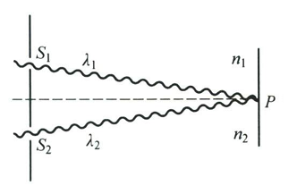
如图$S1$和$S2$为初相相同的相干光源，光束$S1P$和$S2P$分别在折射率为 $n1$和$n2$的介质中传播，相应的路程为$r1$和$r2$，在$P$点两光束相遇，其相位差为$$\Delta\varphi=\frac{2\pi r_2}{\lambda_2}-\frac{2\pi r_1}{\lambda_1}=\frac{2\pi n_2r_2}{\lambda_0}-\frac{2\pi n_1r_1}{\lambda_0}$$即$$\Delta\varphi=\frac{2\pi}{\lambda_0}(n_2r_2-n_1r_1)$$上式说明，引入光程的概念厚，计算通过不同介质的相干光的相位差，可不用介质中的波长，而统一采用真空中的波长$\lambda_0$进行计算。
令$$\delta=n_2r_2-n_1r_1$$ $\delta$称为光程差，当$n_2=n_1=1$,即二光束在真空中传播时，可得$$\delta=r_2-r_1$$这是已知的波程差的表达式，所以，波程差是特殊情况下的光程差。$$\Delta\varphi=\frac{2\pi}{\lambda_0}\delta$$
### 正薄透镜的等光程性
**基本原理**

**现象描述**
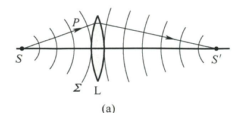
在图(a)中，从物点S发出的球面波，在某时刻的波面为$\Sigma$。从S到波面上任意一点P的光程是相等的。

**理论依据**
根据**惠更斯-菲涅耳原理**，像点S'的光振动是由波面$\Sigma$上各点发出的次波在该点的光振动相干叠加的结果。

**关键结论**
像点S'是透镜右方像空间中最明亮的点，这说明：
- 从波面$\Sigma$上各点发出的次波在S'是**相干加强**的
- 从波面$\Sigma$上任意一点P至像点S'的各光线，虽然传播路径不同，经过介质的情况也不尽相同，但**光程是相同的**
- 如果各光线在到达S'点时存在光程差，叠加后一般不会成为最明亮的像点

**适用范围**

**适用条件**
这一结论对**任何正薄透镜**都适用。

**适用情况**
1.  **光轴上的物点和像点**：从正薄透镜光轴上物点发出的各光线至像点的光程是相等的
2.  **轴外的物点和像点**：只要经过正薄透镜，物点发出的光能够无像差地会聚成明亮的像点，上述结论同样适用

> 💡 **理论说明**：物像点之间的等光程问题可以从理论上给予更一般的证明。

**特殊情况与应用**
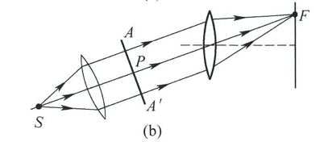
平行光聚焦
对于图(b)所示的情况：
- 从波面AA'上任意点P经正薄透镜聚焦于焦点F的各光线
- 光程都是相等的

**重要应用**
这种情况在下面研究**干涉**和**夫琅禾费衍射**时将会用到。

## 薄膜干涉

薄膜是指透明介质形成的厚度很薄的一层介质膜。

### 等厚干涉
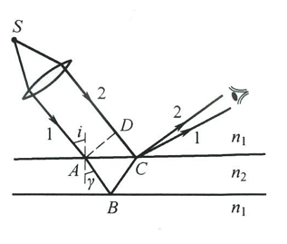
如图所示，厚度不均匀的薄膜，折射率为$n_2$，置于折射率为$n_1$的介质中，单色光源置于透镜焦点上，使出射的平行光束入射到薄膜表面上，现考虑两条特定的光线1和2，光线1入射于薄膜面A点，并折入薄膜内，再从膜下表面B点反射，最后从膜面C点射出；光线2直接入射到膜面C点，并在该处反射回原介质。在交点C，这两条光线的光程差为$$\delta=n_2(AB+BC)-n_1DC$$因膜很薄，A点与C点距离很近，因而可认为AB近似等于BC，并在这一区域内薄膜的厚度可看作相等，设为d，可得
$$ A B=B C=\frac{d}{\cos \gamma}, D C=A C \sin i=2 d \tan \gamma \cdot \sin i $$
根据折射定律
$$ n_{1} \sin i=n_{2} \sin \gamma $$
可得，光程差δ为
$$ \delta=2 n_{2} A B-n_{1} D C=2 d \sqrt{n_{2}^{2}-n_{1}^{2} \sin ^{2} i}=2 n_{2} d \cos \gamma $$
还必须指出，电磁理论可以证明，在正入射或掠入射情况，如劳埃德镜实验，光从光疏介质射向光密介质，在分界面反射时有半波损失。我们讨论的问题就是这种情况，不论$ n_{1} < n_{2} $，还是$ n_{1} > n_{2} $，1与2这两条光线之一总有半波损失出现。因而在光程差中，必须计及这个半波损失。1与2两条光线的光程差最后应表示为
$$ \delta = 2 n_{2} d \cos \gamma + \frac{\lambda}{2} $$ 
显然，薄膜上C点的光强决定于光程差δ，且有
$$ \delta = 2 n_{2} d \cos \gamma + \frac{\lambda}{2}=\left\{\begin{matrix}2 k \cdot \frac{\lambda}{2},\quad k = 1,2,\cdots  \text{相长干涉} \\(2 k + 1) \cdot \frac{\lambda}{2},\quad k = 0,1,2,\cdots  \text{相消干涉}\end{matrix}\right. $$
在实际应用中，通常使光线垂直入射膜面，即$ i = \gamma = 0 $，在这种情况下，上式变为
$$ \delta=2 n_{2} d+\frac{\lambda}{2}=\left\{\begin{array}{ll}
2 k \cdot \frac{\lambda}{2}, & k=1,2, \cdots \text { 相长干涉 } \\
(2 k+1) \cdot \frac{\lambda}{2}, & k=0,1,2, \cdots \text { 相消干涉 }
\end{array}\right. (A)$$ 
在薄膜表面上，相长干涉处光强大，因而亮；相消干涉处光强小，因而暗，形成干涉图样。由A式可以看出，两条光线在相遇点的光程差只决定于该处薄膜的厚度d，因此干涉图样中同一干涉条纹对应于薄膜上厚度相同点的连线，这种条纹称为等厚干涉条纹。

> **💡 复习要点：**
> - **核心方法：** 分振幅法获得相干光
> - **半波损失：** 光从光疏介质射向光密介质反射时发生
> - **条纹特点：** 等厚条纹，厚度相同点形成同一干涉条纹

由上面讨论可以看出，薄膜干涉和杨氏干涉等不同，在这里相干光束是通过把一波列的波分割而形成的，即用分振幅法获得相干光。

若所用点光源是非单色的，则由于各种波长的光各自在薄膜表面形成自己的一套单色干涉图样，而各套图样的干涉条纹互相错开，因而在薄膜形成色彩绚丽的花纹。

还要指出的是，当薄膜的厚度很小，并用具有小入射孔径的光学仪器或眼睛进行观察时，采用扩展光源可增大视场，对厚度均匀的薄膜，还可增大干涉条纹的亮度，因此，在做实验时采用扩展光源，一般说来是有利无害的。

#### 1.劈尖干涉
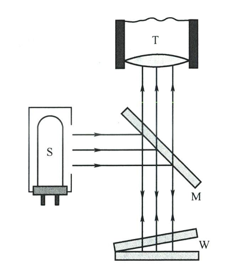
##### ➤ 实验装置

图为劈尖干涉的实验装置，从单色光源S发出的光经光学系统成为平行光束，经平玻璃片M反射后垂直入射到空气劈尖W，由劈尖上、下表面反射的光束进行相干叠加，形成干涉条纹，通过显微镜T进行观察和测量。

##### ➤ 干涉条件
根据A式$$ \delta=2 n_{2} d+\frac{\lambda}{2}=\left\{\begin{array}{ll}
2 k \cdot \frac{\lambda}{2}, & k=1,2, \cdots \text { 相长干涉 } \\
(2 k+1) \cdot \frac{\lambda}{2}, & k=0,1,2, \cdots \text { 相消干涉 }
\end{array}\right. $$知
$$ \left.\begin{matrix}\delta=2 d+\frac{\lambda}{2}=2 k \frac{\lambda}{2},  k=1, 2, 3, \cdots \text{明条纹} \\\delta=2 d+\frac{\lambda}{2}=(2 k+1) \frac{\lambda}{2},  k=0, 1, 2, 3, \cdots \text{暗条纹}\end{matrix}\right\}\quad \text{(B)} $$

💡 注意：空气中n≈1，因此B式省略$n_2$

显然，同一明条纹或同一暗条纹都对应相同厚度的空气层，因而是等厚条纹。

##### ➤ 条纹特性

由B式容易求得，两相邻明条纹(或暗条纹)对应的空气层厚度差都等于$\frac{\lambda}{2} $,
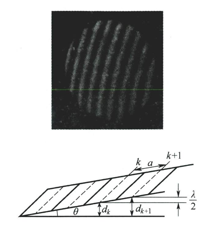
如图所示：
$$ d_{k+1}-d_{k}=\frac{\lambda}{2} $$
设劈尖的夹角为θ，则相邻明条纹(或暗条纹)之间距a应满足关系式

$$ a \sin \theta = \frac{\lambda}{2} $$

从上式看出，劈尖的夹角θ越小，条纹分布越疏；反之，θ越大，条纹分布越密。当夹角θ大到一定程度，干涉条纹将密得无法分辨，这时将看不到干涉现象。

> **📌 速查公式：**
> - 光程差：$\delta = 2d + \frac{\lambda}{2}$ （空气劈尖）
> - 厚度差：$\Delta d = \frac{\lambda}{2}$
> - 条纹间距：$a \sin\theta = \frac{\lambda}{2}$

从上式还可以看出，如果已知夹角θ，则测出条纹间距a，就可算出波长λ。反之，如果波长λ已知，则测出条纹间距a，就可算出微小角度θ。

#### 2.牛顿环

###### ➤ 现象描述
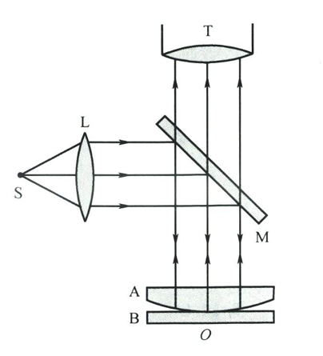

如图所示，在一块平面玻璃与一块曲率半径很大的平凸透镜之间形成一个上表面是球面，下表面是平面的空气薄层，当用单色光垂直照射时，从上往下观察会看到以接触点O为中心的一组圆形干涉条纹。
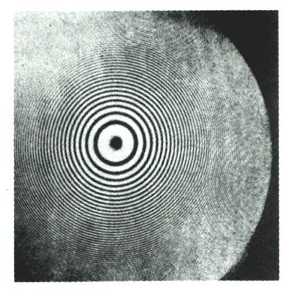

如图所示。这是由环空气劈尖上下表面反射的光发生干涉而形成的条纹。由于以接触O为中心的任一圆周上，空气层的厚度是相等的，因此这种条纹是等厚干涉条纹，通常称其为牛顿环。

###### ➤ 几何关系

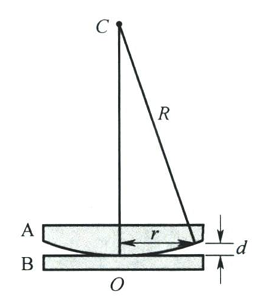
现在对牛顿环进行计算，上图中R为平凸透镜的曲率半径，r为环形干涉条纹的半径，只要知道r与R、λ的关系，就可以用已测得的r和已知的曲率R求出入射光的波长，或已知λ求出R。

若半径为r的环形条纹下面的空气层厚度为d，由图中可知
$$ R^{2}=r^{2}+(R-d)^{2}=r^{2}+R^{2}-2Rd+d^{2} $$
因$ d\ll R $, $ d^{2} $可略去,于是得
$$ d=\frac{r^{2}}{2R} $$ 
这一结果表明,离中心愈远(r愈大),光程差增加愈快,所看到的牛顿环也变得越来越密。

###### ➤ 明暗纹条件
根据B式,可知牛顿环的明纹条件为
$$ 2 \cdot \frac{r^{2}}{2R}+\frac{\lambda}{2}=2 k \frac{\lambda}{2}, k=1,2,3, \cdots $$
暗纹条件为
$$ 2 \cdot \frac{r^{2}}{2R}+\frac{\lambda}{2}=(2 k+1) \frac{\lambda}{2}, k=0,1,2, \cdots $$
由此可得牛顿环的明、暗纹半径分别为
$$ r=\sqrt{(2k-1)\cdot\frac{R\lambda}{2}},k=1,2,3,\cdots\text{明纹} $$
$$ r=\sqrt{k\lambda R},\quad k=0,1,2,\cdots\text{暗纹} $$

> **📌 速查公式：**
> - 厚度公式：$d = \frac{r^2}{2R}$
> - 明纹半径：$r = \sqrt{(2k-1)\cdot\frac{R\lambda}{2}}$
> - 暗纹半径：$r = \sqrt{k\lambda R}$
> - **物理图像：** $d \propto r^2$，厚度非线性增大，故条纹内疏外密

在实验室,常用牛顿环来测定光波的波长或平凸透镜的曲率半径。

#### 📊 对比总结

| 特征 | 劈尖干涉 | 牛顿环 |
|:---|:---|:---|
| **薄膜形状** | 楔形，厚度线性变化 | 球面与平面间，厚度非线性变化 |
| **条纹形状** | 直条纹 | 内疏外密的同心圆环 |
| **中心点** | - | 暗点（$k=0$级暗纹） |
| **条纹间距** | 等间距 $a$ | 不等距，内疏外密 |
| **厚度公式** | $d = k \cdot \frac{\lambda}{2}$ | $d = \frac{r^2}{2R}$ |

#### ❓ 自测问题

1. 如果劈尖夹角θ增大，条纹会怎么变化？
2. 牛顿环实验中，如果平凸透镜和平板玻璃之间接触点有灰尘，环状图样会如何变化？
3. 为什么牛顿环中心总是暗点？
4. 如果劈尖中填充的不是空气而是水（n>1），条纹会变密还是变疏？

📌 点击展开：公式分析、推导及物理意义

>**问题一：劈尖夹角θ增大对条纹的影响**
>劈尖干涉条纹间距由以下公式决定：$$ a \sin \theta = \frac{\lambda}{2} $$
>1. **公式分析**：
>   - $a$：相邻条纹间距
>   - $\theta$：劈尖夹角
>   - $\lambda$：光波波长
>2. **数学推导**：
   当$\theta$增大时，$\sin\theta$随之增大
   由于$\lambda$为常数，为保持等式成立，$a$必须减小
   ∴ $\theta \uparrow \rightarrow \sin\theta \uparrow \rightarrow a \downarrow$
>3. **物理意义**：
   夹角增大导致相同厚度变化对应的水平距离减小，因此条纹更加密集
>图中清晰展示了劈尖干涉的条纹分布 pattern，夹角越大，条纹越密集

>**问题二：牛顿环中心总是暗点的原因**
>1. **几何关系**：
>   在中心点O处，空气层厚度$d=0$
>
>2. **光程差计算**：
   $$ \delta = 2d + \frac{\lambda}{2} = \frac{\lambda}{2} $$
>3. **干涉条件分析**：
>   - 光程差为半波长的奇数倍
>   - 满足相消干涉条件：$\delta = (2k+1)\frac{\lambda}{2}$
>半波损失机制
>无论$n_1$与$n_2$的关系如何，两条光线中总有一条发生半波损失
>数学证明
>根据牛顿环暗纹条件：
>$$ r = \sqrt{k\lambda R},\quad k=0,1,2,\cdots $$
>当$k=0$时，$r=0$，即中心点为暗点

>问题三：劈尖中填充水对条纹的影响
>理论推导
>1. **光程差修正**：
>   填充水后，折射率$n>1$，光程差变为：
>   $$ \delta = 2nd + \frac{\lambda}{2} $$
>2. **相邻条纹厚度差**：
>   $$ \Delta d = \frac{\lambda}{2n} $$
>3. **条纹间距公式**：
>   $$ a \sin\theta = \frac{\lambda}{2n} $$
>定量分析
>- 水的折射率$n≈1.33$
>- $\frac{\lambda}{2n} < \frac{\lambda}{2}$
>- ∴ $\Delta d$减小，条纹间距$a$减小
>物理解释
>折射率增大导致光在介质中波长变短，相同相位差对应的厚度变化减小

>问题四：灰尘对牛顿环图样的影响
>几何关系破坏分析
>1. **理想情况几何关系**：
>   $$ d = \frac{r^2}{2R} $$
>2. **灰尘引入的扰动**：
>   - 接触点位置偏移
>   - 局部厚度分布改变
>   - 几何对称性破坏
>具体影响机制
>1. **接触点偏移**：
>   - 中心点不再对应几何中心
>   - 环状条纹整体偏移
>2. **厚度分布改变**：
>   $$ d = \frac{r^2}{2R} + \Delta d_{\text{灰尘}} $$
>   破坏了原有的二次函数关系
>3. **条纹形变**：
>   - 同心圆环→椭圆或不规则形状
>   - 条纹间距不均匀

#### 参数变化影响总结表
| 变化条件 | 条纹间距 | 物理机制 | 数学关系 |
|---------|---------|---------|---------|
| **θ增大** | 减小 | 相同厚度变化对应距离减小 | $a \propto \frac{1}{\sin\theta}$ |
| **n增大** | 减小 | 介质中波长变短 | $a \propto \frac{1}{n}$ |
| **λ增大** | 增大 | 波长直接增大 | $a \propto \lambda$ |
| **灰尘污染** | 不规则 | 几何关系破坏 | $d = \frac{r^2}{2R} + \Delta$ |

#### 重要公式回顾
1. **基本光程差公式**：
   $$ \delta = 2n_2d\cos\gamma + \frac{\lambda}{2} $$
2. **劈尖条纹间距**：
   $$ a = \frac{\lambda}{2\sin\theta} $$
3. **牛顿环半径公式**：
   $$ r_{\text{暗}} = \sqrt{k\lambda R} $$
   $$ r_{\text{明}} = \sqrt{(2k-1)\frac{R\lambda}{2}} $$
### 等倾干涉
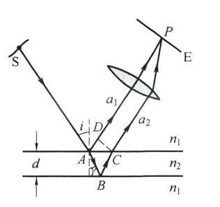
##### 基本概念
- 发生在**厚度均匀**的薄膜上
- 干涉条纹由**入射角相同**的光形成
- 干涉图样定域在**无穷远**，需用透镜观察

#### 光程差公式
##### 基本形式
$$\delta = 2d\sqrt{n_2^2 - n_1^2 \sin^2 i} = 2n_2 d \cos\gamma$$

##### 考虑半波损失后
$$\delta = 2n_2 d \cos\gamma + \frac{\lambda}{2}$$

#### 干涉条件
- 明纹条件：$\delta = k\lambda$ （$k=1,2,3,...$）
- 暗纹条件：$\delta = (2k+1)\frac{\lambda}{2}$ （$k=0,1,2,...$）

#### 实验装置
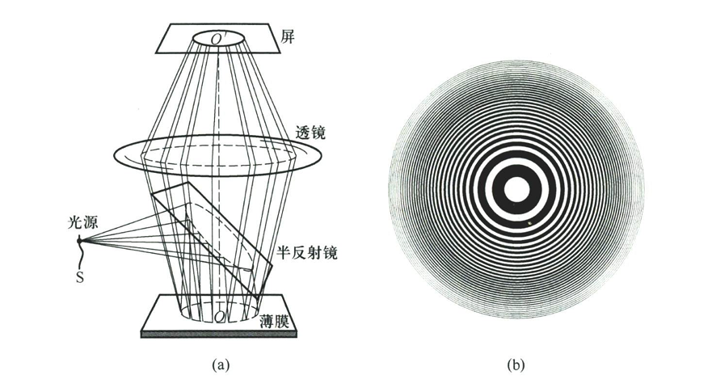
- 装置示意图对应图(a)
- 干涉图样为同心圆环（对应图(b)）

#### 条纹特征
- **内圆纹级次高，外圆纹级次低**（与牛顿环相反）
- 入射角$i$越小 → 形成的圆纹级次越高
- 圆纹中心对应最小入射角（$i=0$）

#### 厚度变化对条纹的影响
- 当$d$增大时：圆纹从中心**冒出**，并向外扩张，条纹变密
- 当$d$减小时：圆纹向中心**湮没**，并向内收缩，条纹变疏

#### 厚度变化量计算
每冒出（或湮没）一个圆纹，厚度改变量为：
$$\Delta d = \frac{\lambda}{2n_2}$$

冒出（或湮没）$N$个圆纹时，总厚度改变量为：
$$\Delta d = N \cdot \frac{\lambda}{2n}$$

#### 应用
##### 检查平板平行度
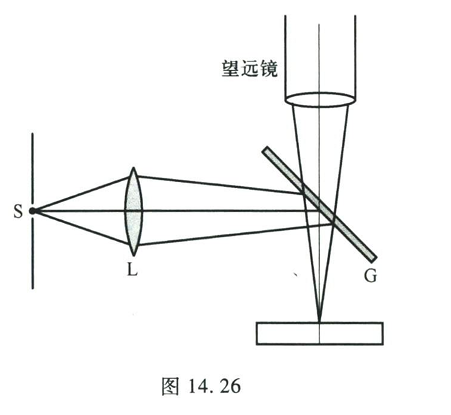
- 装置示意图对应图14.26
- 平移平板时：
  - 若平板等厚 → 圆纹无变化
  - 若厚度不均匀 → 圆纹动态变化（冒出或湮没）
- 通过观察圆纹变化可检测厚度均匀性

#### 测量方法
1. 记录中心圆纹冒出或湮没的数目$N$
2. 计算厚度改变量：$\Delta d = N \cdot \frac{\lambda}{2n}$
3. 可测出平板各处的厚度差和变化方向

#### 实验注意事项
- 可用眼睛直接观察（视场角约$6^\circ-8^\circ$）
- 使用单色性好的激光源可检查更厚平板的质量