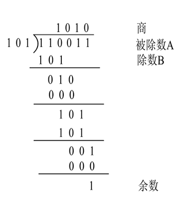
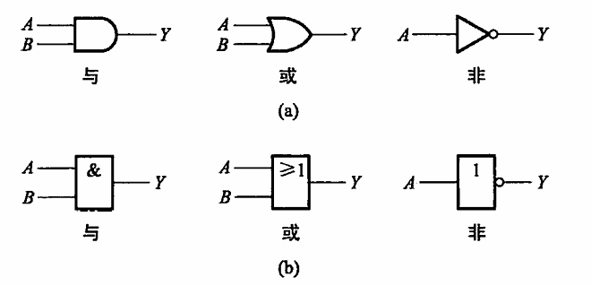
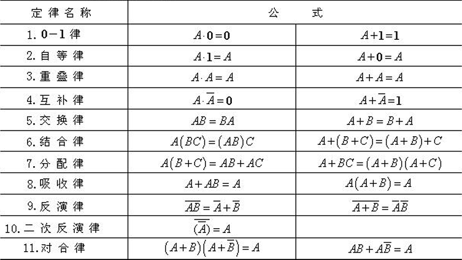

# 数字逻辑与数字系统
### 📚 数字电子技术学习方案
**教材**：学校配套目录教材  
**网课**：清华大学王红《数字电子技术基础》高清重制版

---

### 🧱 阶段化学习路径
| 阶段             | 网课章节   | 教材章节       | 关键任务                                                                 | 工具/操作                                                                 |
|------------------|------------|---------------|--------------------------------------------------------------------------|--------------------------------------------------------------------------|
| **基础奠基**     | 1.01-1.02  | 第1章          | 掌握二进制/十六进制转换、8421码、格雷码                                  | [在线进制转换器](https://www.rapidtables.com/convert/number/decimal-to-binary.html) |
| **逻辑代数核心** | 1.03-1.07  | 第2章          | 卡诺图化简、约束项应用                                                  | ```卡诺图口诀：圈1要最大，圈数要最小```                                    |
| **门电路物理**   | 1.08-1.16  | 第4章          | TTL/CMOS特性对比、OC门/三态门应用                                        | Multisim仿真门电路延时                                                    |
| **组合电路设计** | 1.18-1.22  | 第5章          | 用Verilog实现编码器/译码器                                               | [👉 点击展开代码](#组合电路代码)                                            |
| **时序电路核心** | 2.23-2.38  | 第7章          | 同步计数器设计、状态机实现                                               | [👉 点击展开流程图](#时序电路设计)                                           |
| **存储与PLD**    | 2.39-2.41  | 第8章          | ROM实现逻辑函数、FPGA配置                                                | ModelSim仿真RAM读写                                                      |
| **ADC/DAC实战**  | 2.48-2.50  | 第9章          | 逐次逼近ADC时序分析                                                      | ADC0809仿真模型                                                          |

---

## 第一章绪论
### 1-1 数字电路基本概念

**数字量和模拟量**：

&emsp;数字量：在时间上和数量上都是离散、不连续的。（存在一个最小数量单位$\Delta$）  

&emsp;模拟量：数字量之外的物理量  

模拟电路：用连续的模拟电压/流值表示信息

数字电路：用一个离散的电压序列来表示信息

### 1-2 数制和编码
数制：表示数量的规则  

<span style="color: #6c757d; font-size: 0.9em; font-style: italic;">
💡 数制包括每一位的构成以及从低位向高位的进位规则
</span>
码制：表示事物的规则  

<span style="color: #6c757d; font-size: 0.9em; font-style: italic;">
💡 各种进制转换 略
</span>
原码 (Sign-Magnitude)​：
概念​​：最直观的二进制表示法。
规则​​：
​​最高位为符号位​​：0表示正数，1表示负数。
​​其余位为数值位​​，表示该数的绝对值。
缺陷​​：存在 ​​+0(0000 0000) 和 -0(1000 0000)​​ 两种零，同时计算时需要比较绝对值和符号位，不利于计算。
反码 (Ones' Complement)​​
​​概念​​：为解决原码计算问题而引入的过渡方案。
​​规则​​：
​​正数​​：反码与原码相同。
​​负数​​：保持符号位 1不变，​​将其原码的数值位按位取反​​。
缺陷​​：同样存在 ​​+0(0000 0000) 和 -0(1111 1111)​​ 两种零。
补码 (Two's Complement)​​
​​概念​​：​​现代计算机统一采用的整数表示标准​​，完美解决了零的歧义和计算问题。
​​规则​​：
​​正数​​：补码与原码、反码相同。
​​负数​​：在其反码的​​基础上，末位加 1​​ (即：原码的数值位取反后加1)。
<span style="color: #6c757d; font-size: 0.9em; font-style: italic;">
💡 想象一个时钟，将时针向前拨5h和向后拨7h是相同的效果
</span>
核心优势​​：
​​唯一零表示​​：0000 0000。
​​无缝衔接加减法​​：可以将减法运算统一为加法运算，CPU只需一套加法器电路。
​​表示范围更广​​：n位补码可表示 $[-2ⁿ⁻¹, 2ⁿ⁻¹ - 1]$范围的数。
<span style="color: #6c757d; font-size: 0.9em; font-style: italic;">
💡 注意进行补码的二进制计算前要考虑是否会发生溢出！
💡 注意表达范围的不对称性！
💡 补码允许小数存在，此时取反后加1在小数部分的末位
</span>
目前，数字电路都采用二进制
数字电路中广泛使用二进制的原因有以下几个方面：
（1）可以很容易的采用具有两个稳定状态的开关器件来表示两个计数符号
0和1。
（2）一切运算均可分解成简便易行的称逻辑运算。
（3）存储二进制信息的设备量接近最低。
表示数量时称二进制
表示事物时称二值逻辑
<span style="color: #6c757d; font-size: 0.9em; font-style: italic;">
💡 二进制中十进制代码不唯一，比如8421码（最常用），余3码（保证超出9的计算结果仍然落在表示范围），2421码等
</span>
常用编码方案

**二－十进制码(BCD)**:
BCD码又称为8421BCD码，是一种有权码
**有权码​​**:
有权码​​是一种二进制编码方式，其核心特征是：​​组成编码的每一位都有自己固定的“权重”​​。
整个编码所表示的十进制数值，等于​​编码中每一位数字（1或0）乘以其对应的权重，然后将所有乘积相加求和​​。
用公式表示就是：
$D=d_{n-1}×w_{n-1}+d_{n-2}×w_{n-2}+d_{n-3}×w_{n-3}+...+d_{0}×w_{0}$
其中：
D是最终的十进制数值。
* $d_{n-1},d_{n-2},...,d_0$是二进制码的每一位（0或1）。
* $w_{n-1},w_{n-2},...,w_0$是每一位对应的固定权重。
  
**格雷码**：
格雷码也叫循环码，每一位的状态变化都按一定顺序循环。编码顺序依次变化，按表中顺序变化时，相邻代码只有一位改变状态。
<span style="color: #6c757d; font-size: 0.9em; font-style: italic;">
💡 为了说明相邻代码只有一位改变状态，我们引入汉明距离
</span>

**汉明距离**：
​​两个等长的字符串（在数字电路中，通常是二进制编码）中，对应位置数字不同的个数。
<span style="color: #6c757d; font-size: 0.9em; font-style: italic;">
💡 简单来说，它就是比较两个编码，从头到尾一位一位地看，数一数有多少个位置不一样。这个“不一样的位置的数量”就是它们之间的距离。
</span>

**格雷码的特点**：
格雷码的设计目标就是确保所有相邻整数的编码之间的汉明距离恒为1。​这使得它在表示连续变化的物理量（如旋转编码器的角度）时极其可靠，完全避免了多位跳变带来的风险。这就是它被广泛应用的根本原因。
虽然相邻数值的汉明距离为1，但​​非相邻数值的格雷码之间的汉明距离可以大于1，并且通常都会大于1​​。
格雷码没有保证也通常不满足​​的是：​​任意两个编码之间的汉明距离都很小​​。
格雷码是​​路径最优​​的（从一个值平滑变化到下一个值），但​​不是全局最优​​的（任意两个值的编码没有直接关系）。

**生成格雷码**:

**递归反射法**（用于构造所有n位格雷码）：
定义最基本的1位格雷码序列：[0, 1]。
将n位格雷码序列完整地**复制**下来，作为新序列的前半部分。
将n位格雷码序列​​逆序​​（镜像**反射**），作为新序列的后半部分。
在​​前半部分​​的每个编码前​​加 0​​。在​​后半部分​​的每个编码前​​加 1​​。
将加好**前缀**的前半部分和后半部分**连接**起来，就得到了n+1位的格雷码序列。
**公式转换法**（用于二进制与格雷码互转）
规则步骤：
二进制码 (B) $➔$ 格雷码 (G)​
最高位保留​​：格雷码的最高位（最左边）与二进制码的最高位相同。
$G_n=B_n$
其余位按位异或​​：格雷码的每一位（从次高位开始）等于二进制码对应位与其​​左边相邻位​​进行​​异或（XOR）​​ 操作的结果。
$G_i=B_i\oplus B_{i+1}$
（异或规则：相同为0，不同为1）
格雷码 (G) $➔$ 二进制码 (B)​
最高位保留​​：二进制码的最高位与格雷码的最高位相同。
$B_n=G_n$
其余位递推异或​​：二进制码的每一位（从次高位开始）等于格雷码对应位与​​已计算出的左边相邻二进制位​​进行异或操作的结果。
$B_i=G_i\oplus B_{i+1}$

**二进制的计算（简略）**：

| 运算类型 | 核心规则 | 示例 | 注意事项 |
| :--- | :--- | :--- | :--- |
| **加法** | `0 + 0 = 0`<br>`0 + 1 = 1`<br>`1 + 0 = 1`<br>`1 + 1 = 10` (逢二进一) | ` 1011 (11)`<br>`+ 0110 (6)`<br>`———`<br>`10001 (17)` | 从最低位开始计算，注意进位。 |
| **减法** | `0 - 0 = 0`<br>`1 - 0 = 1`<br>`1 - 1 = 0`<br>`0 - 1 = 1` (需借位，借一当二) | ` 1010 (10)`<br>`- 0101 (5)`<br>`———`<br>` 0101 (5)` | 从最低位开始计算，不够减时向高位借位。 |
| **乘法** | `0 × 0 = 0`<br>`0 × 1 = 0`<br>`1 × 0 = 0`<br>`1 × 1 = 1` | ` 1011 (11)`<br>`×  101 (5)`<br>`———`<br>` 1011`<br>`0000`<br>`1011`<br>`———`<br>`110111 (55)` | 类似于十进制乘法：**移位相加**。乘数每一位与被乘数相乘后，根据位置左移，最后将所有结果相加。 |
| **除法** | `0 ÷ 1 = 0`<br>`1 ÷ 1 = 1` || 类似于十进制除法：**长除法**。从被除数高位开始取位，够除则商1，然后做减法并取下一位；不够除则商0。 |
| **左移 (`<<`)** | 所有位向左移动，低位补0。 | `0011 (3) << 2 = 1100 (12)` | **等效于乘以 2^n** (n为移动位数)。可能会溢出。 |
| **逻辑右移 (`>>>`)** | 所有位向右移动，**高位补0**。 | `1110 (-2¹) >>> 1 = 0111 (7)` | 对于**无符号数**，等效于除以 2^n 并取整。 |
| **算术右移 (`>>`)** | 所有位向右移动，**高位用原符号位填充**。 | `1110 (-2) >> 1 = 1111 (-1)` | 对于**有符号数**（补码表示），保持符号不变，等效于除以 2^n 并向下取整。 |
| **按位与 (`&`)** | 同位置都为1则结果为1，否则为0。 | `1010 & 1100 = 1000` | 常用于**掩码操作**（提取特定位）、清零特定位。 |
| **按位或 (`\|`)** | 同位置有1则结果为1，否则为0。 | `1010 \| 1100 = 1110` | 常用于**设置特定位为1**。 |
| **按位异或 (`^`)** | 同位置不同则为1，相同则为0。 | `1010 ^ 1100 = 0110` | 常用于**翻转特定位**、不需要临时变量的值交换。 |
| **按位非 (`~`)** | 所有位取反（0变1，1变0）。 | `~1010 = 0101` (以4位为例) | 得到的是原值的**反码**。 |

**重要概念：**
*   **溢出 (Overflow)**：当运算结果超出了所用位数能表示的范围时发生。
*   **补码 (Two's Complement)**：现代计算机表示有符号整数的方式，使加法和减法可以使用同一套加法器电路。

**等长编码与变长编码**
| 特性 | 等长编码 (Fixed-Length Encoding) | 变长编码 (Variable-Length Encoding) |
| :--- | :--- | :--- |
| **定义** | 每个符号都用长度相同的二进制串表示。 | 不同符号用长度不同的二进制串表示。 |
| **核心思想** | 简单、规整，易于处理。 | 效率优先，高频符号用短码，低频符号用长码。 |
| **优点** | 译码简单（无需分隔符）、随机访问、易于同步。 | 平均编码长度短、压缩率高、更节省空间/带宽。 |
| **缺点** | 可能存在冗余，效率较低（无论符号出现频率，都占用相同长度）。 | 译码复杂（需要前缀码特性或分隔符）、同步困难、不易随机访问。 |
| **常见例子** | ASCII码、Unicode (UTF-32)、机器指令集、格雷码 | 摩斯电码、霍夫曼编码、UTF-8、算术编码 |

## 第二章逻辑代数基础
### 2－1基本逻辑运算
**逻辑**：事物的因果关系
**逻辑运算的数学基础**：逻辑代数（布尔代数）
在二值逻辑中的变量取值：0/1

**与运算 (AND Operation)**
*   **定义**：当且仅当所有输入条件同时成立时，结果才成立。
*   **逻辑表达式**：$F = A \cdot B$ 或 $F = A \land B$
*   **真值表**
    | A | B | F = A · B |
    |:-:|:-:|:---------:|
    | 0 | 0 |     0     |
    | 0 | 1 |     0     |
    | 1 | 0 |     0     |
    | 1 | 1 |     1     |
*   **逻辑符号**：
    *   `·`(可省略),`Λ`,`∩`
    *   矩形符号：`AND`
*   **运算规则**：有 `0` 出 `0`，全 `1` 出 `1`。

**或运算 (OR Operation)**
*   **定义**：只要有一个或多个输入条件成立，结果就成立。
*   **逻辑表达式**：$F = A + B$ 或 $F = A \lor B$
*   **真值表**
    | A | B | F = A + B |
    |:-:|:-:|:---------:|
    | 0 | 0 |     0     |
    | 0 | 1 |     1     |
    | 1 | 0 |     1     |
    | 1 | 1 |     1     |
*   **逻辑符号**：
    *   `＋`,`V`,`U`
    *   矩形符号：`OR`
*   **运算规则**：有 `1` 出 `1`，全 `0` 出 `0`。

**非运算 (NOT Operation)**
*   **定义**：输出与输入状态相反。也称为“取反”。
*   **逻辑表达式**：$F = \overline{A}$ 或 $F = \lnot A$
*   **真值表**
    | A | F = $\overline{A}$ |
    |:-:|:------------------:|
    | 0 |          1         |
    | 1 |          0         |
*   **逻辑符号**：
    *   `¯`(上划线)
    *   矩形符号：`NOT` 或 `INV`
*   **运算规则**：入 `0` 出 `1`，入 `1` 出 `0`。
<span style="color: #6c757d; font-size: 0.9em; font-style: italic;">
💡 提示：与、或、非是三种最基本的逻辑运算，是构成所有复杂逻辑电路的基础。任何逻辑函数都可以通过这三种运算的组合来实现。 
</span>
图形符号见下



实现逻辑与运算的电路称为与门，实现逻辑或运算的电路称为或门，实现非逻辑的电路称为非门
### 2－2逻辑代数的基本定律和规则

其中反演律又称德摩根律
补充一些常用公式：
$$A+\overline{A}B=AB\\
AB+A\overline{B}=A\\
A(A+B)=A\\
AB+A\overline{C}+BC=AB+A\overline{C}\\
AB+A\overline{C}+BCD=AB+A\overline{C}\\
A(\overline{AB})=A\overline{B};\overline{A}(\overline{AB})=\overline{A}
$$
**逻辑代数的三条规则**:
一、代入规则:
任何一个含有变量A的等式，如果将所有出现A的地方都代之以逻辑函数
F，等式仍成立，这就是代入规则。
<span style="color: #6c757d; font-size: 0.9em; font-style: italic;">
💡 合理运用代入规则可以极大简化公式
</span>

二、反演规则:
将任一逻辑函数F表达式中的所有“·”号变成“+”号，“+”号变成“·”
号（注意，函数中常省略“·”号），1变成0，0变成1，并将原变量变成反变量，
反变量变成原变量，保持运算顺序不变，就可求得逻辑函数F的反函数F，这
就是反演规则。
<span style="color: #6c757d; font-size: 0.9em; font-style: italic;">
💡 在数字电路实际应用上，直接添加一个非门更快捷
</span>

三、对偶规则:
将任一逻辑函数F表达式中的所有“·”号变成“+”号，“+”号变成“·”号（注意，函数中常省略“·”号），1变成0，0变成1，保持变量和运算顺序不变，就可得到一个新的逻辑函数F，这个新函数$F'$称为逻辑表达式$F$的对偶式。
如函数式$F$=A(B+C)，则其对偶式为$F'$=A+BC。对于函数式$G$=AB+AC，其对偶
式为$G'$=(A+B)(A+C)。如果两个逻辑函数$F$和$G$相等，则它们各自的对偶式'F''和
$G'$也相等。即
由$F$=A(B+C)=AB+AC＝$G$可知$F'$= $G'$ ，故有A+BC=(A+B)(A+C)。
<span style="color: #6c757d; font-size: 0.9em; font-style: italic;">
💡 对偶定理常常用于判断两个公式等价
</span>
一般情况下，$\overline{F}\neq F'$。
与非逻辑
$F=\overline{AB}$
或非逻辑
$F=\overline{A+B}$
与或非逻辑
$F=\overline{AB+CD+EG}$
异或逻辑和同或逻辑
异或逻辑的表达式为：$F=A\overline{B}+\overline{A}B=A\oplus B$
同或逻辑的表达式为：
$F=AB+\overline{AB}=A\odot B$
异或逻辑与同伙逻辑互为反函数又互为对偶函数
基本恒等式
$$
A \oplus B = \overline{A \odot B} = A \odot \overline{B} = \overline{A} \odot B
$$

$$
A \odot B = \overline{A \oplus B} = A \oplus \overline{B} = \overline{A} \oplus B
$$
对偶关系
$$
F = A \oplus B \Rightarrow F' = A \odot B
$$

$$
F = A \odot B \Rightarrow F' = A \oplus B
$$
| 基本定律     | 异或运算 (⊕)                     | 同或运算 (⊙)                     |
|--------------|----------------------------------|----------------------------------|
| 0-1律        | A ⊕ A = 0                        | A ⊙ A = 1                        |
| 互补律       | A ⊕ Ā = 1                        | A ⊙ Ā = 0                        |
| 自等律       | A ⊕ 0 = A                        | A ⊙ 1 = A                        |
| 反演律       | A ⊕ B = Ā ⊕ B                    | A ⊙ B = Ā ⊙ B                    |
| 交换律       | A ⊕ B = B ⊕ A                    | A ⊙ B = B ⊙ A                    |
| 结合律       | A ⊕ (B ⊕ C) = (A ⊕ B) ⊕ C        | A ⊙ (B ⊙ C) = (A ⊙ B) ⊙ C        |
| 分配律       | A(B ⊕ C) = AB ⊕ AC               | A(B ⊙ C) = AB ⊙ AC               |
| 控制反演律   | A ⊕ 1 = Ā                        | A ⊙ 0 = Ā                        |
| 调换律       | A ⊕ B = C ⇒ A ⊕ C = B            | A ⊙ B = C ⇒ A ⊙ C = B            |

四、逻辑函数及其表示方法

**逻辑函数的表示方法**：
真值表，逻辑式，逻辑图，波形图，卡诺图，EDA中硬件描述语言
各种表示方法之间可以相互转换

### 2－3逻辑函数的标准表达式
**最小项**：
最小项也叫标准乘积项，它是全部输入变量以原变量或者反变量形式参与的乘积项。在最小项中全部输入变量都以原变量或者反变量的形式出现，并且只出现一次。
* 有多少种变量输入组合，就有多少个最小项。
对任何一个最小项$m_i$，在输入变量的所有各种组合中，只有一组输入变量组合值使其值为1。因此，最小项是输出1的可能性最小的乘积项（因此得名）。
* 设$m_i、m_j$是任意的两个最小项，当$i\neq j$时，$m_i m_j =0$
* 全体最小项之和恒为1

**逻辑函数的最小项表达式**
逻辑函数的​​最小项表达式​​，也称为​​标准与或式（Canonical Sum of Products, SOP）​​，是一种标准化的布尔函数表示形式。
**定义**：最小项表达式是将逻辑函数表示为使其输出为 ​​1​​ 的所有​​最小项​​的逻辑和（OR）。
对于一个有 n个变量的逻辑函数，其最小项表达式的一般形式为：
$F=\sum(m_i,m_j,...,m_k)$或$F=m_i+m_j+...+m_k$
其中每个m都是一个最小项

**最大项**：
最大项也叫标准和项，它是全部输入变量以原变量或者反变量形式参与的
和项。同样，在最大项中全部输入变量都以原变量或者反变量的形式出现，并且，
只出现一次。
* 有多少种变量输入组合，就有多少个最大项。对任何一个最大项$M_i$，在输入变量的所有各种组合中，只有一组输入变量组合使其值为0，因此，最大项是输出为1的可能性最大的和项（因此得名）
* 设$M_i、M_j$是任意的两个最大项，当$i\neq j$时，$M_i+M_j =1$
* 全体最大项之积恒为0
  
**逻辑函数的最大项表达式**：
逻辑函数的​​最大项表达式​​，也称为​​标准或与式（Canonical Product of Sums, POS）​​，是一种标准化的布尔函数表示形式。它与最小项表达式互为对偶。
**定义**​​：最大项表达式是将逻辑函数表示为使其输出为 ​​0​​ 的所有​​最大项​​的逻辑积（AND）。
最大项表达式是将逻辑函数表示为使其输出为 ​​0​​ 的所有​​最大项​​的逻辑积（AND）。
对于一个有 n 个变量的逻辑函数，其最大项表达式的一般形式为：
$F=\prod(M_i,M_j,...,M_k)$或$F=M_i\cdot M_j\cdot...,M_k)$其中每个 M都是一个最大项。